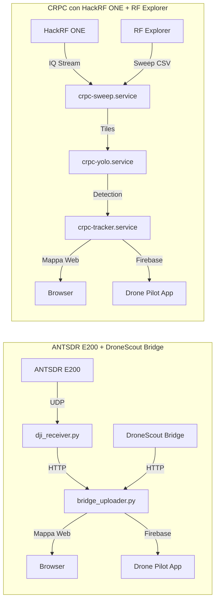

# 📡 Drone Detector con SDR e Raspberry Pi

Questo progetto utilizza **due ricevitori SDR distinti** su Raspberry Pi per rilevare droni di diverse tipologie:

1. **Sistema 1 – ANTSDR E200 + DroneScout Bridge**  
   Per il rilevamento **DJI DroneID** e **Remote ID**.
   Tutto gira su **Raspberry Pi3**.
2. **Sistema 2 – CRPC (Cognitive Radio Protocol Cracking)** con HackRF ONE + RF Explorer  
   Per l’analisi dello spettro RF e rilevamento di droni generici.
   Tutto gira su **Raspberry Pi5**

Entrambi inviano i dati a un **cruscotto web** integrato e possono trasmettere le tracce a **Firebase** per la visualizzazione su altre piattaforme (es. Drone Pilot App).

---

## ✅ Funzionalità principali
- **Rilevamento DJI DroneID** via ANTSDR E200
- **Rilevamento Remote ID** via DroneScout Bridge
- **Rilevamento generico droni** via CRPC con HackRF e RF Explorer
- **Cruscotto radio** per osservare il funzionamento del CRPC con **Modalità waterfall** per visualizzare lo spettro in tempo reale (HackRF)
- **Server web con mappa** e dashboard integrata
- **Invio dati** in rete locale o verso Firebase


---

## 📦 Struttura del repository su Raspberry Pi

```
/home/pi/             # Sistema ANTSDR/DroneScout
├── bridge_uploader.py
├── start_all.sh / stop_all.sh
├── static/           # Frontend mappa
├── trackers/
│   ├── dji_receiver.py
│   └── service_controller.sh
└── remotetrack/      # Bridge Remote ID modificato

/home/raffaello/crpc  # Sistema CRPC
├── rf_scan_classifier.py
├── waterfall_web.py
├── start_crpc / stop_crpc
├── crpc_cleanup.sh
└── dataset/          # Immagini YOLO per addestramento
```

---

# 1️⃣ Sistema ANTSDR E200 + DroneScout Bridge

### Installazione
1. Impostare IP Raspberry Pi: `192.168.1.5`
2. ANTSDR E200 con firmware DJI: IP `192.168.1.10`
3. Avviare tutti i servizi:
   ```bash
   ./start_all.sh
   ```
4. Arresto servizi:
   ```bash
   ./stop_all.sh
   ```

### Accesso mappa web
```
http://<IP_RPI>:8080
```

### Componenti principali
- **`dji_receiver.py`**: riceve UDP da ANTSDR e invia a `bridge_uploader.py`
- **`remotetrack/`**: riceve Remote ID e invia a `bridge_uploader.py`
- **`bridge_uploader.py`**: server web + gestione dati

---

# 2️⃣ Sistema CRPC con HackRF ONE + RF Explorer

### Login e IP
- Raspberry Pi CRPC: IP `192.168.1.6`
- Login: `raffaello / solita`

### Servizi principali
File di configurazione:
```
/etc/default/crpc
```
Target e unità principali:
```
crpc.target
crpc-prepare.service
crpc-sweep.service
crpc-tiles.service
crpc-yolo.service
crpc-tracker.service
crpc-rfscan.service
crpc-cleanup.service
```

### Stato servizi
```bash
# Stato generale
systemctl status crpc.target

# Servizi singoli
systemctl status crpc-sweep.service
journalctl -u crpc-yolo.service -f   # log YOLO + detections
systemctl status crpc-tracker.service
journalctl -u crpc-rfscan.service -f
```

### Avvio/Stop manuale
```bash
/usr/local/bin/start_crpc
/usr/local/bin/stop_crpc
```

### Pulizia file temporanei
```bash
/usr/local/bin/crpc_cleanup.sh
```

---

## 📊 Addestramento YOLO (solo su CRPC)
> L’addestramento si esegue solo in un **venv** dedicato per non interferire con i pacchetti di sistema.

```bash
python3 -m venv --system-site-packages ~/yolo-venv
source ~/yolo-venv/bin/activate
pip install --upgrade "numpy==1.26.4" pip
pip install --no-deps ultralytics
pip install "opencv-python<4.10" "pillow<11" "matplotlib<3.9"
```

Dataset RF:  
[Roboflow Dataset](https://universe.roboflow.com/rui-shi/drone-signal-detect-few-shot/dataset/6/images)

Esempio di training:
```python
from ultralytics import YOLO
m = YOLO('yolov8n.pt')
m.train(
    data='/home/raffaello/dataset/yolo_vision/data.yaml',
    epochs=50, imgsz=640, batch=8, workers=2,
    project='/home/raffaello/yolo_runs', name='rf_yolo',
    plots=False
)
```

---

## 🎯 Classificatore RF
Esempi di configurazioni:
```bash
# Bilanciato
python3 rf_scan_classifier.py --w-model 0.45 --w-csv 0.35 --w-img 0.20 --min-track-len 1 --fprint-min 0.05

# Alta precisione
python3 rf_scan_classifier.py --fprint-min 0.35
```

---

## 🌊 Modalità waterfall HackRF
```bash
mkfifo /tmp/hackrf.iq
hackrf_transfer -f 2440000000 -s 10000000 -a 1 -l 16 -g 32 -r /tmp/hackrf.iq
python waterfall_web.py
```

---

## 🌐 Accesso al cruscotto web CRPC
```
http://192.168.1.6:8080
```
Mostra:
- Waterfall e Spectrum RF
- Log in tempo reale
- Immagini YOLO

---

## 📊 Diagramma architetturale



---

## ⚠️ Note legali
L’uso di questo sistema è soggetto alle normative locali su radiofrequenze e privacy.  
Verificare sempre la conformità prima dell’utilizzo.

---

## 📚 Riferimenti e fonti utili
Questi materiali sono stati utili nello sviluppo del progetto CRPC:
- [RFUAV – GitHub repository](https://github.com/kitoweeknd/RFUAV/)
- [RFUAV – Articolo scientifico su arXiv](https://arxiv.org/html/2503.09033v2#bib)

## 📸 Screenshot

<p align="center">
  <a href="http://www.kwos.org/appoggio/droni/dronedetector/crpc_01.png">
    
  </a>
  <a href="http://www.kwos.org/appoggio/droni/dronedetector/crpc_02.png">
    
  </a>
</p>

<p align="center">
  <a href="http://www.kwos.org/appoggio/droni/dronedetector/crpc_03.png">
    
  </a>
  <a href="http://www.kwos.org/appoggio/droni/dronedetector/crpc_04.png">
    
  </a>
</p>

<p align="center">
  <a href="http://www.kwos.org/appoggio/droni/dronedetector/crpc_05.png">
    
  </a>
  <a href="http://www.kwos.org/appoggio/droni/dronedetector/crpc_06.png">
    
  </a>
</p>
