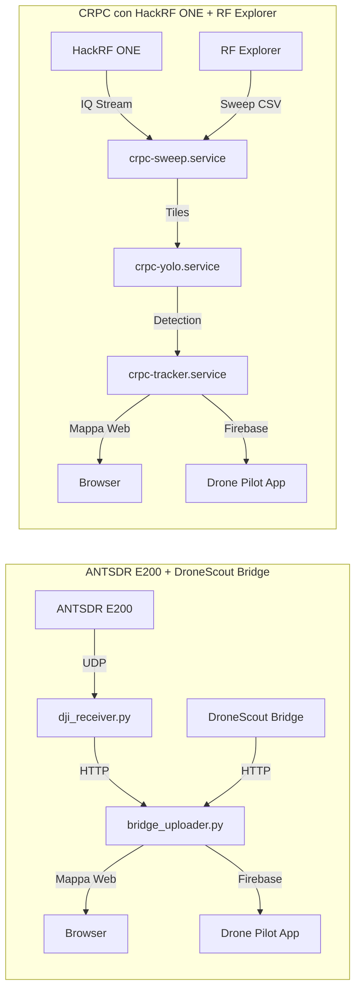

# 📡 Drone Detector con SDR e Raspberry Pi

Questo progetto utilizza **due ricevitori SDR distinti** su Raspberry Pi per rilevare droni di diverse tipologie:

1. **Sistema 1 – ANTSDR E200 + DroneScout Bridge**  
   Per il rilevamento **DJI DroneID** e **Remote ID**.
   Tutto gira su **Raspberry Pi3**.
2. **Sistema 2 – CRPC (Cognitive Radio Protocol Cracking)** con HackRF ONE + RF Explorer  
   Per l’analisi dello spettro RF e rilevamento di droni generici.
   Tutto gira su **Raspberry Pi5**

Entrambi inviano i dati a un **cruscotto web** integrato e possono trasmettere le tracce a **Firebase** per la visualizzazione su altre piattaforme (es. Drone Pilot App).

---

## ✅ Funzionalità principali
- **Rilevamento DJI DroneID** via ANTSDR E200
- **Rilevamento Remote ID** via DroneScout Bridge
- **Rilevamento generico droni** via CRPC con HackRF e RF Explorer
- **Cruscotto radio** per osservare il funzionamento del CRPC con **Modalità waterfall** per visualizzare lo spettro in tempo reale (HackRF)
- **Server web con mappa** e dashboard integrata
- **Invio dati** in rete locale o verso Firebase


---

## 📦 Struttura del repository su Raspberry Pi

### 1️⃣ Sistema ANTSDR E200 + DroneScout Bridge
```
/home/pi/                 # Sistema ANTSDR/DroneScout
├── bridge_uploader.py    # Riceve dati dal tracker e dal remotetracke e li invia su firebase
├── start_all.sh / stop_all.sh
├── static/               # Frontend mappa
├── trackers/             # Tracker per Drone ID, collegato ad AntSDR
│   ├── dji_receiver.py   # Riceve dati da AntSDR
│   └── service_controller.sh # Fa partire i servizi su AntSDR
└── remotetrack/          # Bridge Remote ID modificato per inviare i dati al bridge_uploader
```

### 2️⃣ Sistema CRPC con HackRF ONE + RF Explorer
```
/home/raffaello/crpc  # Sistema CRPC
├── run_hackrf_iq.sh      # Per far partire la ricezione su HackRF ONE triggerato da RF Explorer
├── rf_scan_classifier.py # Classificatore dei segnali, riceve sia da RF Explorer che controlla le immagini di HackRF ONE
├── iq_to_tiles_cmap_arg.py # trasforma in immagini i dati IQ di HackRF ONE
├── capability_classifier.py # Di supporto al classificatore per analizzare i segnali delle modulazioni dei droni
├── spectral_tracker.py   # Valuta lo spettrogramma delle immagini (tiles) di HackRF ONE
├── yolo_watcher.py       # Confronta le imamgini degli spettrogrammi (tiles) con quelle del dataset con YOLOv7  
├── crpc_api.py           # Interfaccia web e api JSON del sistema CRPC 
├── waterfall_web.py      # Waterfall web
/home/raffaello/dataset/  # Immagini YOLO per addestramento create dal sistema di apprendimento
/home/raffaello/apprendimento/ # Sezione dedicata all'apprendimento del dataset. Immagazzinamento immagini waterfall
/home/raffaello/rfe_bridge/ # Sezione dedicata al RF Explorer

```

---

# 1️⃣ Sistema ANTSDR E200 + DroneScout Bridge

### Installazione
1. Impostare IP Raspberry Pi: `192.168.1.5`
2. ANTSDR E200 con firmware DJI: IP `192.168.1.10`
3. Avviare tutti i servizi:
   ```bash
   ./start_all.sh
   ```
4. Arresto servizi:
   ```bash
   ./stop_all.sh
   ```

### Accesso mappa web
```
http://<IP_RPI>:8080
```

### Componenti principali
- **`dji_receiver.py`**: riceve UDP da ANTSDR e invia a `bridge_uploader.py`
- **`remotetrack/`**: riceve Remote ID e invia a `bridge_uploader.py`
- **`bridge_uploader.py`**: server web + gestione dati

---

# 2️⃣ Sistema CRPC con HackRF ONE + RF Explorer

### Login e IP
- Raspberry Pi CRPC: IP `192.168.1.6`
- Login: `raffaello / solita`

### Servizi principali
File di configurazione:
```
/etc/default/crpc
```
Target e unità principali:
```
crpc.target
crpc-prepare.service
crpc-sweep.service
crpc-tiles.service
crpc-yolo.service
crpc-tracker.service
crpc-rfscan.service
crpc-cleanup.service
```

### Stato servizi
```bash
# Stato generale
systemctl status crpc.target

# Servizi singoli
systemctl status crpc-sweep.service
journalctl -u crpc-yolo.service -f   # log YOLO + detections
systemctl status crpc-tracker.service
journalctl -u crpc-rfscan.service -f
```

### Avvio/Stop manuale
```bash
/usr/local/bin/start_crpc
/usr/local/bin/stop_crpc
```

### Pulizia file temporanei
```bash
/usr/local/bin/crpc_cleanup.sh
```

---

## 📊 Addestramento YOLO (solo su CRPC)
> L’addestramento si esegue solo in un **venv** dedicato per non interferire con i pacchetti di sistema.

```bash
python3 -m venv --system-site-packages ~/yolo-venv
source ~/yolo-venv/bin/activate
pip install --upgrade "numpy==1.26.4" pip
pip install --no-deps ultralytics
pip install "opencv-python<4.10" "pillow<11" "matplotlib<3.9"
```

Dataset RF:  
[Roboflow Dataset](https://universe.roboflow.com/rui-shi/drone-signal-detect-few-shot/dataset/6/images)

Esempio di training:
```python
from ultralytics import YOLO
m = YOLO('yolov8n.pt')
m.train(
    data='/home/raffaello/dataset/yolo_vision/data.yaml',
    epochs=50, imgsz=640, batch=8, workers=2,
    project='/home/raffaello/yolo_runs', name='rf_yolo',
    plots=False
)
```

---

## 🎯 Classificatore RF
Esempi di configurazioni:
```bash
# Bilanciato
python3 rf_scan_classifier.py --w-model 0.45 --w-csv 0.35 --w-img 0.20 --min-track-len 1 --fprint-min 0.05

# Alta precisione
python3 rf_scan_classifier.py --fprint-min 0.35
```

---

## 🌊 Modalità waterfall HackRF
```bash
mkfifo /tmp/hackrf.iq
hackrf_transfer -f 2440000000 -s 10000000 -a 1 -l 16 -g 32 -r /tmp/hackrf.iq
python waterfall_web.py
```

---

## 🌐 Accesso al cruscotto web CRPC
```
http://192.168.1.6:8080
```
Mostra:
- Waterfall (porta 8081) e Spectrum RF
- Log in tempo reale
- Immagini YOLO
- Apprendimento (porta 8082)

---

## 📊 Diagramma architetturale




# Direction Finding (DF) — Pseudo-Doppler / Sector-Scan per CRPC

## Obiettivo

Stimare l’**angolo di arrivo (AoA)** del segnale del drone (2.4 e 5.x GHz) usando **4 antenne settoriali** e hardware economico, ottenendo:

- un **bearing “coarse”** durante la scansione con **RF Explorer**;
- un **handoff automatico** all’**HackRF One** per l’analisi fine (tiles + classificatore);
- possibilità futura di **pseudo-Doppler rapido** (commutazione kHz) senza cambiare la meccanica.

---

## Architettura hardware

```
4× Patch APA-M25 (N/E/S/O) ──► SP4T 0.1–6 GHz
                                  │
                              [PAD 6–10 dB]
                                  │
                              [LNA 10–20 dB]   (unico, dopo SP4T)
                                  │
                           ┌──────┴────────────┐
                           │                    │
                       SPDT#1 (HMC849)      [PAD 3–10 dB] → HackRF One
                      RFE ↔ HackRF
                           │
                       SPDT#2 (HMC849)
                   RFE IN 2.4 ↔ RFE IN 5.x
                     │              │
                [BPF 2.4 GHz]   [BPF 5.8 GHz]
```

**Note pratiche**

- Cavi antenna→SP4T **tutti uguali**; tratti SP4T↔LNA↔SPDT più **corti** possibile.
- **PAD** (attenuatori fissi) per stabilità e per evitare overload su RFE/HackRF.
- **BPF** economici (Wi-Fi) solo sui due rami verso RF Explorer.
- Se uno switch non è **assorbente**, terminare le porte inattive a **50 Ω**.

---

## Cablaggio GPIO (Raspberry Pi, numerazione **BCM**)

| Switch | Segnale | GPIO | Pin fisico | Significato |
|---|---|---:|---:|---|
| **SP4T** | S0 | **17** | 11 | bit 0 antenna |
| **SP4T** | S1 | **27** | 13 | bit 1 antenna |
| **SP4T** | EN (opz.) | **22** | 15 | alto = abilitato |
| **SPDT#1** | H | **23** | 16 | 0 = RFE, 1 = HackRF |
| **SPDT#2** | B | **24** | 18 | 0 = 2.4, 1 = 5.x |

> Mettere **pull-down**, serie 100–330 Ω sui fili, **level-shifter** se qualche modulo vuole logica 5 V (HMC849 di solito accetta 3.3 V).  
> Se lo SP4T è “one-hot” (CH1..CH4) invece di binario S0/S1, usare 4 GPIO e tenerne **alto uno solo** alla volta.

**Truth table (SP4T binario)**

| S1 | S0 | Antenna |
|---:|---:|---|
| 0 | 0 | N (0°) |
| 0 | 1 | E (90°) |
| 1 | 0 | S (180°) |
| 1 | 1 | O (270°) |

---

## Tecnica DF: Sector-Scan (pseudo-Doppler “lento”)

Durante le sweep di RF Explorer, il software **ruota** la selezione del settore (SP4T) **tra uno sweep e il successivo**. Per la frequenza candidata \( f_0 \) (stimata dal trigger) raccogliamo i 4 livelli \(P_N, P_E, P_S, P_O\) e calcoliamo:

\[
X = P_E - P_O,\qquad Y = P_N - P_S,\qquad
\text{bearing} = \operatorname{atan2}(Y,\,X)\ \ [^\circ]
\]

Stabilizzazione con **EMA**:

\[
P_i \leftarrow \alpha\,P_i + (1-\alpha)\,P_{i,\text{mis}},\quad \alpha \approx 0.6
\]

Confidenza (contrasto normalizzato):

\[
\text{conf} = \frac{\max(P)-\min(P)}{\sum P + \varepsilon}
\]

Quando `conf ≥ soglia` → **handoff** su HackRF per tiles/classificatore.

> **Variante futura (opz.)**: commutazione dei 4 settori a qualche **kHz** e demodulazione della **fase** del tono Doppler con HackRF (pseudo-Doppler “vero”).

---

## Strategia di scansione e handoff

1. **2.4 GHz**: SPDT#2 su 2.4; SPDT#1 su **RFE**.  
2. Ad ogni **nuovo CSV** (`/tmp/rfe/scan/latest_24.csv`) selezionare il **prossimo** settore (N→E→S→O), leggere il livello al **bin** più vicino a \( f_0 \), aggiornare l’EMA.  
3. Ogni 4 sweep → calcolo **bearing** + **confidenza**.  
   - Se nessun segnale o conf bassa → passare a **5.x** (SPDT#2).  
   - Se conf ≥ soglia → **handoff** (SPDT#1 su HackRF) e avvio cattura IQ → tiles → classificatore.  
4. Al termine (timeout/clear) tornare a **RFE** e riprendere il ciclo.

---

## Pseudocodice (Python)

```python
from gpiozero import LED
import time, numpy as np, pathlib as P

# GPIO
S0, S1 = LED(17), LED(27)
H, B   = LED(23), LED(24)  # H: 0=RFE,1=HackRF  |  B: 0=2.4,1=5.x
def set_ant(i): S0.value, S1.value = (i & 1), ((i>>1) & 1)
def route_to_hackrf(on): H.value = bool(on)
def select_band(is_5x): B.value = bool(is_5x)

CSV24 = P('/tmp/rfe/scan/latest_24.csv')
CSV58 = P('/tmp/rfe/scan/latest_58.csv')

def sweep_band(csv, f0_mhz, ema=0.6, thresh=0.15):
    Pwr = np.zeros(4); i=0; last=0
    while True:
        if not csv.exists(): time.sleep(0.05); continue
        mt = csv.stat().st_mtime
        if mt != last:
            last = mt
            set_ant(i)  # antenna per PROSSIMO sweep
            data = np.loadtxt(csv, delimiter=',')  # [MHz, dB]
            k = np.argmin(np.abs(data[:,0]-f0_mhz))
            Pwr[i] = ema*Pwr[i] + (1-ema)*data[k,1]
            i = (i+1) % 4
            if i == 0:
                X = Pwr[1]-Pwr[3]; Y = Pwr[0]-Pwr[2]
                az = (np.degrees(np.arctan2(Y,X)) + 360) % 360
                conf = (Pwr.max()-Pwr.min())/(Pwr.sum()+1e-6)
                print(f"AZ={az:.0f}° conf={conf:.2f} P={np.round(Pwr,1)}")
                if conf >= thresh: return az, conf
        time.sleep(0.02)

# Esempio d'uso:
# select_band(False); route_to_hackrf(False)
# az, conf = sweep_band(CSV24, f0_mhz=2468.7)
# route_to_hackrf(True);  # handoff → HackRF tiles/classificatore
```

---

## Parametri consigliati (tuning)

- **EMA**: `α = 0.6` (reazione stabile, meno jitter).  
- **Soglia confidenza**: `0.12–0.20` (da tarare sul campo).  
- **Ordine bande**: provare prima **2.4**, poi **5.x** (o viceversa se il teatro è pulito a 5.x).  
- **PAD**: 6–10 dB tra SP4T e LNA; 3–10 dB verso HackRF e 3–6 dB verso RFE.  
- **LNA**: partire **senza**; aggiungerlo solo se i livelli sono bassi. Evitare guadagni “40 dB” senza PAD.

---

## Calibrazione

1. **Nord vero & `az_offset`**  
   Orientare fisicamente il box a **Nord vero** (non magnetico), marcare N-E-S-O sul coperchio, salvare un **az_offset** software.

2. **Equalizzazione settori**  
   In assenza di segnale, portare i 4 canali su livelli simili (PAD/trim o compensazione software).

3. **Livelli d’ingresso**  
   Evitare overload su RFE/HackRF: se serve, aumentare i PAD o ridurre il guadagno LNA.

---

## Troubleshooting

- **Conf bassa / bearing instabile** → controllare orientamento patch, cavi uguali, BPF corretti, vicinanza di grandi superfici metalliche (multipath).  
- **Saltellii sul bearing** → aumentare EMA o dwell (più sweep), elevare soglia `thresh`.  
- **Overload / clipping** → aggiungere PAD, ridurre LNA, verificare inserzione dei BPF.  
- **Ripple con antenne inattive** → se lo SP4T non è assorbente, terminare le porte a 50 Ω.

---

## Componenti essenziali

- **SP4T** 0.1–6 GHz (binario S0/S1 o “one-hot”).  
- **2× SPDT** (HMC849 o equiv.) per: RFE↔HackRF + IN 2.4↔5.x.  
- **LNA** (10–20 dB reali) *opzionale* dopo SP4T.  
- **PAD**: 3/6/10 dB (SMA, DC–6 GHz).  
- **BPF**: 2.4 GHz e 5.8 GHz (inline Wi-Fi).  
- **Terminazioni 50 Ω**, pigtail uguali, scatola schermata.

---

## Estensioni (futuro)

- **Pseudo-Doppler kHz**: commutazione rapida dei 4 settori e stima **di fase** del tono Doppler con HackRF (AoA più fine).  
- **Cross-detector X/Y**: 4 log-detector + 2 sottrattori analogici → bearing continuo anche senza RFE.


---

## ⚠️ Note legali
L’uso di questo sistema è soggetto alle normative locali su radiofrequenze e privacy.  
Verificare sempre la conformità prima dell’utilizzo.

**Licenza & crediti**: sezione DF per il progetto CRPC; riuso interno con attribuzione.

---

## 📚 Riferimenti e fonti utili
Questi materiali sono stati utili nello sviluppo del progetto CRPC:
- [RFUAV – GitHub repository](https://github.com/kitoweeknd/RFUAV/)
- [RFUAV – Articolo scientifico su arXiv](https://arxiv.org/html/2503.09033v2#bib)

---

## 📸 Screenshots

### 1️⃣ Sistema ANTSDR E200 + DroneScout Bridge

... da completare

### 2️⃣ Sistema CRPC con HackRF ONE + RF Explorer

<p align="center">
  <a href="http://www.kwos.org/appoggio/droni/dronedetector/crpc_01.png">
    
  </a>
  <a href="http://www.kwos.org/appoggio/droni/dronedetector/crpc_02.png">
    
  </a>
</p>

<p align="center">
  <a href="http://www.kwos.org/appoggio/droni/dronedetector/crpc_03.png">
    
  </a>
  <a href="http://www.kwos.org/appoggio/droni/dronedetector/crpc_04.png">
    
  </a>
</p>

<p align="center">
  <a href="http://www.kwos.org/appoggio/droni/dronedetector/crpc_05.png">
    
  </a>
  <a href="http://www.kwos.org/appoggio/droni/dronedetector/crpc_06.png">
    
  </a>
</p>
