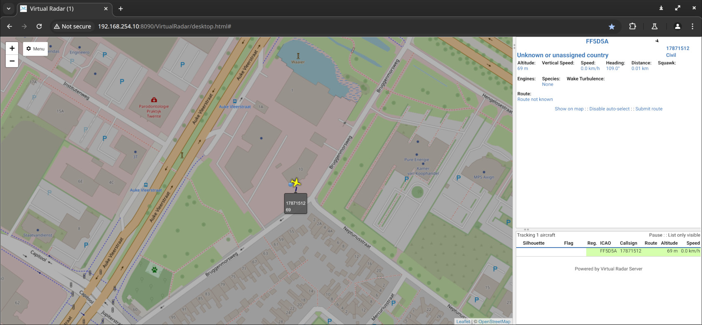

# RemoteID-DroneScout-Bridge-python


## What is it?
This repository contains Python reference code to display parse data of DroneScout Bridge receiver dongles (Technical: [MAVLink ADS-B vehicle](https://mavlink.io/en/messages/common.html#ADSB_VEHICLE) or [MAVLink OpenDroneID](https://mavlink.io/en/services/opendroneid.html) messages). It is a basic application that only displays the payload of these messages. It can also save detected signals to a CSV file. A similar application written in C can be found here: [RemoteID-DroneScout-Bridge-C](https://github.com/BluemarkInnovations/RemoteID-DroneScout-Bridge-C)


The DroneScout-Bridge receiver dongles can be purchased at [https://dronescout.co/](https://dronescout.co/bridge) The manual can be found here: [manual](https://download.bluemark.io/ds_bridge.pdf)


DroneScout Bridge receivers detect broadcast/direct drone Remote ID signals (Bluetooth, WLAN); a <em>"wireless number plate"</em> technology that is mandatory in several parts of the world e.g. USA, EU, Japan. It supports 2.4 GHz frequency band only and transmission protocols (WLAN Beacon, Bluetooth 4 Legacy, Bluetooth 5 Long Range.). Currently, 5 GHz support is missing to hardware limitations of the used WiFi/Bluetooth chip. A dual-band version of DroneScout Bridge (including 5 GHz) is expected to be ready in Q1 2025. There is also transmission protocol WLAN NaN which is rare and not allowed in the USA. Support for WLAN NaN is expected to be added via firmware upgrade. 


### DroneScout receivers vs DroneScout bridge
DroneScout receivers are designed for fixed installation with large detection range and support for all protocols and frequency band. DroneScout bridge is designed to be a low-cost RemoteID receiver dongle in situations where there is only one RemoteID drone. In case of multiple drones, the data refresh rate can be much slower.


### Applications
DroneScout bridge has several use cases:

<ul>
<li><i>wireless relay</i>: Most iOS and Android phones only receive RemoteID signals in Bluetooth legacy format. DroneScout Bridge can receive RemoteID signals (WLAN Beacon, Bluetooth Long Range) and wireless relay them in a format that your smartphone understands. You can keep using your favorite RemoteID app.</li>
<li><i>RemoteID receiver for your drone</i>: Install the DroneScout bridge on your drone and use it for DAA (Detect And Avoid) scenarios. The device allows outputting data using MAVLink ADS-B vehicle format on an UART interface.</li>
<li><i>RemoteID receiver for your own application/product</i>: Connect the DroneScout Bridge to your processing platform (computer, Raspberry Pi etc). The device allows outputting data using MAVLink OpenDroneID format on an UART interface. Use this data to collect RemoteID data of nearby phones. DroneScout Bridge allows to connect multiple DroneScout Bridge devices by using the IN and OUT UART connectors.</li>
</ul>
#RemoteID #FAA #F3411 #DIN_EN_4709-002 #dronetechnology #DAA_DetectAndAvoid


## Installation
The code is Python3 code. It needs these dependencies (tested under Ubuntu):

```
sudo pip3 install pymavlink bitstruct
```


## Configuration

In the config.py file, enter the correct settings for the ``interface``. If you want to save detected RemoteID signals to a CSV file, uncomment ``log_path``


## Usage
Start the script to receive and show Remote ID signals of nearby drones.

```
python3 main.py
```


### SBS BaseStation
The Python code can also output data via [SBS BaseStation](http://woodair.net/sbs/article/barebones42_socket_data.htm) on a net socket. To enable this, uncomment the variables sbs_``server_ip_address`` and ``sbs_server_port`` in config.py. Normally you only need to change the port. The IP address needs to be an IP address of the computer where this script runs. Only change it, if you want to have the SBS BaseStation export available on a particular network interface.

This export data format is used by programs that display ADS-B data from airplanes. Examples of such programs that support this data format are: [Virtual Radar Server](https://www.virtualradarserver.co.uk/) and [FlightAirMap](https://www.flightairmap.com/). A typical use case is, if you want to view both ADS-B data from airplanes and RemoteID signals from drones in one application. To configure a SBS BaseStation receiver in Virtual Radar Server, see this [link](https://www.virtualradarserver.co.uk/Documentation/WebServer/ReceiversOptions.aspx)

Note: for exporting data, the normal Serial Number of RemoteID is too long. It is decided in this implementation to use an ICAO code starting with FF. This range is **not** assigned to a country. The remaining 4-digits in the ICAO code are based on the Serial Number of the drone (hash). In this way, each drone has its own unique ICAO code. The 8-character call sign is based on the first 4 digits of the Serial Number (manufacturer code) and the last 4 digits.



