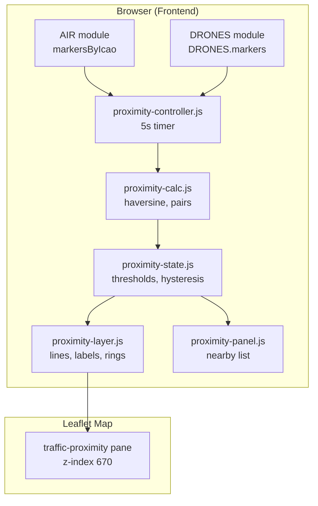
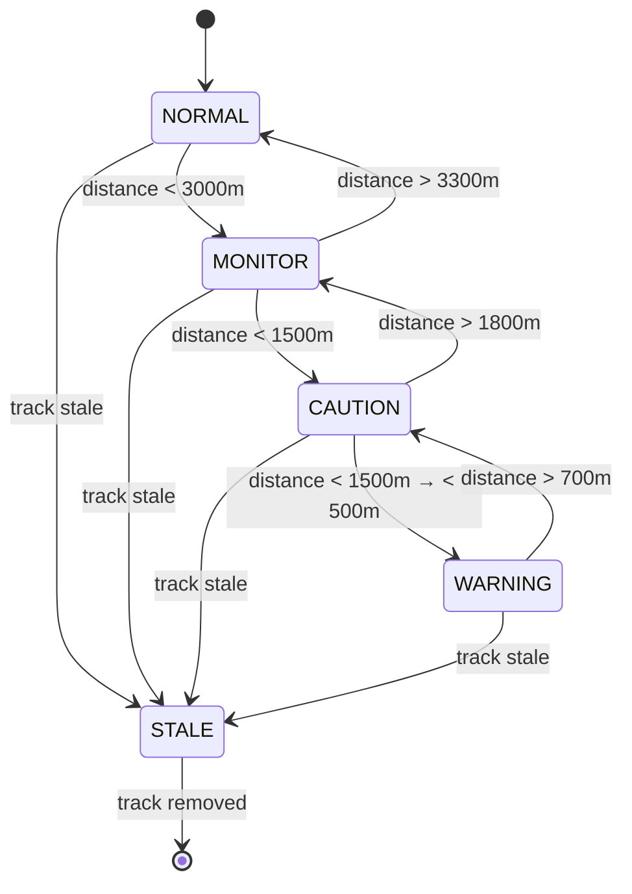
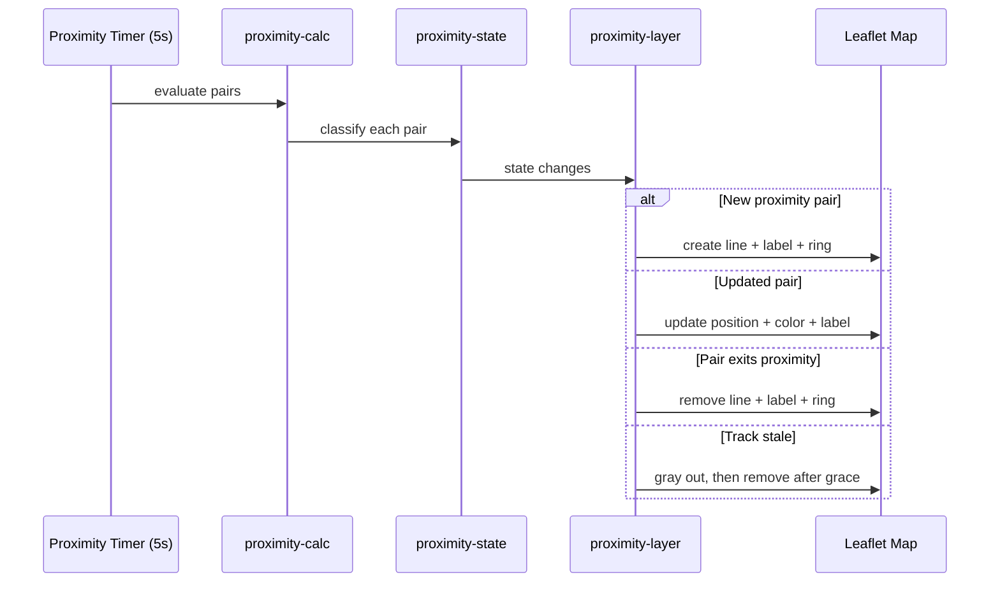

# MT-TRAFFIC-01 — Traffic Proximity Awareness

## Technical Design

---

## Verified Current Traffic Architecture

### Aircraft Data Sources

| Source | Backend Service | API | Refresh | Fields |
|--------|----------------|-----|---------|--------|
| Local ADS-B | `services/air_local.py` | `GET /api/air/local?bounds` | 15s (frontend) | icao, callsign, lat, lon, altitude (meters, converted from ft), speed (m/s, converted from knots), heading, category, isHelicopter, source, updatedAt (ms epoch) |
| Network ADS-B | `services/air_network.py` | `GET /api/air/network?bounds` | 15s (frontend) | Same structure; merged from SolarMonitor, OGN-ADSB, OpenSky |

**Altitude reference**: Local ADS-B uses `alt_geom` or `alt_baro` from readsb (feet, converted to meters). Network sources vary: OpenSky returns geometric/barometric meters, SolarMonitor returns feet (converted). All are approximate MSL.

**Speed**: Converted to m/s from knots (ground speed).

### Drone Data Sources

| Source | Backend Service | API | Refresh | Fields |
|--------|----------------|-----|---------|--------|
| Remote ID (DS110) | `services/ds110.py` | `GET /api/remoteid/aircraft` | 5s (frontend) | serial, vendor, model, lat, lon, altitude (ODID geometric, meters above WGS84 ellipsoid), height (AGL, meters), speed (m/s from ODID), heading, operator_lat, operator_lon, last_seen (ISO UTC), source, id_type, ua_type |

**Altitude reference**: ODID `altitude` = geometric altitude (WGS84 ellipsoid - 2000)/2. ODID `height` = height above takeoff. These are NOT the same reference as ADS-B barometric/geometric altitude.

**Key differences**:
- Aircraft `updatedAt` = millisecond epoch; Drone `last_seen` = ISO 8601 UTC string
- Aircraft identified by `icao`; Drone identified by `serial`
- Aircraft speed in m/s (from knots); Drone speed in m/s (from ODID encoding)
- Aircraft altitude ≈ MSL; Drone altitude ≈ WGS84 ellipsoid (incompatible for comparison)

### Frontend Traffic State

| Module | Global | Markers | Timer |
|--------|--------|---------|-------|
| Aircraft | `window.AIR` | `markersByIcao` (Map) | 15s `setInterval` |
| Drones | `window.DRONES` | `DRONES.markers` (object keyed by serial) | 5s `setInterval` |
| OGN/FLARM | `window.GLIDER` | managed by `GLIDER_LAYER` | 10s `setInterval` |

### Map Panes

| Pane | z-index | Content |
|------|---------|---------|
| `traffic-air` | 650 | Aircraft markers and trails |
| `traffic-glider` | 655 | OGN/FLARM markers |
| `traffic-drone` | 660 | Drone markers |

### Stale Handling (Current)

- **Aircraft**: `MAX_MISSES = 2` cycles (30s), then grayscale + fade; removed after `STALE_GRACE_MS = 60000` (60s)
- **Drones**: Removed immediately when not in the API response (no grace period)

### Existing Helpers

- No geographic distance utilities exist in the codebase
- No proximity or spatial calculation modules exist
- Haversine must be implemented

### Configuration

- `config/settings.json` via `backend/config.py` — `SETTINGS` dict, `save_settings()`
- Frontend uses `localStorage` for display preferences
- No existing `proximity` or `traffic_awareness` settings section

### Tests

- No automated test framework exists
- No traffic simulation or mock facilities exist

---

## Proposed Architecture

### Design Decision: Frontend-Only Calculation

**Recommendation**: Implement proximity calculations entirely in the frontend.

**Rationale**:
1. Both aircraft and drone state already exist in browser memory (markers)
2. No new API needed — the frontend already has all required data
3. Avoids adding threads or computation load to the Raspberry Pi backend
4. Calculation is lightweight (haversine for ≤50 pairs at 5s cadence)
5. Rendering updates are immediate without HTTP round-trip
6. Configuration can use `localStorage` initially, `settings.json` later

**Trade-off**: If a future feature needs proximity state on the backend (e.g., Meshtastic alerts), a backend module will be needed. The architecture should keep calculation logic in a reusable module.

### Module Structure

```
frontend/js/proximity/
├── proximity-calc.js      # Haversine, distance pairs, state machine
├── proximity-state.js     # State management, thresholds, hysteresis
├── proximity-layer.js     # Map objects (lines, labels, rings)
├── proximity-panel.js     # Nearby-traffic panel UI
└── proximity-controller.js # Init, timer, integration with AIR + DRONES
```

### Architecture Diagram



---

## Distance Calculation

### Haversine Formula

```javascript
function haversineMeters(lat1, lon1, lat2, lon2) {
    const R = 6371000; // Earth radius in meters
    const dLat = (lat2 - lat1) * Math.PI / 180;
    const dLon = (lon2 - lon1) * Math.PI / 180;
    const a = Math.sin(dLat/2) * Math.sin(dLat/2) +
              Math.cos(lat1 * Math.PI / 180) * Math.cos(lat2 * Math.PI / 180) *
              Math.sin(dLon/2) * Math.sin(dLon/2);
    const c = 2 * Math.atan2(Math.sqrt(a), Math.sqrt(1-a));
    return R * c;
}
```

### Pair Evaluation

For each active drone:
1. Filter aircraft within evaluation radius (default 10 km) using fast lat/lon bounding box pre-filter
2. Calculate haversine distance for remaining candidates
3. Sort by distance
4. Apply state classification

### Pre-filter (fast reject)

At typical latitudes (40-50°N), 10km ≈ 0.09° latitude, ≈ 0.12° longitude. A bounding-box check avoids haversine for distant aircraft.

---

## State Model



### Hysteresis

Each state transition uses separate entry and exit thresholds:
- Enter MONITOR: distance < 3000m
- Exit MONITOR: distance > 3300m (10% hysteresis)
- Same pattern for CAUTION and WARNING

This prevents flickering when an aircraft hovers near a threshold boundary.

### Stale Timeout

When a track becomes stale:
1. Pair state → STALE
2. Proximity graphics switch to gray/dashed
3. After 10s grace, proximity graphics are removed
4. Pair is dropped from evaluation

---

## Movement Analysis

### Distance Trend

Maintain a short history (last 3 distance calculations, ~15s window):

```javascript
{
    pairId: "DRONE_serial:AC_icao",
    history: [
        { time: t1, distance: d1 },
        { time: t2, distance: d2 },
        { time: t3, distance: d3 }
    ]
}
```

**Approaching**: if distance decreased consistently over at least 2 samples spanning > 3 seconds.
**Diverging**: if distance increased consistently over at least 2 samples spanning > 3 seconds.
**Stable/Unknown**: otherwise.

### Requirements for Movement Determination

- Minimum 2 history entries
- Time span > 3 seconds between oldest and newest
- Both entries must have valid coordinates
- No implausible jump (> 50km) between consecutive entries

### Excluded from MVP

- Closing speed (m/s rate of change)
- CPA calculation
- TCPA prediction

These are prepared architecturally (the history buffer supports them) but not computed in the MVP.

---

## Altitude Handling

### Analysis of References

| Source | Altitude Field | Reference |
|--------|---------------|-----------|
| Local ADS-B | `altitude` | Barometric or geometric, ≈ MSL, feet→meters |
| Network ADS-B (OpenSky) | `altitude` | Geometric meters MSL |
| Network ADS-B (SolarMonitor) | `altitude` | feet→meters, baro or geo |
| Remote ID (ODID) | `altitude` | Geometric WGS84 ellipsoid |
| Remote ID (ODID) | `height` | AGL (above takeoff) |

**Conclusion**: Aircraft altitude ≈ MSL (mixed baro/geo). Drone altitude = WGS84 ellipsoid. The difference between MSL and WGS84 can be 20-50m in Italy. Combined with baro/geo mixing, **vertical separation cannot be reliably determined**.

### MVP Decision

- **Do not display vertical separation warnings**
- **Do display raw altitude values** in the nearby-traffic panel for informational awareness
- **Prepare** the data structure to include vertical fields for future use
- **Never** generate a proximity state escalation based on altitude alone

---

## Configuration

### Settings Location

Add `proximity` section to `config/settings.json`:

```json
{
  "proximity": {
    "enabled": true,
    "evaluation_radius_m": 10000,
    "thresholds": {
      "monitor_entry_m": 3000,
      "monitor_exit_m": 3300,
      "caution_entry_m": 1500,
      "caution_exit_m": 1800,
      "warning_entry_m": 500,
      "warning_exit_m": 700
    },
    "stale_timeout_aircraft_ms": 30000,
    "stale_timeout_drone_ms": 15000,
    "stale_grace_ms": 10000,
    "calculation_interval_ms": 5000,
    "max_nearby_display": 5,
    "show_approaching_diverging": true,
    "pulse_on_warning": true
  }
}
```

### Frontend Access

Loaded via existing `GET /api/settings` (already used by `dashboard.js`). No new API endpoint needed for reading. A new `POST /api/settings/proximity` route will allow Dashboard configuration.

---

## API Changes

### New Route

`backend/routes/settings.py` — add proximity settings endpoint:

```
GET  /api/settings/proximity    → returns proximity config
POST /api/settings/proximity    → updates proximity config, calls save_settings()
```

### No New Traffic APIs

Proximity calculation happens in the frontend using data already available from existing APIs.

---

## Map Integration

### New Pane

```javascript
map.createPane("traffic-proximity");
map.getPane("traffic-proximity").style.zIndex = 670;
```

Z-index 670 places proximity graphics above all traffic layers but below UI overlays.

### Visual Elements

| Element | When Shown | Style |
|---------|-----------|-------|
| Distance line | Reference drone → nearest proximity aircraft | Dashed, colored by state |
| Distance label | On the line midpoint | Text with background |
| Proximity ring | On aircraft marker | Colored circle border |
| Approaching/diverging arrow | In nearby panel | ↓ (red) / ↑ (green) |
| Pulse animation | WARNING state only | Subtle CSS pulse on ring (if enabled) |

### Colors

| State | Line Color | Ring Color |
|-------|-----------|-----------|
| MONITOR | `#007AFF` (blue) | `#007AFF` |
| CAUTION | `#FF9500` (orange) | `#FF9500` |
| WARNING | `#FF3B30` (red) | `#FF3B30` |
| STALE | `#8E8E93` (gray) | `#8E8E93` |

### Object Lifecycle



---

## Nearby Traffic Panel

A compact floating panel (bottom-left or bottom-right of map) showing:

```
┌─────────────────────────────┐
│ NEARBY TRAFFIC              │
│ Ref: DJI Mavic 3 (1581F…)  │
├─────────────────────────────┤
│ ↓ ICA4B1A2E  450m  WARNING │
│ ↑ POLI32     1.2km MONITOR │
│   CC118      2.8km MONITOR │
│   N/A        4.1km NORMAL  │
└─────────────────────────────┘
```

- Shows when at least one drone is active AND at least one aircraft is within evaluation radius
- Hidden when no drone is present
- Maximum 5 entries
- Updates every calculation cycle

---

## Logging

Use existing `console.log` / `console.warn` pattern with `[PROXIMITY]` prefix for frontend logging.

No backend logging changes needed (no backend proximity computation).

---

## Error Handling

| Condition | Behavior |
|-----------|----------|
| No drones visible | Disable proximity, hide panel, remove graphics |
| No aircraft visible | Show panel with "No aircraft in range" |
| Invalid drone coordinates | Skip drone, log warning |
| Invalid aircraft coordinates | Skip aircraft |
| Position jump > 50km | Skip update, mark history uncertain |
| Configuration missing | Use hardcoded defaults |
| Settings API unreachable | Use last known or defaults |

---

## Performance Analysis

### Expected Load (typical operation)

- Drones: 1-3 (usually 1 in range)
- Aircraft within 10km: 0-15 (depends on location)
- Pairs to evaluate: 1-45
- Haversine calculations per cycle: 1-45
- Cycle time: ~1ms for 45 haversine calls (negligible)

### Optimization Strategy

1. Bounding-box pre-filter eliminates distant aircraft without haversine
2. Only recalculate when underlying data changes (check `updatedAt`)
3. Limit history buffer to 3 entries per pair
4. Debounce panel updates (no more than 1 DOM update per cycle)
5. Use `requestAnimationFrame` for Leaflet layer updates

### Raspberry Pi Constraints

- Browser rendering is the bottleneck, not calculation
- Limit to 1 distance line + 5 proximity rings maximum
- Use lightweight Leaflet objects (circles, polylines) not complex SVGs
- Avoid continuous animation; pulse only on WARNING state

---

## Compatibility

- Does not modify `air-layer.js`, `drone-layer.js`, or their data structures
- Reads from existing marker collections (`markersByIcao`, `DRONES.markers`)
- Does not modify marker popups (adds information via panel, not popup replacement)
- Works alongside existing mission layers (different pane)
- No conflict with dark-map overlay (proximity pane above it)

---

## Migration

No migration needed. Feature is purely additive:
- New JS modules
- New CSS
- New settings section (added to existing settings.json)
- New map pane
- New settings route

Disabling `proximity.enabled` removes all proximity behavior cleanly.

---

## Test Strategy

### Unit Tests (pytest + JS test runner)

- Haversine accuracy against known distances
- State transitions with hysteresis
- Stale detection
- Movement analysis (approaching/diverging)
- Invalid data handling
- Bounding-box pre-filter

### Synthetic Traffic Tests

- Python script generating mock aircraft + drone positions
- Inject via local API or mock JSON files
- Test scenarios: approaching, crossing, departing, stale

### Frontend Integration Tests

- Verify panel appears/disappears correctly
- Verify map objects created/removed
- Verify color changes at threshold boundaries

### Physical Validation (separate task)

- Deploy to Mini Tracker staging
- Observe with real ADS-B + test Remote ID beacon
- Measure CPU/RAM impact
- Verify Dashboard responsiveness

---

## Physical Validation Plan

1. Record stable starting commit
2. Deploy committed proximity feature to `/home/pi/tracker-mini-staging`
3. Stop `tracker-mini.service`
4. Start staging version
5. Verify local ADS-B active (readsb output present)
6. Place DS110 receiver in range of test drone (or use drone beacon simulator)
7. Observe proximity calculations and map rendering
8. Measure CPU with `htop`
9. Verify stale cleanup when drone is powered off
10. Verify no interference with existing traffic layers
11. Stop staging, restore stable service
12. Record results in `AI_HANDOFF.md`

---

## Security and Privacy

- No new external network requests
- No new data sent to DSC or third parties
- Proximity state is ephemeral (in-memory only)
- No PII exposed beyond what existing traffic markers already show
- No new authentication requirements

---

## Risks

| Risk | Impact | Mitigation |
|------|--------|-----------|
| Drone update rate (5s) limits movement analysis accuracy | Approaching/diverging may be unreliable | Require ≥2 samples over >3s; show "unknown" when uncertain |
| Aircraft altitude incompatible with drone altitude | Cannot determine vertical separation | Do not display vertical warnings in MVP |
| Noisy GPS on drone causes false proximity changes | Flickering states | Hysteresis + minimum movement threshold |
| Multiple drones create visual clutter | Map becomes confusing | Use only nearest drone as reference; limit to 1 line |
| Raspberry Pi browser struggles with rendering | Dashboard lag | Limit visual elements; avoid continuous animation |
| ADS-B position delayed by network source latency | Displayed distance is stale | Show updatedAt age in panel; mark if > 15s old |

---

## Rejected Alternatives

| Alternative | Reason for Rejection |
|-------------|---------------------|
| Backend proximity calculation with new API | Adds Raspberry Pi CPU load, requires new endpoint, adds latency; frontend already has all data |
| Calculate for ALL drone-aircraft pairs simultaneously | Visual clutter, performance cost, confusing UX with multiple lines |
| Use drone height (AGL) for vertical comparison | AGL reference point unknown, incompatible with ADS-B MSL |
| Implement full CPA/TCPA in MVP | Insufficient data quality (5s drone updates, noisy GPS); risk of misleading predictions |
| Persistent proximity log | Adds storage writes; not needed for operational awareness; can be added later |
| Sound alerts | May be disruptive in field operations; can be added in a future iteration |
