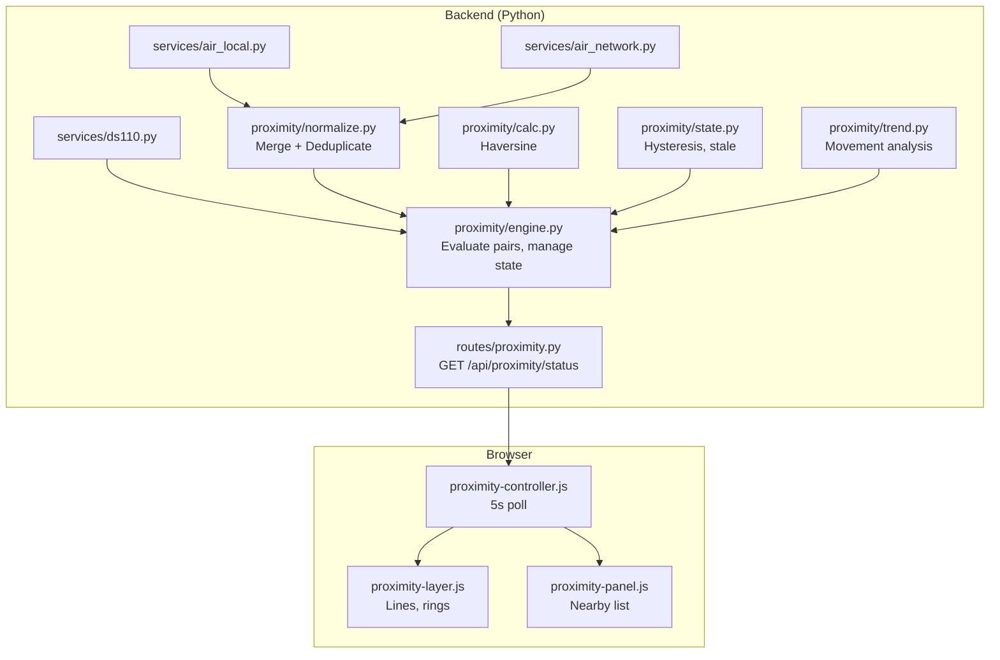
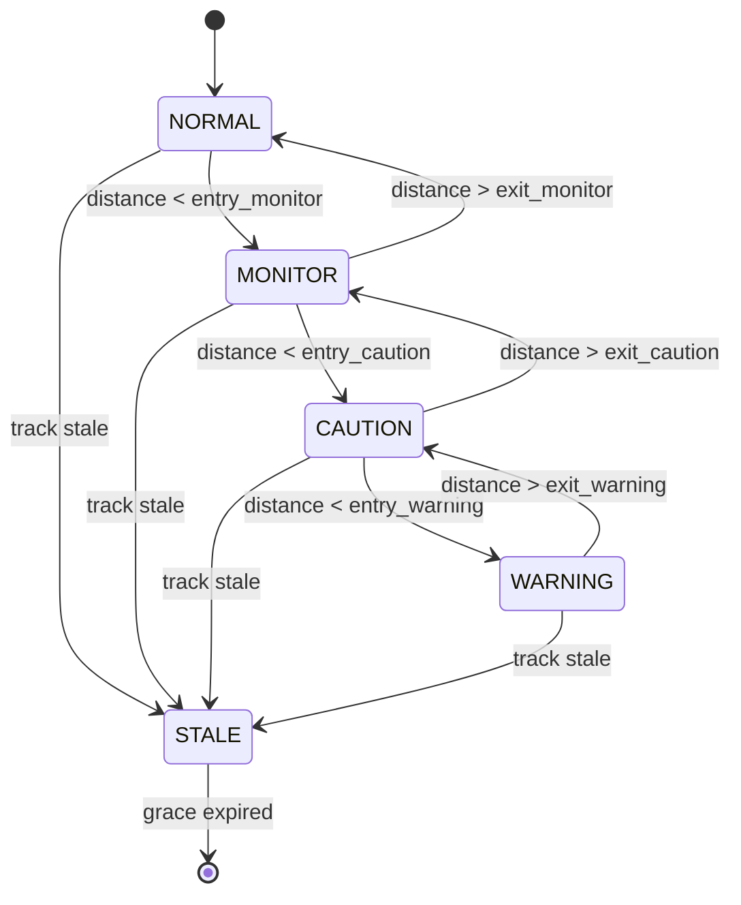

# MT-TRAFFIC-01 — Traffic Proximity Awareness

## Technical Design (Revision 2)

---

## 1. Verified Current Traffic Architecture

### 1.1 ADSBRx (Local ADS-B)

| Aspect | Detail |
|--------|--------|
| Decoder | `readsb-local.service` (systemd) |
| Output | `/run/readsb/aircraft.json` |
| Backend service | `services/air_local.py` |
| API | `GET /api/air/local?minLat&maxLat&minLon&maxLon&showAll` |
| Enable/disable | `POST /api/readsb/enable` → systemctl start/stop, persists `settings.traffic.adsb_local_enabled` |
| Health | File exists AND mtime < 30s |
| Frontend toggle | `adsbLocalEnabled` checkbox → API call |
| Frontend label | "ADSB Rx" |
| Refresh | 15s frontend polling |

**Aircraft fields from ADSBRx** (normalized in `air_local.py`):

```python
{
    "icao": str,          # hex ICAO address
    "callsign": str,      # flight ID or ICAO
    "lat": float,         # WGS84 latitude
    "lon": float,         # WGS84 longitude
    "altitude": float,    # meters (converted from alt_geom or alt_baro feet)
    "speed": float|None,  # m/s (converted from knots ground speed)
    "heading": float,     # degrees track
    "category": str|None, # ADSB category code (A1-A7, etc.)
    "isHelicopter": bool, # category == "A7"
    "source": "LOCAL_ADSB",
    "updatedAt": int      # milliseconds epoch (time.time() * 1000)
}
```

**Altitude reference**: `alt_geom` (geometric feet MSL) preferred, fallback `alt_baro` (barometric feet). Converted to meters. Approximate MSL.

**Coordinate validation**: `lat is not None and lon is not None` (no explicit 0,0 rejection — readsb does not emit 0,0 for missing positions; it omits the fields entirely).

### 1.2 ADSBNet (Network ADS-B)

| Aspect | Detail |
|--------|--------|
| Backend service | `services/air_network.py` |
| Providers | SolarMonitor, OGN-derived ADSB, OpenSky |
| API | `GET /api/air/network?minLat&maxLat&minLon&maxLon&showAll` |
| Enable/disable | **Frontend-only**: `localStorage("adsbNetworkEnabled")` — if "false", frontend skips API call |
| Backend enable | None — backend always serves if asked |
| Internet check | `services/network.py: has_internet()` (TCP 8.8.8.8:53 timeout 2s) |
| Provider failure | Each returns `[]` independently on timeout/error |
| Merge | `merge_aircraft(*lists)` — dedup by ICAO, keep newest `updatedAt` |
| Frontend label | "ADSB Net" |
| Refresh | 15s frontend polling (same timer as ADSBRx) |

**Aircraft fields from ADSBNet** (same structure as ADSBRx):

```python
{
    "icao": str,
    "callsign": str,
    "lat": float,
    "lon": float,
    "altitude": float,    # meters (sources vary: OpenSky=geo meters, Solar=feet→m)
    "speed": float|None,  # m/s (from knots)
    "heading": float,
    "category": str|None,
    "isHelicopter": bool,
    "source": "SOLARMONITOR_ADSB" | "OGN_ADSB" | "OPENSKY",
    "updatedAt": int      # milliseconds epoch
}
```

**Existing merge logic** (`merge_aircraft`): iterates all provider lists, deduplicates by `icao`, keeps entry with newest `updatedAt`. This means source provenance is lost after merge — only the winning source's `source` field survives.

**Key finding**: ADSBNet has NO backend-side enable/disable. The preference lives entirely in the browser localStorage. The backend proximity engine cannot directly know whether the user wants ADSBNet — it must be told via configuration.

### 1.3 Remote ID (Drones)

| Aspect | Detail |
|--------|--------|
| Backend service | `services/ds110.py` |
| Protocol | MAVLink (OPEN_DRONE_ID_MESSAGE_PACK + BAD_DATA decode) |
| Serial | Configured in `settings.ds110.device` at `settings.ds110.baudrate` |
| API | `GET /api/remoteid/aircraft` |
| Enable/disable | `POST /api/ds110/enable` → start/stop worker thread |
| Health | `is_alive()` — MAVLink heartbeat within 30s |
| In-memory cache | `remoteid_aircraft` dict keyed by serial/operator_id |
| Frontend label | "RID" |
| Refresh | 5s frontend polling |

**Drone fields**:

```python
{
    "source": "RemoteID" | "DJI DroneID",
    "serial": str|None,       # ODID Basic ID (primary identifier)
    "vendor": str|None,       # identified from serial prefix
    "model": str|None,        # identified from serial code
    "lat": float|None,        # WGS84 latitude
    "lon": float|None,        # WGS84 longitude
    "altitude": float|None,   # meters (ODID geometric, WGS84 ellipsoid, (raw-2000)/2)
    "height": float|None,     # meters AGL (ODID, (raw-2000)/2)
    "speed": float|None,      # m/s (ODID encoding)
    "heading": float|None,    # degrees (ODID direction)
    "operator_lat": float|None,
    "operator_lon": float|None,
    "operator_altitude": float|None,
    "operator_id": str|None,
    "last_seen": str          # ISO 8601 UTC (datetime.now(timezone.utc).isoformat())
}
```

**Coordinate validation**: `is_valid_position(lat, lon)` — rejects `(0.0, 0.0)` (ODID sentinel for no GPS fix), validates -90≤lat≤90, -180≤lon≤180.

**Altitude reference**: ODID `altitude` = geometric altitude above WGS84 ellipsoid. NOT comparable to ADS-B barometric/MSL.

### 1.4 OGN/FLARM (Deferred from MVP)

| Aspect | Detail |
|--------|--------|
| Backend service | `services/ogn_network.py` |
| Data source | `solarmonitor.kwos.org/api/ogn/traffic` (filtered: FLARM, SAFESKY, FREEFLIGHT, FANET) |
| API | `GET /api/ogn/network?bounds` |
| Enable/disable | Frontend-only: `localStorage("ognNetworkEnabled")` |
| Requires Internet | Yes |
| Separate from ADSBNet | Yes — different endpoint, different source filter, different frontend module |

**Decision**: OGN/FLARM is deferred from the proximity MVP. The architecture supports adding it later as an additional source category.

---

## 2. Proposed Architecture

### 2.1 Authoritative Backend Proximity Engine

The proximity engine runs in the **backend** (Python).

**Rationale**:
- Future Meshtastic alerts need proximity state from backend
- Single source of truth for thresholds/stale/hysteresis (no JS/Python duplication)
- Backend already has access to all traffic data
- Normalizes and deduplicates before evaluation
- API makes results available to any consumer

**Trade-off**: Adds lightweight computation to the Flask process. Acceptable because calculation is O(n×m) with small n,m and completes in <100ms.

### 2.2 Module Structure

**Runtime files (deployed by updater)**:
```
backend/services/proximity/
├── __init__.py
├── engine.py           # Main evaluation loop, managed worker
├── adsb_net_cache.py   # ADSBNet snapshot cache worker
├── normalize.py        # Aircraft normalization, deduplication, source merge
├── calc.py             # Haversine, bounding-box filter
├── state.py            # State machine, hysteresis, stale lifecycle
├── trend.py            # Movement trend analysis
└── config.py           # Code-defined defaults, config access

backend/routes/
└── proximity.py        # API: config + status endpoints

frontend/js/proximity/
├── proximity-controller.js  # Poll API, manage lifecycle
├── proximity-layer.js       # Leaflet objects (lines, rings, labels)
└── proximity-panel.js       # Nearby-traffic panel

frontend/css/
└── proximity.css            # Proximity styles

frontend/help/docs/          # Documentation (deployed)
```

**Development-only files (NOT deployed)**:
```
tests/
├── conftest.py
├── requirements-dev.txt
├── test_proximity_calc.py
├── test_proximity_normalize.py
├── test_proximity_stale.py
├── test_proximity_config.py
├── test_proximity_state.py
├── test_proximity_trend.py
├── test_proximity_engine.py
├── test_proximity_source_switching.py
├── test_proximity_hysteresis.py
├── test_proximity_integration.py
└── fixtures/

.kiro/specs/                  # Feature specs
pytest.ini                    # Test configuration
```

**Deployment verification**: Removing all development-only files must not prevent the feature from operating. The deployed runtime is complete using only `backend/` and `frontend/`.

### 2.3 Architecture Diagram



### 2.4 Responsibility Split

**Backend**:
- Read ADSBRx tracks from `air_local.py` (call `get_local_aircraft` with wide bounds)
- Read optional ADSBNet tracks from `air_network.py` (only if enabled in proximity config)
- Read drone tracks from `ds110.py` (`get_aircraft()`)
- Normalize fields and units
- Deduplicate aircraft by ICAO
- Preserve source provenance
- Validate coordinates and timestamps
- Evaluate all valid drone-aircraft pairs
- Calculate horizontal distance (haversine)
- Manage track freshness per-source and per-normalized-target
- Manage hysteresis state
- Calculate movement trend
- Expose results via `GET /api/proximity/status`
- Provide reusable internal interface for future Meshtastic alerts

**Frontend**:
- Poll `/api/proximity/status` every 5 seconds
- Render nearby-traffic panel
- Render distance lines, labels, proximity rings
- Apply optional pulse animation
- Clean up Leaflet objects
- Show source provenance where appropriate
- Do NOT independently calculate proximity states

### 2.5 ADSBNet Snapshot Cache

The proximity engine must NOT fetch Internet providers on every 5-second cycle.

**Design**: A shared `ADSBNetCache` service performs provider retrieval at a separate interval:

```python
class ADSBNetCache:
    refresh_interval_ms: int = 15000  # configurable, ≥ current frontend cadence
    last_fetch_time: float
    last_result: ProviderResult
    fetch_in_progress: bool

    def get_snapshot() -> ProviderResult:
        """Returns last completed result (never blocks on network)."""

    def _refresh():
        """Called by the worker; fetches providers, stores result."""
```

**Cadence separation**:

| Cadence | Value | Purpose |
|---------|-------|---------|
| ADSBNet provider refresh | 15s (configurable: `adsb_net_refresh_interval_ms`) | Actual Internet requests |
| ADSBRx local read | Every proximity cycle (5s) | Local file read, no network |
| Proximity calculation | 5s (`calculation_interval_ms`) | Evaluate pairs |
| Frontend API poll | 5s | Display results |

The proximity engine calls `adsb_net_cache.get_snapshot()` which returns immediately with the latest cached data. If a refresh is in progress, the previous valid snapshot is returned.

### 2.6 Managed Proximity Worker Lifecycle

The proximity engine runs as a managed background daemon thread, independent of browser connections (required for future Meshtastic consumers).

```python
class ProximityEngine:
    _thread: threading.Thread | None
    _stop_event: threading.Event
    _snapshot: ProximitySnapshot  # thread-safe immutable result
    _started: bool = False

    def start(self):
        """Idempotent start. No-op if already running."""
        if self._started:
            return
        self._started = True
        self._stop_event = threading.Event()
        self._thread = threading.Thread(target=self._loop, daemon=True)
        self._thread.start()

    def stop(self):
        """Clean shutdown. Signals thread and waits."""
        self._stop_event.set()
        if self._thread:
            self._thread.join(timeout=5)
        self._started = False

    def _loop(self):
        """Main worker loop."""
        while not self._stop_event.is_set():
            self._calculate_cycle()
            self._stop_event.wait(timeout=self._interval_s)

    def get_snapshot(self) -> ProximitySnapshot:
        """Thread-safe read of latest results. Used by API route and future Meshtastic."""
        return self._snapshot
```

**Duplicate prevention**: `start()` is idempotent. Flask debug reload with `use_reloader=True` may call startup twice — the `_started` flag prevents duplicate threads. In production (single-process `app.run`), this is not an issue.

**Shutdown**: `stop()` uses `Event.set()` to interrupt the `wait()`, ensuring clean exit without hanging threads.

---

## 3. Normalized Aircraft Model

```python
class NormalizedTarget:
    track_id: str               # Primary: ICAO hex; fallback: synthetic ID
    icao: str | None
    callsign: str | None
    latitude: float
    longitude: float
    altitude: float | None      # meters (informational only, not used for proximity)
    altitude_reference: str     # "baro_msl" | "geo_msl" | "geo_wgs84" | "unknown"
    ground_speed: float | None  # m/s
    track_heading: float | None # degrees
    updated_at: float           # seconds epoch (most recent from any source)
    primary_source: str         # "ADSBRx" | "ADSBNet"
    sources: list[str]          # ["ADSBRx"] or ["ADSBNet"] or ["ADSBRx", "ADSBNet"]
    source_timestamps: dict     # {"ADSBRx": epoch, "ADSBNet": epoch}
    is_helicopter: bool
    category: str | None
```

### Source Provenance Labels (for UI)

| Condition | Label |
|-----------|-------|
| Only ADSBRx provides data | `RX` |
| Only ADSBNet provides data | `NET` |
| Both provide data | `RX+NET` |

---

## 4. Source Precedence and Duplicate Handling

### Deduplication Key

Primary: **ICAO hex address** (case-insensitive).

### Merge Policy (Timestamp-Aware)

1. Discard source positions that are stale (age > `aircraft_source_stale_ms`)
2. Among remaining fresh positions, prefer the most recently updated one
3. When ADSBRx and ADSBNet timestamps are within `source_precedence_tie_window_s` (default: 3s), prefer ADSBRx (local source advantage)
4. Use the non-primary source to supplement missing non-position fields (callsign, category)
5. Never replace a newer valid position with an older one
6. Never allow a stale source to override a fresh source
7. Maintain both source timestamps independently
8. `primary_source` = whichever source provided the current position

### Fallback Behavior

| Condition | Behavior |
|-----------|----------|
| ICAO missing (some OpenSky edge cases) | Use synthetic ID, cannot merge with local |
| Callsigns differ between sources | Prefer ADSBRx callsign if available |
| One source has newer coordinates | Use newer coordinates, record both timestamps |
| ADSBRx disappears, ADSBNet still has target | Target continues from ADSBNet, `primary_source` = "ADSBNet" |
| ADSBNet disappears, ADSBRx still has target | Target continues from ADSBRx, `sources` updated |
| Same target reappears from another source | Merge into existing normalized target, preserve history |

### Transition Rules

When a target switches primary source:
- Preserve `track_id` (stable identity)
- Preserve proximity-pair identity
- Preserve distance history if position continuity is plausible (<5km jump)
- Reset history if jump is implausible (>50km)

---

## 5. Source Health Model

Separate from individual track freshness:

```python
class ProviderResult:
    provider: str           # "SolarMonitor" | "OGN_ADSB" | "OpenSky"
    successful: bool        # True even if zero aircraft returned
    aircraft: list          # May be empty on a successful fetch
    fetch_timestamp: float  # epoch seconds
    response_duration_ms: float
    error: str | None       # None if successful

class SourceHealth:
    source: str         # "ADSBRx" | "ADSBNet" | "RemoteID"
    state: str          # DISABLED | AVAILABLE | DEGRADED | OFFLINE | ERROR
    last_successful: float | None  # epoch of last successful data retrieval
    error: str | None
```

**Provider health is based on execution result, not aircraft count.** A successful HTTP response with zero aircraft is `successful=True` (empty sky). A timeout or HTTP error is `successful=False` (provider failure).

| Source | DISABLED | AVAILABLE | DEGRADED | OFFLINE |
|--------|----------|-----------|----------|---------|
| ADSBRx | `settings.traffic.adsb_local_enabled` = false | File fresh | File exists but mtime > 30s | File absent |
| ADSBNet | `settings.traffic.adsb_net_enabled` = false | ≥1 provider `successful=True` | Some providers failed | All failed or no Internet |
| RemoteID | DS110 worker not running | `is_alive()` = True | Worker running, no heartbeat | Worker stopped |

**Key rules**:
- Source health is reported for diagnostics. It does NOT affect freshness of targets already received.
- A target received 5s ago from ADSBRx remains fresh even if ADSBRx transitions to OFFLINE.
- An empty successful response does NOT degrade source health.
- Source labels in the UI (`RX`, `NET`, `RX+NET`) represent currently accepted **fresh** contributors, not sources observed historically.

---

## 6. Stale Lifecycle

### Timeouts (configurable)

| Concept | Default | Purpose |
|---------|---------|---------|
| `aircraft_source_stale_ms` | 30000 | A single-source track is stale after this age |
| `drone_stale_ms` | 15000 | A drone track is stale after this age |
| `target_retention_ms` | 60000 | Normalized target removed from engine after this total staleness |
| `pair_stale_grace_ms` | 10000 | Proximity graphics remain in STALE visual before removal |

### Freshness Rules

- A **source-track** is fresh if `now - source_timestamp < aircraft_source_stale_ms`
- A **normalized target** is fresh if ANY contributing source-track is fresh
- A **normalized target** becomes stale when ALL source-tracks are stale
- A **proximity pair** becomes STALE when either the drone or target is stale
- A stale normalized target is retained for `target_retention_ms` (supports source switching)
- After retention expires, the target is removed and any associated pairs are dropped

### Source-Switching Without Staleness

```
t=0s:   Aircraft ABC123 received from ADSBRx (fresh)
t=10s:  Aircraft ABC123 received from ADSBNet (fresh) → sources=["ADSBRx","ADSBNet"]
t=25s:  ADSBRx stops receiving ABC123 (ADSBRx source-track age=15s, still fresh)
t=35s:  ADSBRx source-track stale (age=25s > 30s threshold)
        BUT ADSBNet source-track was updated at t=28s → target still FRESH
t=60s:  ADSBNet also stops → both stale → target STALE → pair STALE
t=70s:  pair_stale_grace_ms expired → proximity graphics removed
t=120s: target_retention_ms expired → target removed from engine
```

### Stale Pair API Lifecycle

The backend is authoritative for the stale grace period:

1. Pair enters STALE state → backend keeps pair in `/api/proximity/status` with `"state": "STALE"`
2. Frontend renders gray dotted representation
3. After `pair_stale_grace_ms` expires → backend removes pair from the API snapshot
4. Frontend removes Leaflet objects on the next poll (pair absent from response)
5. Frontend does NOT independently invent a stale timeout — it trusts the API presence/absence

---

## 7. Distance Calculation

### Haversine

```python
import math

def haversine_meters(lat1, lon1, lat2, lon2):
    R = 6_371_000  # Earth radius meters
    dlat = math.radians(lat2 - lat1)
    dlon = math.radians(lon2 - lon1)
    a = (math.sin(dlat / 2) ** 2 +
         math.cos(math.radians(lat1)) * math.cos(math.radians(lat2)) *
         math.sin(dlon / 2) ** 2)
    return R * 2 * math.atan2(math.sqrt(a), math.sqrt(1 - a))
```

### Bounding-Box Pre-filter

At 45°N latitude, 10km ≈ 0.09° lat, 0.13° lon. Quick reject before haversine.

### Pair Evaluation (per cycle)

For each active drone:
1. Pre-filter aircraft outside bounding box
2. Haversine for remaining candidates
3. Classify each pair
4. Rank: WARNING > CAUTION > MONITOR; ties by shortest distance

---

## 8. State Model



Direct escalation allowed: an aircraft appearing directly within WARNING range enters WARNING immediately.

---

## 9. Movement Trend

### Model

Maintain per-pair distance history: circular buffer of last 4 entries (covers ~20s at 5s intervals).

```python
class TrendEntry:
    timestamp: float   # epoch seconds
    distance: float    # meters

class TrendResult:
    trend: str         # "APPROACHING" | "DIVERGING" | "STABLE" | "UNKNOWN"
    rate: float | None # m/s (optional, for diagnostics)
```

### Determination Rules

- Require ≥3 valid samples (valid positions + timestamps)
- Time span of samples must be ≥10 seconds
- Deadband: 50m (changes within deadband = STABLE)
- APPROACHING: distance decreased by > deadband consistently
- DIVERGING: distance increased by > deadband consistently
- STABLE: net change within deadband
- UNKNOWN: insufficient samples, inconsistent direction, or history contains implausible jump
- Speed and heading are NOT required for trend determination (trend is derived from successive distance values)
- Speed and heading may be used for supplementary validation or diagnostics only
- Missing speed or heading alone must NOT disable trend analysis
- Reset history after: stale state, target identity discontinuity, or implausible jump (>50km)

### Display

Use explicit text labels: `APR`, `DIV`, `STB`, `—` (for UNKNOWN).
NOT vertical arrows (avoid confusion with climb/descent).

---

## 10. Multiple-Drone Behavior

Evaluate **all valid drone-aircraft pairs** inside the evaluation radius.

### Ranking and Display Limits

- Calculate all pairs
- Rank: severity first (WARNING > CAUTION > MONITOR), then distance (shorter first)
- Deterministic tie-breaking: drone serial alphabetical, then aircraft ICAO alphabetical
- Panel: display top 5 pairs (across all drones)
- Rings: display on up to 5 distinct aircraft
- Distance line: draw ONE line for the highest-priority pair only
- Show both drone and aircraft identifiers in every panel entry

### Why Not Single Reference Drone

One critical pair involving Drone-B must not be hidden because Drone-A is currently "nearest." Operational safety requires visibility of all WARNING/CAUTION pairs regardless of which drone is involved.

---

## 11. Coordinate Validation

| Check | Behavior |
|-------|----------|
| lat or lon is None | Skip target |
| lat or lon is not finite (NaN, Inf) | Skip target |
| lat outside [-90, 90] | Skip target |
| lon outside [-180, 180] | Skip target |
| `(0.0, 0.0)` for drones | Reject (verified ODID sentinel for no GPS fix) |
| `(0.0, 0.0)` for aircraft | Accept (readsb does not emit 0,0 as sentinel; it omits fields entirely. Network sources could theoretically have 0,0 for targets near Null Island) |

**Note**: Aircraft `(0.0, 0.0)` is astronomically unlikely in operational use (Gulf of Guinea). If it becomes a problem, it can be filtered later. The DS110 0,0 rejection is verified as correct ODID behavior.

---

## 12. Configuration

### Runtime Deployment Rule

The Mini Tracker updater deploys only `backend/` and `frontend/`. All runtime files required for this feature must reside in those directories.

Configuration defaults and backward-compatible handling are implemented **inside backend code** (in `backend/services/proximity/config.py`). The feature does NOT require the updater to distribute a modified `config/settings.json`.

### Configuration Strategy

```python
# backend/services/proximity/config.py

PROXIMITY_DEFAULTS = {
    "enabled": True,
    "evaluation_radius_m": 10000,
    "thresholds": {
        "monitor_entry_m": 3000,
        "monitor_exit_m": 3300,
        "caution_entry_m": 1500,
        "caution_exit_m": 1800,
        "warning_entry_m": 500,
        "warning_exit_m": 700,
    },
    "aircraft_source_stale_ms": 30000,
    "drone_stale_ms": 15000,
    "target_retention_ms": 60000,
    "pair_stale_grace_ms": 10000,
    "calculation_interval_ms": 5000,
    "adsb_net_refresh_interval_ms": 15000,
    "max_panel_entries": 5,
    "max_rendered_aircraft": 5,
    "movement_deadband_m": 50,
    "movement_history_window_s": 15,
    "source_precedence_tie_window_s": 3,
    "pulse_on_warning": True,
}

def get_proximity_config():
    """Returns merged config: settings.json values override code defaults."""
    from config import SETTINGS
    saved = SETTINGS.get("proximity", {})
    merged = {**PROXIMITY_DEFAULTS, **saved}
    # Deep-merge thresholds
    merged["thresholds"] = {
        **PROXIMITY_DEFAULTS["thresholds"],
        **saved.get("thresholds", {})
    }
    return merged
```

### Behavior on Existing Installations

1. If `settings.json` has no `proximity` section → code defaults used, application starts normally
2. If `settings.json` has a partial `proximity` section → missing keys filled from defaults
3. The configuration API (`POST /api/proximity/config`) persists the section via `save_settings()`
4. Existing unrelated settings values remain unchanged
5. No manual file copy required after update

### ADSBNet Unified Setting

The unified `traffic.adsb_net_enabled` setting follows the same pattern:

```python
TRAFFIC_DEFAULTS = {
    "remoteid_enabled": True,
    "adsb_local_enabled": True,
    "adsb_net_enabled": False,   # conservative default for new installs
    "meshtastic_enabled": False,
}

def get_traffic_config():
    from config import SETTINGS
    return {**TRAFFIC_DEFAULTS, **SETTINGS.get("traffic", {})}
```

### What is NOT in `config/settings.json` at deploy time

The updater does NOT deploy `config/settings.json`. The file remains on the device untouched. All new keys are optional and have code-defined defaults.

### API

```
GET  /api/proximity/config    → returns merged proximity configuration
POST /api/proximity/config    → validates, merges into SETTINGS["proximity"], calls save_settings()
GET  /api/settings/traffic    → returns merged traffic configuration
POST /api/settings/traffic    → validates, merges into SETTINGS["traffic"], calls save_settings()
GET  /api/proximity/status    → returns current proximity results (main polling endpoint)
```

---

## 13. Proximity API Response

`GET /api/proximity/status`:

```json
{
  "enabled": true,
  "source_health": {
    "adsb_rx": {"state": "AVAILABLE", "last_successful": 1722783600.0},
    "adsb_net": {"state": "AVAILABLE", "last_successful": 1722783598.0},
    "remote_id": {"state": "AVAILABLE", "last_successful": 1722783602.0}
  },
  "drones_active": 2,
  "targets_active": 8,
  "pairs": [
    {
      "pair_id": "1581F4QW1234:3C6589",
      "drone_id": "1581F4QW1234",
      "drone_label": "DJI Avata",
      "target_id": "3C6589",
      "target_label": "POLI32",
      "distance_m": 420,
      "state": "WARNING",
      "trend": "APR",
      "drone_lat": 41.893, "drone_lon": 12.577,
      "target_lat": 41.897, "target_lon": 12.580,
      "target_altitude_m": 350,
      "target_source": "RX",
      "target_updated_ago_s": 3,
      "drone_updated_ago_s": 2
    }
  ],
  "calculation_time_ms": 12,
  "last_calculated": 1722783605.0
}
```

The `pairs` array is pre-ranked (severity, then distance). Frontend renders the first `max_panel_entries`.

**Non-blocking guarantee**: `GET /api/proximity/status` returns the latest completed engine snapshot immediately. It does NOT trigger network requests, provider fetches, or a new calculation cycle. Response time is deterministic and unaffected by Internet availability.

---

## 14. Map Integration

### New Pane

```javascript
map.createPane("traffic-proximity");
map.getPane("traffic-proximity").style.zIndex = 670;
```

### Visual Elements

| Element | State | Color | Line Pattern | Text |
|---------|-------|-------|-------------|------|
| Distance line | MONITOR | #007AFF (blue) | Dashed | "MON" |
| Distance line | CAUTION | #FF9500 (orange) | Dashed | "CTN" |
| Distance line | WARNING | #FF3B30 (red) | Solid | "WRN" |
| Distance line | STALE | #8E8E93 (gray) | Dotted | "STL" |
| Proximity ring | Per state | Same as line | Same as line | — |
| Distance label | At midpoint | — | — | "1.2 km" or "450 m" |
| Pulse | WARNING only | — | — | CSS animation (if enabled) |

### Accessibility

Every state distinguishable by THREE channels:
1. Color
2. Line pattern (solid/dashed/dotted)
3. Text label (MON/CTN/WRN/STL)

### Object Lifecycle

- Created when pair enters non-NORMAL state (from API response)
- Updated on each poll cycle
- Removed when pair no longer in API response
- Stale pairs shown grayed briefly, then removed by frontend after one cycle without the pair

---

## 15. Nearby Traffic Panel

```
┌──────────────────────────────────┐
│ NEARBY TRAFFIC                   │
├──────────────────────────────────┤
│ DJI Avata → POLI32   450m  WRN APR │
│ DJI Avata → CC118    1.2km CTN DIV │
│ Dronetag  → ICA4B1A  2.8km MON STB │
└──────────────────────────────────┘
```

- Floating panel, bottom-right, semi-transparent background
- Shows when ≥1 pair with non-NORMAL state exists
- Hidden when no non-NORMAL proximity pairs exist (including when no drones or no aircraft)
- Does NOT continuously display "No aircraft in range" on the operational map
- Source problems shown in diagnostics/status panel, not in the proximity panel
- Each entry: drone label → aircraft label, distance, state badge, trend
- Source label (RX/NET/RX+NET) shown on hover or in expanded mode
- Does NOT show continuous error when ADSBNet is disabled/offline

---

## 16. Network Loss and Source Switching

### Verified Transitions

| # | Scenario | Engine Behavior |
|---|----------|----------------|
| 1 | Start offline, ADSBRx only | Engine uses ADSBRx tracks only. Full proximity. |
| 2 | Internet becomes available, ADSBNet contributes | New targets merged, existing ADSBRx targets enriched. |
| 3 | Internet disappears, ADSBRx remains | ADSBNet source-tracks age out. Targets with ADSBRx remain fresh. |
| 4 | ADSBNet provider fails, Internet remains | That provider's tracks age out; other providers continue. |
| 5 | Aircraft enters ADSBRx from ADSBNet-only | Merge: primary_source switches to ADSBRx. Pair identity preserved. |
| 6 | Aircraft leaves ADSBRx, remains in ADSBNet | Merge: primary_source switches to ADSBNet. Pair preserved. |
| 7 | ADSBNet manually disabled (config change) | Engine stops fetching ADSBNet. Existing net-only targets age out naturally. |
| 8 | ADSBNet enabled but no Internet | Engine attempts fetch, gets empty results. Same as scenario 3. |
| 9 | Same aircraft, different update ages | Use position from newer source. Preserve both timestamps. |
| 10 | ADSBRx restarts | Existing targets from ADSBRx go stale. ADSBNet covers gap if available. |

### Stability Rules

- Source transitions preserve: track_id, pair_id, distance history (if <50km jump), hysteresis state
- Reset history only on implausible position discontinuity

---

## 17. Altitude Handling

| Source | Field | Reference |
|--------|-------|-----------|
| ADSBRx | `altitude` | ~MSL (baro or geo, mixed) |
| ADSBNet (OpenSky) | `altitude` | Geometric MSL meters |
| ADSBNet (Solar) | `altitude` | Feet→meters (baro or geo) |
| Remote ID | `altitude` | WGS84 ellipsoid |
| Remote ID | `height` | AGL (above takeoff) |

**MVP decision**: Do NOT compute or display vertical separation. Altitude values are included in the normalized model for informational display only. The panel MAY show raw altitude but MUST NOT show vertical separation or derive proximity states from altitude.

---

## 18. Performance

### Expected Load

- Drones: 1-5 (typical: 1-2)
- Aircraft within 10km: 0-30
- Pairs: 0-150
- Haversine per cycle: 0-150 (negligible: <5ms)
- Total cycle time target: <100ms

### Optimization

- Bounding-box pre-filter before haversine
- Skip pairs where both positions unchanged since last cycle
- Limit trend history to 4 entries per pair
- API response pre-sorted (frontend does no sorting)

### Performance Validation Criteria

| Metric | Method | Acceptable |
|--------|--------|-----------|
| Backend CPU | 5-min `top` observation | Sustained increase < 5% |
| API response time | Measure `calculation_time_ms` in response | p95 < 100ms |
| Frontend rendering | Visual observation on RPi | No perceptible lag |
| Memory | `ps` RSS before and after | Increase < 10MB |

---

## 19. Error Handling

| Condition | Behavior |
|-----------|----------|
| No drones visible | Empty pairs, panel hidden |
| No aircraft visible | Empty pairs, panel hidden (source status in diagnostics) |
| ADSBRx service not running | Source health = DISABLED/OFFLINE, no ADSBRx tracks |
| ADSBNet disabled | Source health = DISABLED, no ADSBNet tracks |
| Internet unavailable | ADSBNet source health = OFFLINE, ADSBRx unaffected |
| Invalid drone coordinates | Skip drone for this cycle |
| Invalid aircraft coordinates | Skip target |
| Position jump > 50km | Reset that target's trend history, mark uncertain |
| Configuration missing | Use hardcoded defaults |
| Proximity API error | Frontend shows last known state, retries next cycle |

---

## 20. Security and Privacy

- No new external network requests (uses existing traffic APIs internally)
- No new data sent to DSC or third parties in MVP
- Proximity state is ephemeral (in-memory only)
- No PII beyond what existing traffic already shows
- No authentication changes

---

## 21. Risks

| Risk | Impact | Mitigation |
|------|--------|-----------|
| Drone 5s update rate limits trend accuracy | Movement determination may be unreliable | Require ≥3 samples over ≥10s; show UNKNOWN when uncertain |
| ADS-B vs ODID altitude incompatible | Cannot determine vertical separation | Do not display vertical warnings in MVP |
| Noisy drone GPS causes state flickering | User confusion | Hysteresis + 50m deadband |
| ADSBNet latency makes positions stale | Displayed proximity may be inaccurate | Show `target_updated_ago_s` in panel; mark if >15s |
| Multiple drones × many aircraft = many pairs | Panel clutter | Limit to 5 panel entries and 5 rings; ranked |
| Backend computation on Raspberry Pi | Performance degradation | <100ms cycle; skip unchanged pairs; pre-filter |
| ADSBNet merge loses source provenance | Cannot show origin | Proximity engine maintains its own normalized targets with provenance |

---

## 22. Rejected Alternatives

| Alternative | Reason |
|-------------|--------|
| Frontend-only calculation | Cannot support future Meshtastic alerts; duplicates logic |
| Single reference drone | Hides critical pairs involving other drones |
| OGN/FLARM in MVP | Adds Internet dependency and complex deduplication without offline benefit |
| CPA/TCPA in MVP | 5s drone updates insufficient for reliable prediction |
| Vertical separation | Altitude references incompatible between sources |
| Sound alerts | May disrupt field operations; deferred |
| Use existing merge_aircraft for dedup | Loses source provenance needed by proximity engine |
