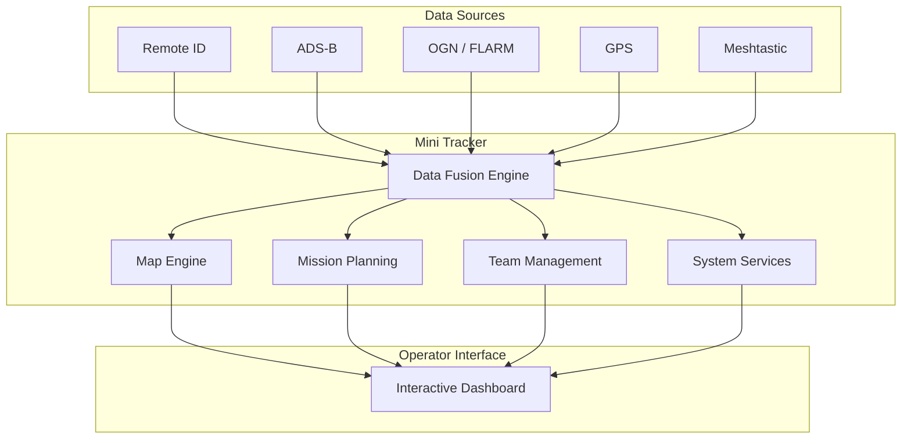
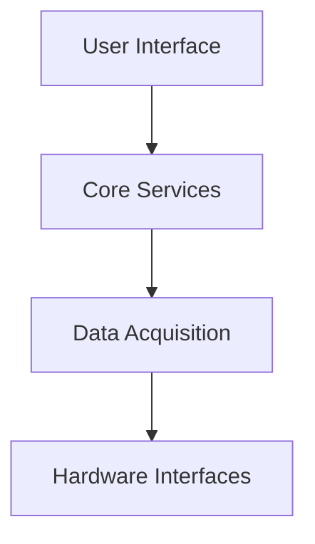

# Product Overview

# Mini Tracker

### Portable Air Awareness Node

---

## Purpose

This document provides a high-level overview of the Mini Tracker platform, its main capabilities and the operational scenarios for which it has been designed.

For the product vision and design philosophy, refer to the **Product Vision** document.

---

# Overview

Mini Tracker is a **Portable Air Awareness Node** designed to provide a unified operational picture during field operations.

Rather than acting as a single-purpose receiver or mapping application, Mini Tracker integrates multiple technologies into a compact field platform capable of collecting, processing and presenting operational information through a single web interface.

The platform has been designed to operate autonomously, even in environments where Internet connectivity is unavailable.

---

# At a Glance

| Feature | Description |
|----------|-------------|
| **Deployment** | Portable field node |
| **Platform** | Raspberry Pi |
| **Interface** | Web-based dashboard |
| **Connectivity** | Offline First |
| **Maps** | Offline MBTiles |
| **Mission Planning** | Integrated |
| **Team Management** | Integrated |
| **Remote ID** | Supported |
| **ADS-B** | Supported |
| **OGN / FLARM** | Supported |
| **Meshtastic** | Supported |
| **GPS** | Integrated |
| **Updates** | OTA Update Manager |

---

# System Overview

---

# Product Highlights

Mini Tracker has been designed around a small number of operational capabilities.

- Portable deployment
- Offline operation
- Unified operational picture
- Multi-protocol traffic monitoring
- Mission planning
- Team coordination
- Interactive mapping
- Modular architecture
- Integrated system monitoring
- Software update management

---

# Information Sources

Mini Tracker can collect and correlate information coming from multiple independent technologies.

| Source | Purpose |
|----------|----------|
| Remote ID | Drone identification and tracking |
| ADS-B | Aircraft traffic awareness |
| OGN / FLARM | Glider and light aircraft awareness |
| Meshtastic | Team position and messaging |
| GPS | Node positioning |
| Offline Maps | Geographic context |

---

# Operational Workflow

---

# Typical Operational Scenarios

Mini Tracker has been designed to support operations including:

- Search and Rescue (SAR)
- Civil Protection
- Wildfire monitoring
- Drone operations
- Emergency response
- Technical field activities
- Demonstration and training
- Research and experimentation

---

# Functional Architecture

Mini Tracker is organized into four logical layers.

---

Further details about the internal software organization are available in the **Architecture Guide**.