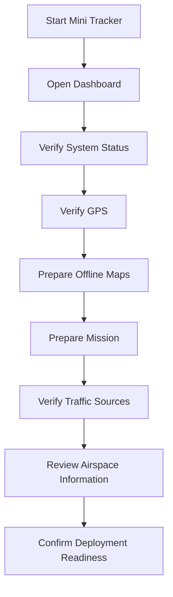

# First Start

### Preparing Mini Tracker for Field Deployment
### Part of the Mini Tracker User Guide

---

## Purpose

This document describes the first operational preparation of Mini Tracker after installation and before the first field deployment.

It is intended for operators who need to verify that the unit is ready for an actual mission.

The procedure focuses on operational readiness. It does not describe hardware installation, internal assembly or detailed mission planning workflows.

---

## First Operational Preparation

Mini Tracker should be prepared before leaving for the operational area whenever possible.

Many field deployments take place in environments where Internet connectivity may be unavailable or unreliable. The operator should therefore complete downloads, mission preparation and external service checks while connectivity is still available.

The objective of first operational preparation is to confirm that Mini Tracker can provide a usable operational picture before the unit is deployed.

Once deployed, configuration opportunities may be limited. Investing a few minutes in preparation before departure can significantly reduce operational issues in the field.

---

## Verify System Status

After Mini Tracker has been powered on, allow the system to complete startup before beginning operational checks.

Open the Dashboard from a computer, tablet or phone connected to Mini Tracker.

The operator should verify:

- Available storage
- Dashboard access
- System startup completion
- Expected network connectivity
- Hardware service availability
- Map area loading
- Status indicators in the Dashboard

Network connectivity should be checked according to the planned operation. Some deployments require only local access through the Mini Tracker network, while others require Internet connectivity for online map sources, downloads or network-based traffic sources.

If Internet connectivity is required, confirm it before leaving an area where corrective action is possible.

---

## Verify GPS

GPS position is part of the operational state of the Mini Tracker node.

After startup, verify that GPS is available and that the unit obtains a position fix.

GPS acquisition may require time, especially after transport, first startup or operation in areas with limited sky visibility.

Recommended sequence:

1. Place Mini Tracker and the GPS antenna where sky visibility is adequate.
2. Open the Dashboard status information.
3. Confirm that GPS information is available.
4. Wait until a valid position fix is obtained.
5. Verify that the node position is consistent with the expected location.

If GPS is not available, treat the system as operationally limited until the cause is understood.

---

## Prepare Offline Maps

Offline maps should be prepared whenever the operational area is known in advance.

The operator should download map coverage before deployment, while Internet connectivity is still available. The required coverage should include the expected mission area and any areas that may become relevant during the operation.

Recommended sequence:

1. Identify the expected mission area.
2. Include access routes, contingency areas and possible search expansion areas.
3. Connect Mini Tracker to the Internet if map downloads are required.
4. Use the map Download Manager to download the required offline coverage.
5. Confirm that the downloaded maps are installed.
6. Activate the maps required for the mission.
7. Verify the operating area on the Dashboard using the prepared map source.

Detailed download procedures are covered in the **Maps** document.

---

## Prepare the Mission

Before deployment, the operator should prepare the mission information required for the field operation.

Mission preparation may include creating a new mission, selecting an existing mission or importing externally prepared operational layers.

The operator should verify:

- Correct mission selected
- Required GeoJSON layers imported
- Externally prepared operational layers imported when available
- Mission objects displayed correctly on the map
- Mission area visible with the selected map source
- Verify that imported layers use the correct coordinate reference system.

This document does not describe the detailed Mission Planning workflow. Mission creation, editing and object management are covered in the **Mission Planning Guide**.

---

## Verify Traffic Sources

Traffic and team awareness depend on both local hardware and external connectivity conditions.

Before deployment, verify that the sources required for the operation are available.

| Source | Dependency |
|----------|-------------|
| **ADS-B** | Local receiver and antenna for local reception; Internet connectivity for network sources where used. |
| **Remote ID** | Local receiver, antenna placement and supported drones transmitting in range. |
| **Meshtastic** | Local gateway state, antenna placement, configured nodes and local radio conditions. |
| **Internet Connectivity** | Required for online map sources, map downloads and network-based traffic sources. |

The operator should confirm that required sources appear available in the Dashboard and that the map displays operational data when such data is present in the area.

The absence of traffic does not confirm that the area is clear. It may indicate that no compatible objects are present, that a source is unavailable or that reception conditions are limited.

Different sources complement each other.

Operators should interpret the operational picture using all available information rather than relying on a single traffic source.

---

## Airspace Preparation

Airspace preparation should be completed before the operational phase begins.

When Drone Sky Check services become available in Mini Tracker, operators should use them to verify information relevant to the intended operation, including:

- Flight restrictions
- NOTAM information
- Operational limitations
- Authorization requirements

This capability will be documented separately when available.

Until then, operators should follow the applicable organizational and regulatory procedures for airspace verification.

---

## Deployment Readiness Checklist

Before leaving for the operational area, perform a final readiness check.

The following checklist summarizes the minimum recommended verification before every field deployment.

- [ ] Dashboard is reachable
- [ ] System startup has completed successfully
- [ ] Network configuration matches the intended operating mode
- [ ] Internet connectivity is available (if required)
- [ ] GPS has obtained a valid position fix
- [ ] Node position has been verified
- [ ] Hardware services are operational
- [ ] Required offline maps have been downloaded
- [ ] Required offline maps are active
- [ ] Mission has been created or selected
- [ ] Mission objects and imported layers are displayed correctly
- [ ] ADS-B reception has been verified (if required)
- [ ] Remote ID reception has been verified (if required)
- [ ] Meshtastic gateway is operational (if required)
- [ ] Airspace information has been reviewed according to operational procedures
- [ ] The planned power source is adequate for the expected mission duration
- [ ] The Dashboard displays the expected operational picture

Once all applicable items have been verified, Mini Tracker is ready for field deployment.

Operational Tip

If one or more items cannot be completed, assess whether the missing capability is acceptable for the planned mission before deployment.

---

## Next Steps

After first operational preparation, continue with the documents required for the planned field operation.

Recommended sequence:

1. Review `user/dashboard.md`.
2. Review `user/maps.md`.
3. Review `user/traffic-monitoring.md`.
4. Review `user/mission-planning.md` when mission objects or operational layers are required.
5. Review `user/settings.md` when configuration changes are required.

---

