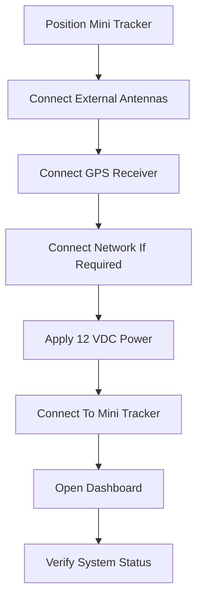

# Installation

### Part of the Mini Tracker User Guide

---

## Purpose

This document explains how to install and prepare a Mini Tracker unit for first use.

It is intended for field operators and system integrators receiving a Mini Tracker unit as a finished product.

The installation procedure covers external preparation, power, network access and initial verification. It does not describe internal electronics or enclosure assembly.

---

## Before You Begin

Before installing Mini Tracker, verify that the operating location has the required power, antenna placement and network conditions.

Select an installation location that provides adequate sky visibility for the GPS receiver and sufficient clearance for the external radio antennas.

The operator should prepare:

- A regulated 12 VDC power source
- The GPS receiver and antenna
- ADS-B antenna
- Remote ID antenna
- Meshtastic antenna
- A computer, tablet or phone for accessing the Dashboard
- Ethernet cable when using wired access

The enclosure contains the internal electronics and must not be opened during normal installation.

TODO: Confirm the minimum power supply current rating for production units.

---

## Installation Workflow

A typical first installation follows this sequence:

---

## Power Requirements

Mini Tracker is powered from an external regulated 12 VDC supply.

Typical power sources include:

- Portable batteries
- Vehicle electrical systems
- Solar power systems
- Portable generators
- Laboratory power supplies

The internal power conversion system is already integrated inside the enclosure. The operator is not expected to configure or adjust the internal power system.

Use only a stable regulated supply suitable for field electronics.

---

## Installing External Components

Mini Tracker uses external connections for field installation.

All antennas and external devices should be connected before the system is placed into operational use.

---

### GPS Receiver

Connect the supplied GPS receiver to the dedicated external USB connector on the enclosure.

Place the GPS antenna where it has adequate visibility of the sky.

Buildings, dense vegetation, vehicles and other obstructions may delay or prevent GPS position acquisition.

After startup, GPS availability can be verified from the Dashboard hardware or status information.

---

### ADS-B Antenna

Connect the ADS-B antenna to the corresponding RF connector.

Proper antenna placement is required for reliable local aircraft reception.

For best results, place the antenna where it has a clear view of the surrounding airspace.

---

### Remote ID Antenna

Connect the Remote ID antenna to the corresponding RF connector.

Remote ID visibility depends on receiver state, antenna placement, radio range and drones transmitting supported data in the operating area.

---

### Meshtastic Antenna

Connect the Meshtastic antenna to the corresponding RF connector.

Meshtastic performance depends on antenna placement, gateway state, node availability and local radio conditions.

---

## Powering the System

After external components are connected, apply regulated 12 VDC power to Mini Tracker.

During startup, Mini Tracker initializes its local services and prepares the web-based Dashboard.

The built-in Access Point is expected to be available by default, allowing direct connection without existing network infrastructure.

Allow the system to complete startup before beginning operational verification.

TODO: Confirm the expected startup time for production units.

---

## Network Access

Mini Tracker provides multiple networking options to support both standalone field deployments and connected environments.

| Method | Operational Use |
|----------|------------------|
| **Ethernet LAN** | Recommended when a wired network or direct computer connection is available. |
| **Wi-Fi Access Point** | Provides direct local access without existing network infrastructure. |
| **Wi-Fi Client** | Allows Mini Tracker to connect to an existing wireless network when the optional adapter is present and configured. |

The Dashboard displays network status for Ethernet, Access Point, Wi-Fi Client and Internet availability.

---

### Ethernet LAN

Use the external Ethernet connector for direct wired access to a computer or connection to an existing local network.

Ethernet is the recommended connection method whenever a wired network is available because it provides stable local access during setup and verification.

The Ethernet interface is configured from the Dashboard Network Settings.

---

### Access Point Mode

The integrated Wi-Fi interface operates as the built-in Access Point.

Access Point mode is enabled by default and allows an operator device to connect directly to Mini Tracker.

This mode is intended for field use where no existing network infrastructure is available.

TODO: Confirm the factory Access Point SSID and default password for production units.

---

### Wi-Fi Client Mode

When the optional USB Wi-Fi adapter is installed and configured, Mini Tracker can connect to an existing wireless network.

Wi-Fi Client mode is primarily used to provide Internet connectivity for functions that require external access, such as online map sources or map downloads.

Mini Tracker maintains local management access while using the Wi-Fi Client connection for Internet connectivity.

Wi-Fi networks can be scanned and selected from the Dashboard Network Settings.

---

## Connecting to the Web Interface

After the system has started, connect a computer, tablet or phone to Mini Tracker using Ethernet or the built-in Access Point.

Open the Mini Tracker web interface in a browser.

TODO: Confirm the production web interface address and whether operators must include a port number.

When the Dashboard opens, the operator should verify that the network status, map area and required traffic sources are available for the intended operation.

---

## Verifying the Installation

After connecting to the Dashboard, perform an initial installation check.

Recommended sequence:

1. Confirm that the Dashboard opens correctly.
2. Verify Ethernet or Access Point connectivity.
3. Verify Internet availability if online services or map downloads are required.
4. Confirm that the optional Wi-Fi Client adapter is detected when installed.
5. Confirm GPS availability and allow time for position acquisition.
6. Confirm that ADS-B, Remote ID and Meshtastic hardware status is available where applicable.
7. Confirm that the map source is suitable for the operating area.

If Internet connectivity is not available, Mini Tracker can still operate with local access and installed offline maps.

---

## Operational Notes

- The enclosure must remain closed during normal installation.
- All operator connections are external.
- The built-in Access Point is intended to support direct field access.
- Ethernet is preferred when a wired connection is available.
- Wi-Fi Client mode requires the optional USB Wi-Fi adapter.
- GPS position acquisition may take longer when sky visibility is limited.
- Online map sources and map downloads require Internet connectivity.
- Offline maps remain available without Internet connectivity when installed locally.

---

## Next Steps

After installation, continue with the first operational startup procedure.

Recommended sequence:

1. Complete the installation checks in this document.
2. Open `user/first-start.md`.
3. Review `user/dashboard.md`.
4. Review `user/maps.md` before field deployment.
5. Review `user/traffic-monitoring.md` before operational traffic monitoring.

---

