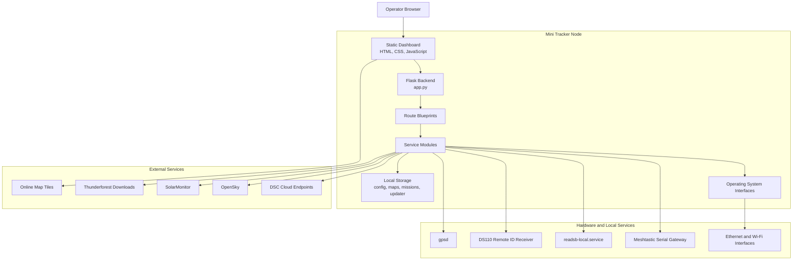
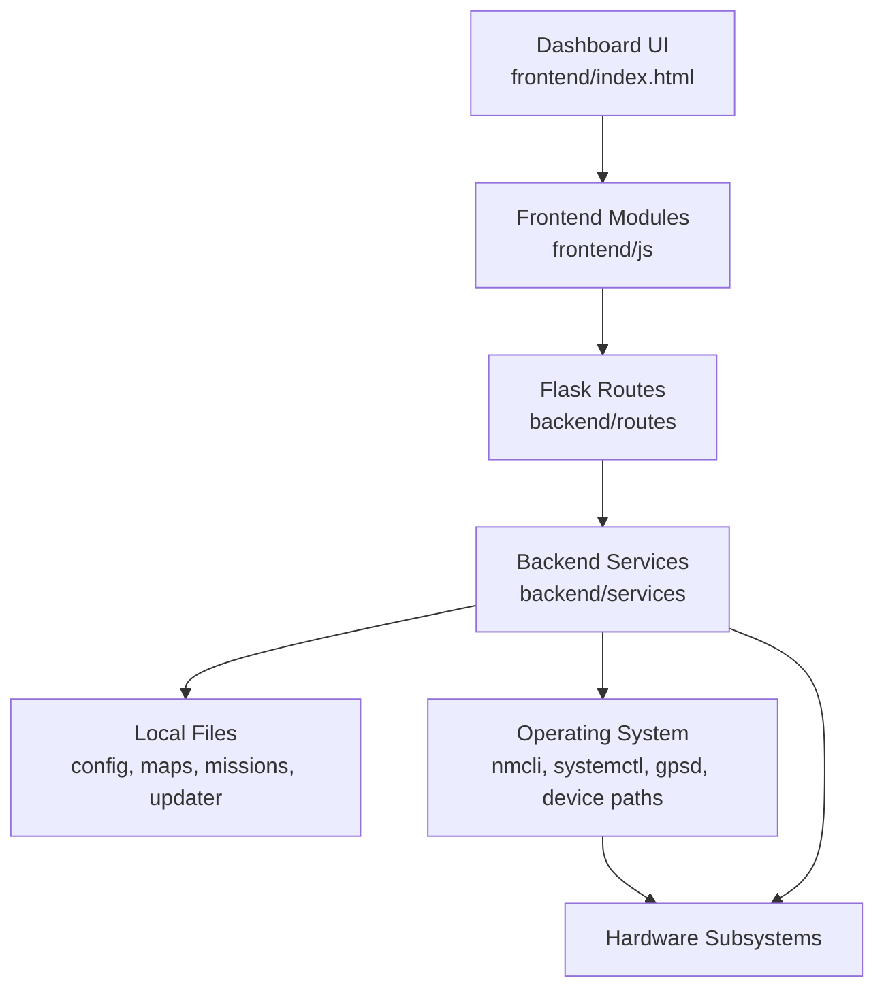
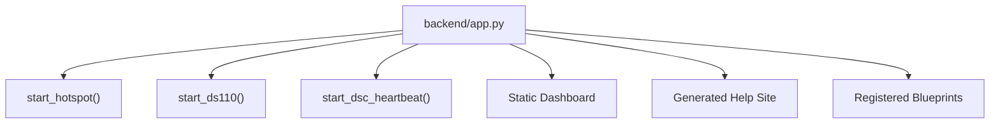
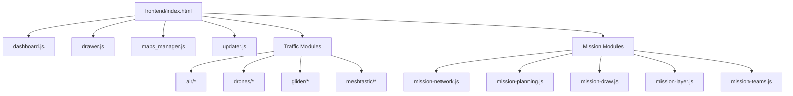
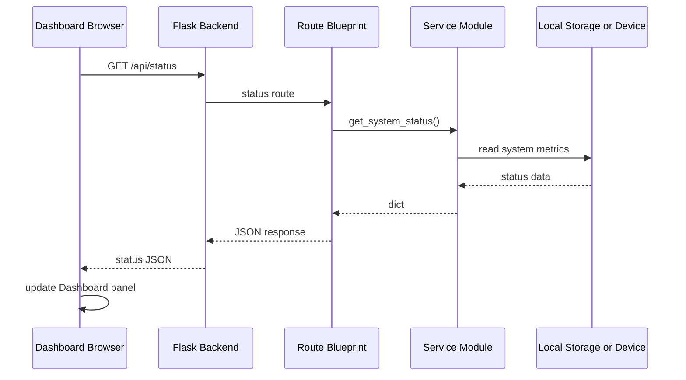
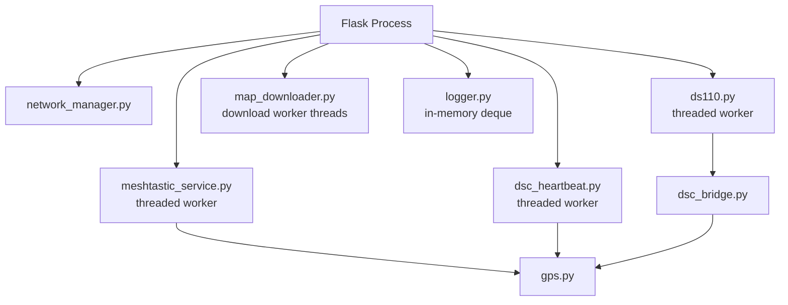
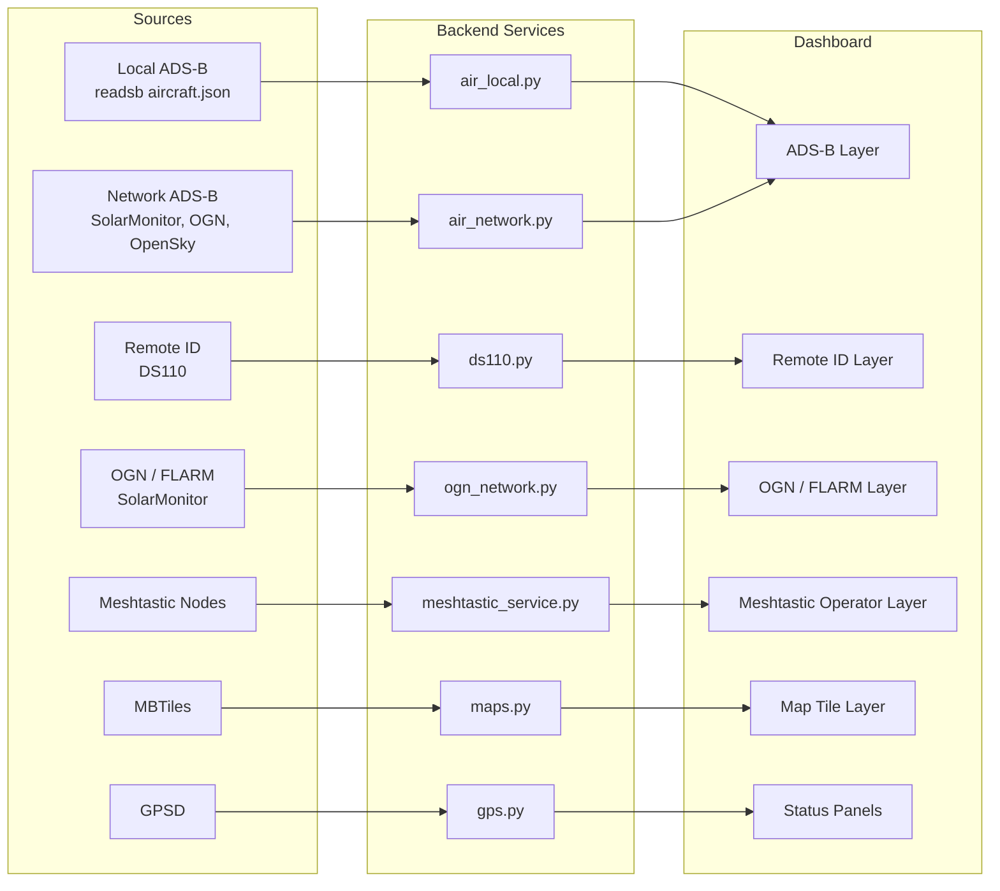
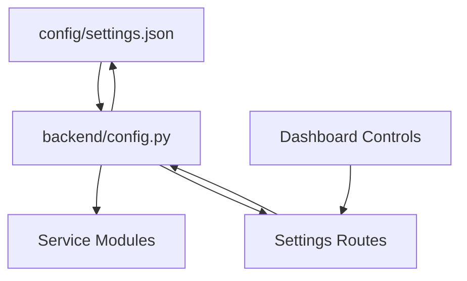
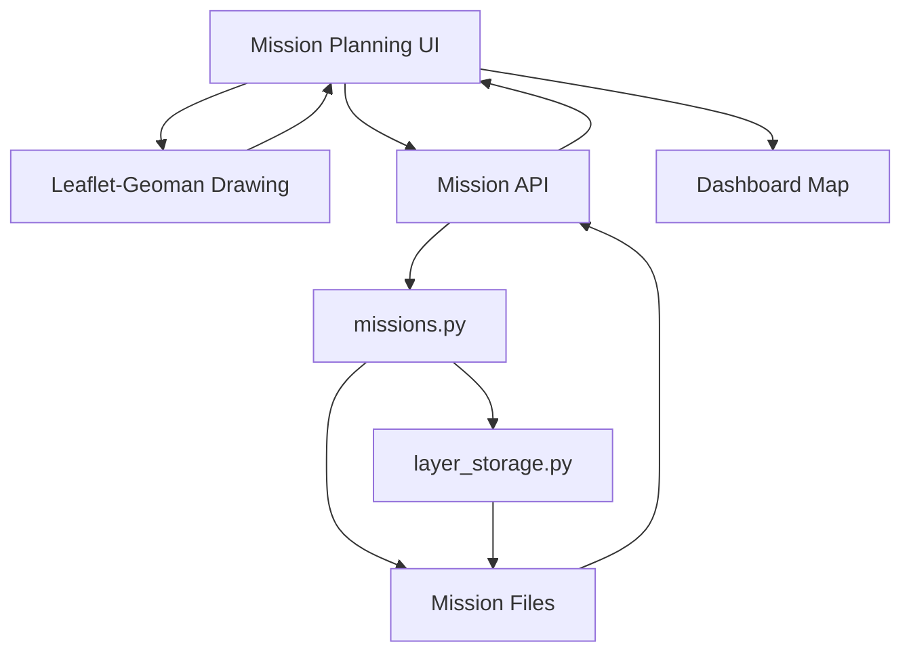
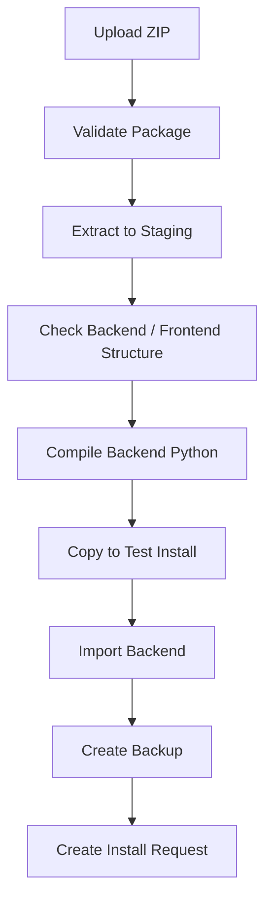

# Architecture

### Part of the Mini Tracker Developer Documentation

---

## Purpose

This document describes the Mini Tracker software architecture from a high-level developer perspective.

It explains how the Dashboard, backend routes, service modules, local storage, operating system interfaces, hardware subsystems and external integrations work together inside the Mini Tracker application.

This document is the primary architectural reference for the Developer Documentation. More detailed developer documents should build on the concepts introduced here.

---

## Architectural Overview

Mini Tracker is a local web application running on the Mini Tracker computing platform.

The backend is a Flask application that serves the Dashboard, exposes JSON APIs and hosts local Help pages. The frontend is a static JavaScript Dashboard built around Leaflet, Leaflet-Geoman and modular browser scripts. The backend service modules read local files, manage operating system interfaces, communicate with hardware receivers and call external services when Internet connectivity is available.

The architecture is organized around local operation. Internet connectivity improves maps, network traffic sources and DSC synchronization, but the Dashboard, offline maps and local subsystem status are served from the Mini Tracker node itself.

---

## Overall System Architecture

Mini Tracker combines a browser-based Dashboard with local backend services and hardware-facing integrations.

The Dashboard communicates with the backend using HTTP requests to local API endpoints. The backend does not use a database server. Persistent application data is stored in JSON files, MBTiles files and update package directories.

---

## Software Layer Architecture

The implementation is organized into a small number of practical software layers.

| Layer | Repository Area | Responsibility |
|----------|-----------------|----------------|
| **Dashboard shell** | `frontend/index.html` | Defines the main map, drawer panels, modals and loaded scripts. |
| **Frontend modules** | `frontend/js/` | Poll APIs, update Leaflet layers, manage Dashboard panels and handle user actions. |
| **Route layer** | `backend/routes/` | Exposes HTTP API endpoints and delegates work to service modules. |
| **Service layer** | `backend/services/` | Implements system status, hardware access, traffic ingestion, maps, missions, updates and integrations. |
| **Configuration and storage** | `config/`, `maps/`, `/home/pi/tracker-mini/missions`, `/home/pi/tracker-mini-updater` | Stores runtime settings, map data, mission data and update state. |
| **Operating system and hardware** | Linux interfaces and connected devices | Provides network interfaces, serial devices, gpsd, readsb and system service control. |

The route layer is intentionally thin. Most implementation behavior belongs to service modules or frontend modules.

---

## Backend Architecture

The backend entry point is `backend/app.py`.

It creates a Flask application with the frontend directory as its static folder, registers route blueprints and serves the local Help site from `frontend/help/site/`.

During startup, the backend attempts to:

- Start the local Wi-Fi Access Point
- Start the DS110 Remote ID worker when Remote ID is enabled in settings
- Start the DSC heartbeat worker
- Register all API route blueprints
- Serve the Dashboard at `/`
- Serve Help pages under `/help/`

The Flask app runs on `0.0.0.0` port `5000` when launched directly.

---

## Route Architecture

Route modules expose JSON APIs for the Dashboard.

| Route Module | Main Responsibility |
|----------|---------------------|
| `status.py` | System status, application restart, Raspberry Pi reboot and Raspberry Pi shutdown. |
| `network.py` | Network status. |
| `network_manager.py` | Wi-Fi scan/connect/disconnect, Access Point control and User LAN configuration. |
| `settings.py` | General settings, DS110 settings and serial port listing. |
| `maps.py` | Offline tile serving, map listing, map metadata, map downloads and provider settings. |
| `missions.py` | Mission CRUD, current mission selection, mission layers and GeoJSON import. |
| `teams.py` | Mission team configuration and Meshtastic-backed team status. |
| `services.py` | Aggregated service status for Dashboard indicators. |
| `hardware.py` | Aggregated hardware status. |
| `remoteid.py` | Remote ID aircraft list. |
| `ds110.py` | Remote ID service enable state. |
| `readsb.py` | Local ADS-B receiver service control. |
| `gps.py` | GPS status. |
| `air_local.py` | Local ADS-B aircraft from readsb output. |
| `air_network.py` | Network ADS-B aircraft from external sources. |
| `ogn_network.py` | OGN / FLARM traffic from external source data. |
| `meshtastic.py` | Meshtastic nodes, gateway state and enable control. |
| `dsc.py` | DSC settings. |
| `logs.py` | In-memory application logs. |
| `update.py` | Update package upload, validation, backup, test install and install request creation. |

Routes generally parse request data, call a service function and return JSON. Storage, device access and external requests are handled in services.

---

## Frontend Architecture

The frontend is a static browser application.

The main page is `frontend/index.html`. It loads Leaflet, Leaflet-Geoman, a rotated marker plugin, CSS files and JavaScript modules. There is no frontend build step in the current repository.

The Dashboard is composed of:

- A top status bar
- A full-page Leaflet map
- A side drawer with Network, Maps, System, DSC and Missions panels
- Modal dialogs for map downloads, mission planning, teams, logs and updates
- A mission drawing toolbar
- Traffic layers for ADS-B, Remote ID, OGN / FLARM and Meshtastic operators

Frontend modules share state through browser globals such as `window.airNodeMap`, `window.AIR`, `window.DRONES`, `window.GLIDER`, `window.MESHTASTIC` and `window.MISSION`.

---

## Dashboard Architecture

`dashboard.js` initializes the main operational Dashboard.

It is responsible for:

- Loading system status from `/api/status`
- Loading network status from `/api/network`
- Initializing the Leaflet map from `/api/settings`
- Selecting online or offline map tiles
- Creating Leaflet panes for traffic layers
- Starting traffic modules when enabled
- Updating status indicators from `/api/services`
- Handling DSC position marker display
- Refreshing system, service and network status every five seconds

The Dashboard uses browser `localStorage` for several client-side display preferences, including map source selection and traffic source toggles.

---

## Backend and Frontend Interaction

The Dashboard communicates with the backend using local HTTP requests.

This request pattern is repeated across the project. The frontend performs polling for live operational views rather than maintaining a persistent WebSocket connection.

---

## Service Interaction

Service modules are not isolated microservices. They are Python modules loaded into the Flask process. Some services start background threads for long-running or periodic work.

The current implementation uses in-memory state for some live services:

- Remote ID aircraft in `ds110.py`
- Meshtastic nodes in `meshtastic_service.py`
- Map download job state in `map_downloader.py`
- Application logs in `logger.py`

These in-memory structures are reset when the backend process restarts.

---

## Hardware and Software Interaction

Mini Tracker interacts with hardware through operating system interfaces and local service outputs.

| Hardware or Local Service | Software Integration |
|----------|-----------------------|
| **Ethernet** | `network.py` and `network_manager.py` read and configure `eth0`. |
| **Wi-Fi Access Point** | `network_manager.py` starts hotspot mode on `wlan0` using `nmcli`. |
| **Wi-Fi Client** | `network.py`, `network_manager.py` and `hardware.py` use `wlan1` when present. |
| **GPS** | `gps.py` reads `gpsd` and connects to `127.0.0.1:2947` for SKY data. |
| **DS110 Remote ID receiver** | `ds110.py` connects to the configured serial or UART device using pymavlink. |
| **ADS-B receiver / decoder** | `readsb.py` controls `readsb-local.service`; `air_local.py` reads `/run/readsb/aircraft.json`. |
| **Meshtastic gateway** | `meshtastic_service.py` connects to the configured serial device with `SerialInterface`. |
| **Operating system status and control** | `system.py` uses `psutil` and hostname information and executes privileged restart, reboot and shutdown commands when requested. |

The hardware abstraction layer is pragmatic. It reports availability and state through file paths, service status, receiver heartbeats and recent decoder output rather than through a formal device model.

---

## Data Flow

Mini Tracker has several data flows. The main operational flow starts with local or external sources, passes through backend service normalization and ends as map markers or Dashboard status.

The frontend performs periodic polling and maintains marker state in the browser.

---

## Configuration Management

Runtime configuration is loaded from `config/settings.json` by `backend/config.py`.

The settings object is read into memory at backend startup. Services import the shared `SETTINGS` object and `save_settings()` writes changes back to the JSON file.

Current settings include:

- Admin LAN IP address
- Access Point SSID
- DS110 interface, device path and baud rate
- Default map position, zoom and base map
- DSC node identity, position source, position and synchronization flag
- Traffic-related flags
- Meshtastic enabled state, device path, node ID and node name

Additional map provider configuration is stored in `config/map_provider.json`.

Because the settings object is loaded into process memory, developers should treat direct file edits and runtime settings updates carefully.

---

## Maps Subsystem

The maps subsystem supports offline map tiles, map management and map downloads.

Offline map files are stored in the `maps/` directory as MBTiles files. Map metadata and active state are stored in `maps/maps_catalog.json`. The configured base map comes from `SETTINGS["map"]["base_map"]`.

`maps.py` provides:

- MBTiles tile lookup for `/tiles/<z>/<x>/<y>.png`
- Map listing
- Map storage reporting
- Map deletion
- Active map state updates
- Description updates
- Map provider settings

`map_downloader.py` provides:

- Tile count calculation from center, radius and zoom range
- Thunderforest tile URL construction from provider settings
- MBTiles creation
- Background download jobs
- In-memory download progress tracking

The Dashboard chooses the tile source in `dashboard.js`. Automatic mode uses online OpenTopoMap tiles when Internet is available and local `/tiles/...` when Internet is unavailable.

---

## Mission Subsystem

The mission subsystem stores missions and mission objects as files.

Mission storage is located under `/home/pi/tracker-mini/missions`.

| File or Directory | Purpose |
|----------|---------|
| `mission_index.json` | Lists available missions. |
| `current_mission.json` | Stores the selected mission ID. |
| `<mission_id>/mission.json` | Stores mission metadata. |
| `<mission_id>/layers/*.json` | Stores mission layers and geometries. |
| `<mission_id>/teams.json` | Stores configured mission operators. |

The backend provides mission and layer CRUD APIs. The frontend mission modules provide the planning workflow:

- `mission-network.js` wraps mission API calls
- `mission-controller.js` opens and closes mission modals
- `mission-planning.js` lists missions and layers
- `mission-draw.js` uses Leaflet-Geoman to create or edit geometry
- `mission-layer-properties.js` combines geometry, styling and metadata before save
- `mission-layer.js` renders saved layers on the map
- `mission-teams.js` displays team and gateway status

Mission export and import buttons are present in the Dashboard markup, but the current implementation confirms GeoJSON layer import and does not implement a complete mission export workflow.

---

## Traffic Sources

Mini Tracker displays several categories of traffic and operational position data.

| Source | Backend Service | Frontend Module | Notes |
|----------|----------------|-----------------|-------|
| **Local ADS-B** | `air_local.py` | `frontend/js/air/*` | Reads `/run/readsb/aircraft.json`; filters by map bounds and altitude rules. |
| **Network ADS-B** | `air_network.py` | `frontend/js/air/*` | Uses SolarMonitor, OGN-derived ADS-B and OpenSky; merges by ICAO. |
| **OGN / FLARM** | `ogn_network.py` | `frontend/js/glider/*` | Reads SolarMonitor OGN traffic and keeps supported sources. |
| **Remote ID** | `ds110.py` and `remoteid.py` | `frontend/js/drones/*` | Reads DS110 MAVLink stream and exposes detected aircraft. |
| **Meshtastic operators** | `meshtastic_service.py` and `teams.py` | `frontend/js/meshtastic/*` | Uses Meshtastic node data matched to mission operators. |
| **GPS node position** | `gps.py` and `dsc_settings.py` | `dashboard.js`, `drawer.js` | Supports Dashboard status, DSC position mode and Meshtastic gateway position updates. |

Traffic source enablement is split between backend service state and frontend display preferences. Some display choices are stored in browser `localStorage`.

---

## Hardware Abstraction

`hardware.py` aggregates hardware state for the Dashboard.

It checks:

- Whether the Wi-Fi Client adapter path `/sys/class/net/wlan1` exists
- Whether the configured DS110 device path exists
- Whether the DS110 heartbeat is recent
- Whether Meshtastic is running and alive
- Whether `/run/readsb/aircraft.json` exists
- Whether the ADS-B decoder output file has been updated recently

GPS status is fetched separately from `/api/gps/status` and combined with hardware status in the frontend hardware panel.

This abstraction is intentionally status-oriented. It gives operators and developers a single Dashboard view of relevant subsystem state without hiding the fact that each subsystem has its own service and device path.

---

## Services Status

`services.py` aggregates service-level indicators for the top status bar and system panel.

It reports:

- Internet availability
- Local ADS-B activity
- Network ADS-B availability based on Internet state
- Remote ID worker state
- Meshtastic worker and link state
- OGN availability based on Internet state
- DSC availability based on Internet state

The Dashboard combines these backend values with user-selected frontend toggles when setting LED colors.

---

## Update Subsystem

The update subsystem is exposed through `/api/update`.

It uses the following paths:

| Path | Purpose |
|----------|---------|
| `/home/pi/tracker-mini-updater/uploads` | Uploaded ZIP packages. |
| `/home/pi/tracker-mini-updater/staging` | Extracted update package contents. |
| `/home/pi/tracker-mini-updater/test-install` | Test installation copy. |
| `/home/pi/tracker-mini-updater/backups` | Backend and frontend backup archives. |
| `/home/pi/tracker-mini-updater/current.json` | Current installed package metadata. |
| `/home/pi/tracker-mini-updater/install-request.json` | Pending install request. |
| `/home/pi/tracker-mini` | Live installation target. |

The backend supports upload, validation, package structure checks, Python syntax checks, test installation, backend import testing, backup creation, restore testing and install request creation.

The current backend creates the install request file. The repository code does not include the external process that consumes the install request and applies the update.

---

## Help and Documentation Subsystem

Documentation source files live under `frontend/help/docs/`.

The MkDocs configuration is `frontend/help/mkdocs.yml`, and generated Help output is served from `frontend/help/site/`. The backend serves the generated Help site under `/help/`.

The application does not build documentation at runtime. Developers should edit files under `frontend/help/docs/` and regenerate the Help site through the documentation build process outside the running Flask route.

---

## Logging

`logger.py` provides application logging through an in-memory deque.

Each log entry includes:

- Time
- ISO timestamp
- Component
- Level
- Message

Logs are also printed to standard output. The Dashboard reads logs through `/api/logs` and clears them through `/api/logs/clear`.

Because logs are stored in process memory, they are not persistent across backend restarts.

---

## Storage Layout

Mini Tracker uses local files and directories for persistence.

| Location | Stored Data |
|----------|-------------|
| `config/settings.json` | Main runtime settings. |
| `config/map_provider.json` | Map provider and API key settings. |
| `maps/*.mbtiles` | Offline map tile databases. |
| `maps/maps_catalog.json` | Map metadata and active state. |
| `/home/pi/tracker-mini/missions` | Mission index, current mission, mission files, layer files and team files. |
| `/home/pi/tracker-mini-updater` | Update uploads, staging, test installs, backups and install request state. |
| `frontend/help/docs` | Documentation source. |
| `frontend/help/site` | Generated Help site served by Flask. |
| `/run/readsb/aircraft.json` | Local ADS-B decoder output consumed by Mini Tracker. |

There is no project-level relational application database in the current implementation. MBTiles uses SQLite internally for map tiles, but application state is primarily JSON files and in-memory runtime state.

---

## External Integrations

Mini Tracker integrates with local devices and external services.

| Integration | Direction | Implementation |
|----------|-----------|----------------|
| **DSC heartbeat** | Outbound HTTP | `dsc_heartbeat.py` posts tracker position and capabilities when sync and Internet are available. |
| **DSC traffic ingest** | Outbound HTTP | `dsc_bridge.py` posts detected Remote ID drones when sync and Internet are available. |
| **Meshtastic** | Serial device | `meshtastic_service.py` uses `SerialInterface` and stores node data in memory. |
| **ADS-B local** | Local file and system service | `readsb.py` controls `readsb-local.service`; `air_local.py` reads decoder JSON. |
| **Remote ID** | Serial or UART device | `ds110.py` uses pymavlink to read DS110 data and decode supported messages. |
| **GPS** | Local gpsd service | `gps.py` reads gpsd packet and SKY data. |
| **Network ADS-B** | Outbound HTTP fetch | `air_network.py` fetches SolarMonitor, OGN-derived ADS-B and OpenSky data. |
| **OGN / FLARM** | Outbound HTTP fetch | `ogn_network.py` fetches SolarMonitor OGN traffic. |
| **Thunderforest** | Outbound HTTP tile download | `map_downloader.py` downloads tiles into MBTiles files. |
| **OpenTopoMap** | Browser HTTP tile request | `dashboard.js` uses online map tiles when selected or when automatic mode detects Internet. |

External network integrations depend on Internet availability. Local Dashboard access and local file-based functions remain separate from those external dependencies.

---

## Developer Reading Path

New developers should read the implementation in this order:

1. `backend/app.py`
2. `backend/config.py`
3. `backend/routes/`
4. `backend/services/`
5. `frontend/index.html`
6. `frontend/js/dashboard.js`
7. `frontend/js/drawer.js`
8. `frontend/js/air/`, `frontend/js/drones/`, `frontend/js/glider/`, `frontend/js/meshtastic/`
9. `frontend/js/missions/`
10. `frontend/js/maps_manager.js`
11. `frontend/js/updater.js`

This sequence follows the runtime flow from application startup to API registration, service implementation and Dashboard behavior.

---

## Related Documentation

- `product-overview.md`
- `product-vision.md`
- `hardware/overview.md`
- `hardware/raspberry-pi.md`
- `hardware/networking.md`
- `user/dashboard.md`
- `user/maps.md`
- `user/traffic-monitoring.md`
