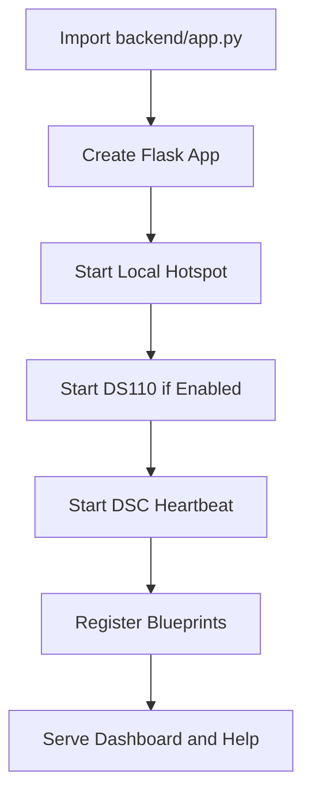
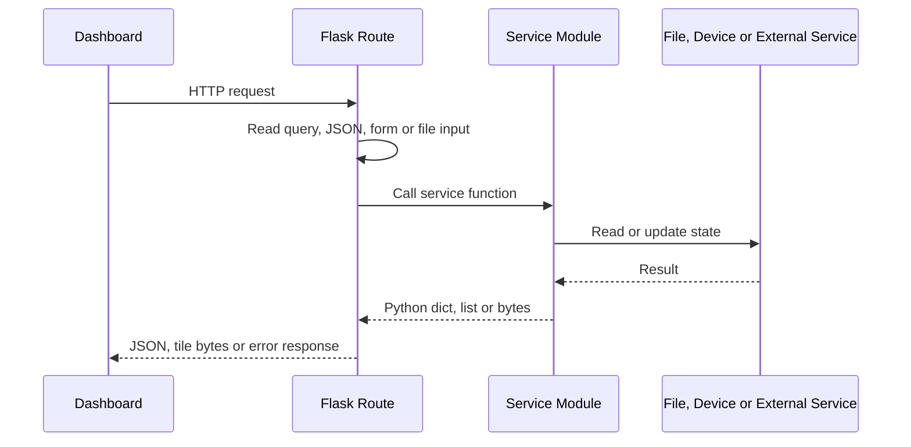
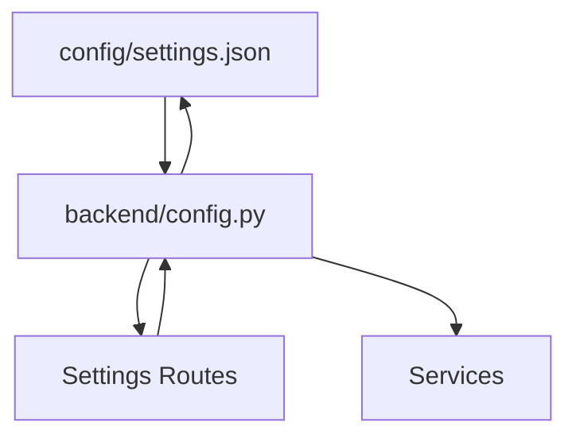
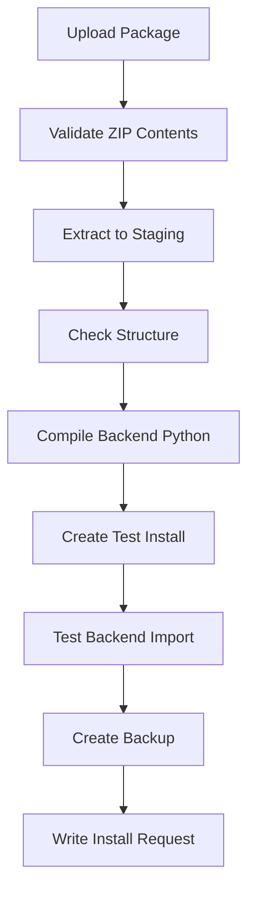

# Backend

### Part of the Mini Tracker Developer Documentation

---

## Purpose

This document describes the Mini Tracker backend implementation.

It explains the Flask application, startup behavior, blueprint organization, request flow, configuration loading, responses, error handling, logging and update workflow.

For the high-level architecture, refer to `developer/architecture.md`.

---

## Backend Role

The backend is the local application server for Mini Tracker.

It serves three main roles:

- Serve the static Dashboard from `frontend/`
- Expose JSON APIs for the Dashboard
- Host service logic that talks to local files, operating system interfaces, hardware subsystems and external services

The backend is implemented as a Flask application in `backend/app.py`.

---

## Flask Application

`backend/app.py` creates the Flask application with:

- `static_folder="../frontend"`
- `static_url_path=""`
- `MAX_CONTENT_LENGTH` set to 500 MB
- `SEND_FILE_MAX_AGE_DEFAULT` set to 0

The root route `/` serves `frontend/index.html`.

The Help routes serve generated documentation from `frontend/help/site/`:

- `/help/`
- `/help/<path:path>`

When run directly, the backend starts Flask on `0.0.0.0` port `5000`.

---

## Application Startup

Backend startup performs application setup and starts selected runtime services.

Startup attempts are wrapped in `try` blocks and errors are printed. Startup failures for hotspot, DS110 or DSC heartbeat do not stop blueprint registration.

---

## Blueprint Organization

The backend uses route blueprints grouped by subsystem.

| Area | Blueprint Module |
|----------|------------------|
| System status and control | `status.py`, `services.py`, `hardware.py` |
| Networking | `network.py`, `network_manager.py` |
| Settings | `settings.py`, `dsc.py` |
| Maps | `maps.py` |
| Missions and teams | `missions.py`, `teams.py` |
| Traffic | `air_local.py`, `air_network.py`, `ogn_network.py`, `remoteid.py` |
| Hardware control | `ds110.py`, `readsb.py`, `gps.py`, `meshtastic.py` |
| Logs | `logs.py` |
| Updates | `update.py` |

The route modules are API adapters. They should remain small and delegate implementation details to services.

---

## Request Flow

Most requests follow the same flow.

The backend does not maintain a session for Dashboard API calls. The Dashboard stores several client-side preferences in browser `localStorage`.

System restart, reboot and shutdown requests follow the same route-to-service pattern. The route returns a simple success response while `services/system.py` performs the privileged operating system command.

---

## Route Philosophy

Current routes generally follow these rules:

- Parse request data close to the endpoint.
- Return JSON with `jsonify()`.
- Use service functions for implementation details.
- Return simple success fields for mutating operations.
- Return HTTP 400 for invalid request inputs in selected routes.
- Return HTTP 404 for missing missions, layers or tiles where implemented.

Routes do not consistently enforce a shared validation or error schema. Developers should preserve the existing endpoint behavior when extending an API used by the Dashboard.

---

## Configuration Loading

Configuration is loaded in `backend/config.py`.

`SETTINGS_FILE` points to `config/settings.json` relative to the repository base directory. `SETTINGS` is loaded once when `config.py` is imported. `save_settings()` writes the in-memory `SETTINGS` object back to disk.

Routes that update DS110 or DSC settings mutate the shared `SETTINGS` object and then call `save_settings()`.

---

## Response Generation

The backend returns several response types.

| Response Type | Used By |
|----------|---------|
| JSON objects | Most API routes. |
| JSON arrays | Map lists, mission lists, layer lists, Remote ID aircraft and logs. |
| PNG bytes | Offline tile route `/tiles/<z>/<x>/<y>.png`. |
| Static files | Dashboard and Help routes. |
| Plain text error | Missing tile and missing Help files. |

Most API routes return data directly from service modules. Services normally use dictionaries and lists that are JSON-serializable.

---

## Error Handling

Error handling is local to each route or service.

Confirmed patterns include:

- Startup service failures are caught and printed in `app.py`.
- Air traffic routes catch exceptions, log the traceback and return `success: false`.
- OGN route returns `success: false`, `objects: []` and `count: 0` on request errors.
- Mission routes return 400 for missing input and 404 for missing missions or layers.
- Map tile route returns 404 when a tile is not found.
- Update upload route returns 400 for missing or empty file input.
- Many service functions catch exceptions and return fallback status data.

There is no global Flask error handler in the current implementation.

---

## Logging

Backend service logging uses `services.logger.log()`.

The logger:

- Builds a timestamped entry with component, level and message
- Stores entries in an in-memory deque
- Prints the entry to standard output
- Keeps up to 2000 entries

The Dashboard reads logs through `/api/logs` and clears them through `/api/logs/clear`.

Because logs are memory-backed, they are lost when the backend process restarts.

---

## Update Workflow

The update API is registered under `/api/update`.

The backend update workflow is implemented in `services/updater.py`.

The backend can validate packages, create backups, perform test installs and write an install request. The current repository does not include the external installer that consumes `install-request.json`.

---

## Backend Extension Guidelines

When adding backend behavior:

- Put implementation logic in `backend/services/`.
- Keep `backend/routes/` focused on HTTP request and response handling.
- Reuse `config.SETTINGS` and `save_settings()` for runtime configuration.
- Use `services.logger.log()` for operational logs.
- Preserve existing endpoint shapes used by the frontend.
- Avoid adding a database dependency unless the surrounding storage model is intentionally changed.

---

## Related Documentation

- `developer/architecture.md`
- `developer/services.md`
- `developer/api.md`
- `developer/repository.md`
- `developer/coding-guidelines.md`
