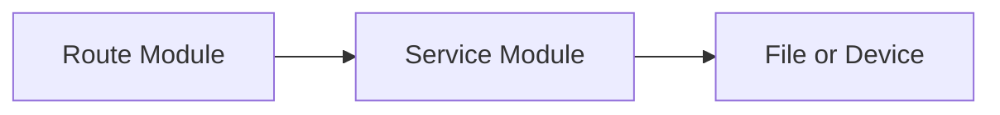

# Coding Guidelines

### Part of the Mini Tracker Developer Documentation

---

## Purpose

This document describes the coding style already present in the Mini Tracker project.

It is based on the current implementation and should guide future contributors toward changes that fit the existing codebase.

For architecture and subsystem boundaries, refer to `developer/architecture.md`.

---

## Project Philosophy

Mini Tracker favors a direct, subsystem-oriented implementation.

The codebase is organized around practical operational functions rather than large abstractions. Backend routes are thin, service modules perform work, frontend modules manage specific Dashboard areas and persistent state is stored in local files.

New code should respect this structure unless there is a clear project decision to change the architecture.

---

## Module Organization

The project uses feature-oriented modules.

| Area | Existing Pattern |
|----------|------------------|
| Backend routes | One route module per subsystem in `backend/routes/`. |
| Backend services | One service module per subsystem in `backend/services/`. |
| Frontend Dashboard | Main behavior in `dashboard.js`, panel behavior in `drawer.js`, feature behavior in dedicated modules. |
| Traffic frontend | Separate namespaces and folders for ADS-B, Remote ID, OGN / FLARM and Meshtastic. |
| Mission frontend | Multiple mission modules under `frontend/js/missions/`, each responsible for a part of the workflow. |
| Storage | JSON files and MBTiles files rather than a central database. |

---

## Naming Conventions

The current project uses plain descriptive names.

Backend conventions:

- Python files use lowercase names with underscores.
- Service functions use snake_case.
- Blueprint variables use names such as `maps_bp`, `missions_bp` and `network_bp`.
- Route functions are short and usually named after their endpoint purpose.
- JSON fields use lower snake_case in backend responses.

Frontend conventions:

- JavaScript functions use camelCase.
- Feature namespaces use uppercase globals such as `AIR`, `DRONES`, `GLIDER`, `MESHTASTIC` and `MISSION`.
- DOM IDs are descriptive and tied to Dashboard panels or controls.
- API wrapper methods are grouped under subsystem objects such as `MISSION.api`.

---

## Backend Structure

Backend code should preserve the current separation:

Routes should:

- Parse HTTP input
- Call service functions
- Return JSON or a specific response type
- Avoid embedding large implementation logic

Services should:

- Encapsulate operating system calls
- Encapsulate hardware interaction
- Encapsulate file reads and writes
- Normalize data for routes and frontend modules
- Use `logger.log()` for operational messages

---

## Frontend Structure

Frontend code should stay close to the Dashboard feature it supports.

Current patterns include:

- `dashboard.js` initializes the map and periodic status refresh.
- `drawer.js` manages drawer panels and several system controls.
- `maps_manager.js` manages the map download and installed map modal.
- `updater.js` manages the update modal.
- Traffic folders contain network, layer and controller modules.
- Mission modules split API calls, planning UI, drawing, layer rendering and toolbar behavior.

The current project does not use ES modules, bundling or a component framework. New code should not assume a build step exists.

---

## Separation of Concerns

Use the same boundary already present in the codebase.

| Concern | Location |
|----------|----------|
| HTTP API shape | `backend/routes/` |
| Business or integration logic | `backend/services/` |
| Runtime configuration | `config/settings.json` and `backend/config.py` |
| Dashboard rendering | `frontend/index.html` and `frontend/js/` |
| Map marker state | Feature-specific frontend layer modules |
| Mission persistence | Mission and layer service modules |
| Documentation source | `frontend/help/docs/` |

Avoid putting filesystem, hardware or external HTTP logic directly into frontend code. Avoid putting DOM or display logic into backend services.

---

## Service Design

Services are currently module-level functions with occasional module-level state.

When adding a service:

- Keep it focused on one subsystem.
- Use descriptive function names.
- Return JSON-serializable dictionaries and lists when called by routes.
- Use `try` and fallback responses where hardware or external services may be unavailable.
- Keep background worker state explicit with module-level variables if following the existing style.
- Use locks when shared state is updated by worker threads and read by routes.

Do not introduce a class hierarchy unless it clearly matches an existing need.

---

## Route Design

Routes should be simple adapters.

Existing route patterns:

- `GET` routes return current state.
- `POST` routes perform actions or save configuration.
- `PUT` routes update existing mission resources.
- `DELETE` routes remove maps, missions, layers or team operators.
- Most responses are JSON.
- Some missing resources return 404.
- Some invalid requests return 400.

When extending an existing endpoint, preserve response fields used by frontend modules.

---

## JavaScript Organization

JavaScript is organized around browser globals.

Follow existing namespace patterns:

- Add ADS-B behavior under `window.AIR`.
- Add Remote ID behavior under `window.DRONES`.
- Add OGN / FLARM behavior under `window.GLIDER`, `GLIDER_DATA` or `GLIDER_LAYER`.
- Add Meshtastic behavior under `window.MESHTASTIC`.
- Add mission behavior under `window.MISSION`.

Keep API calls, layer state and controller behavior separated when the feature already has those files.

---

## Configuration Handling

Runtime configuration should be handled through `backend/config.py`.

Current approach:

- Load `config/settings.json` at backend startup.
- Use the shared `SETTINGS` object in services.
- Update settings through route handlers.
- Call `save_settings()` after mutating persistent settings.

Map provider settings are stored separately in `config/map_provider.json`.

Developers should be careful when adding settings because the in-memory `SETTINGS` object and the JSON file must remain aligned.

---

## Storage Philosophy

Mini Tracker uses local file storage.

Confirmed storage patterns:

- Main settings are JSON.
- Map provider settings are JSON.
- Map catalog metadata is JSON.
- Offline map data is MBTiles.
- Missions and layers are JSON files under the mission root.
- Update packages, backups and staging directories are filesystem-based.
- Live traffic, logs and worker state may be stored in memory.

Do not assume a database server exists.

---

## Logging Philosophy

Use `services.logger.log()` for backend operational logs.

Logs should identify the component, keep messages concise and use `level="ERROR"` or `level="WARNING"` where the existing code does so.

Logs are visible in the Dashboard and printed to standard output. They are not persistent across backend restarts.

---

## Error Handling

The current implementation handles errors locally.

Recommended approach:

- Catch expected hardware, network and filesystem errors near the service that performs the operation.
- Return a JSON object with a clear failure field when the route already follows that pattern.
- Use HTTP 400 for invalid request input where the route validates input.
- Use HTTP 404 for missing resources where the route already does so.
- Log operational errors that help diagnose field issues.

There is no global error response schema in the current project.

---

## Recommendations for Contributors

Future contributors should:

- Read `developer/architecture.md` before changing subsystem boundaries.
- Keep new behavior close to the subsystem it affects.
- Prefer small service functions over broad shared abstractions.
- Preserve current JSON response fields used by frontend modules.
- Avoid editing generated Help files under `frontend/help/site/`.
- Avoid adding build or runtime dependencies unless the project explicitly adopts them.
- Treat hardware and external services as unavailable by default and return safe fallback state.
- Keep file storage human-inspectable where possible.
- Document new developer-facing behavior under `frontend/help/docs/developer/`.

---

## Related Documentation

- `developer/architecture.md`
- `developer/repository.md`
- `developer/backend.md`
- `developer/frontend.md`
- `developer/services.md`
- `developer/api.md`
- `developer/mission-storage.md`

