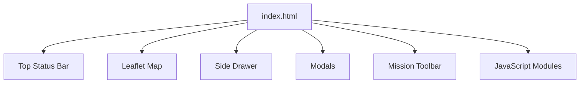
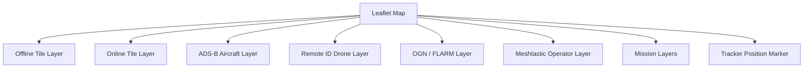
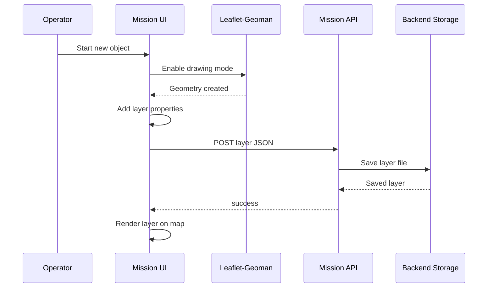
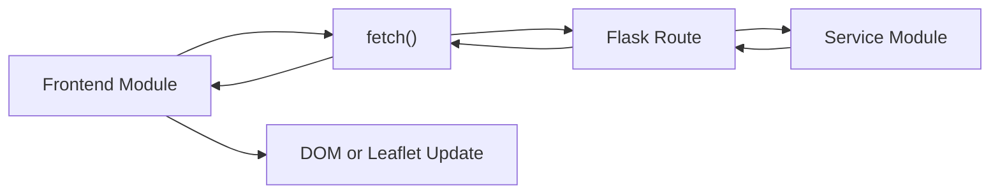

# Frontend

### Part of the Mini Tracker Developer Documentation

---

## Purpose

This document describes the Mini Tracker frontend implementation.

It explains the Dashboard architecture, JavaScript module organization, Leaflet integration, map layers, drawer panels, mission planning, polling model, browser storage and backend API interaction.

For the complete system architecture, refer to `developer/architecture.md`.

---

## Frontend Role

The frontend is a static browser Dashboard served by the Flask backend.

It provides the operator interface for:

- Map display
- Traffic visualization
- Network and system status
- Hardware status
- Map management
- Mission planning
- Team awareness
- Logs
- System update workflow

The frontend does not use a build system in the current repository. Files are loaded directly by `frontend/index.html`.

---

## Dashboard Structure

`frontend/index.html` defines the Dashboard shell.

The page loads:

- Leaflet
- Leaflet-Geoman
- Leaflet rotated marker plugin
- Dashboard CSS files
- Feature-specific JavaScript modules

---

## JavaScript Modules

Frontend logic is split by subsystem.

| Module Area | Purpose |
|----------|---------|
| `dashboard.js` | Main map initialization, status refresh, service indicators, traffic startup and map source selection. |
| `drawer.js` | Drawer interactions, network settings, hardware status, logs, DSC settings, DS110 settings, system power actions and update modal opening. |
| `maps_manager.js` | Map list, storage display, provider settings, download preview and download polling. |
| `updater.js` | Update upload, verification, install request and current version display. |
| `air/` | ADS-B network/local polling and aircraft marker layer. |
| `drones/` | Remote ID polling and drone marker layer. |
| `glider/` | OGN / FLARM polling, icons and marker layer. |
| `meshtastic/` | Team/operator polling and operator marker layer. |
| `missions/` | Mission APIs, planning modal, drawing, layer rendering, layer properties, toolbar, teams view and notification message actions. |

Modules communicate through browser globals rather than ES modules.

---

## Shared Browser Globals

The current frontend uses global namespaces.

| Global | Purpose |
|----------|---------|
| `window.airNodeMap` | Shared Leaflet map instance. |
| `window.AIR` | ADS-B polling and marker behavior. |
| `window.DRONES` | Remote ID polling and marker behavior. |
| `window.GLIDER` | OGN / FLARM start and stop facade. |
| `window.GLIDER_DATA` | OGN / FLARM polling. |
| `window.GLIDER_LAYER` | OGN / FLARM marker layer. |
| `window.MESHTASTIC` | Meshtastic team polling and operator markers. |
| `window.MISSION` | Mission API wrappers, planning, drawing, layers and teams. |

New frontend code should follow the existing namespace style unless the project intentionally adopts a different frontend architecture.

---

## Leaflet Integration

Leaflet is the core map library.

`dashboard.js` creates the map using default map settings from `/api/settings`. It creates dedicated panes for traffic:

- `traffic-air`
- `traffic-glider`
- `traffic-drone`

The Dashboard uses tile layers for:

- Online OpenTopoMap tiles
- Local offline tiles from `/tiles/<z>/<x>/<y>.png`

Leaflet-Geoman is used by the mission drawing workflow to create and edit mission geometries.

---

## Map Layers

Traffic and mission data are displayed as Leaflet layers.

Layer modules maintain marker state on the client. Backend APIs provide current data; browser modules decide how to create, update or remove markers.

---

## Drawer Organization

The side drawer is defined in `index.html` and managed by `drawer.js`.

Drawer groups include:

- Network
- Maps
- System
- DSC
- Missions

`drawer.js` handles opening panels, scanning Wi-Fi, connecting and disconnecting Wi-Fi, saving User LAN settings, loading hardware status, displaying logs, initializing DSC settings, loading DS110 settings, opening the update modal and sending System Power actions to the backend.

---

## Mission Planning

Mission planning is implemented in `frontend/js/missions/`.

The frontend workflow is:

1. Load missions and current mission through `MISSION.api`.
2. Display mission metadata and mission layers.
3. Use Leaflet-Geoman to draw or edit geometry.
4. Open layer properties to collect name, category, color and description.
5. Send the resulting layer JSON to the backend.
6. Render saved layers on the map.

Mission storage details are documented in `developer/mission-storage.md`.

The Teams view in `mission-teams.js` calls team APIs for gateway, operator and external node display. It also calls notification APIs to list messages and send messages to one operator or to all online configured operators.

---

## Traffic Layers

Traffic modules poll backend APIs and update map layers.

| Traffic Type | Frontend Modules | Polling Interval |
|----------|------------------|------------------|
| ADS-B local and network | `air/air-controller.js`, `air-network.js`, `air-layer.js` | 15 seconds |
| Remote ID | `drones/drone-controller.js`, `drone-network.js`, `drone-layer.js` | 5 seconds |
| OGN / FLARM | `glider/glider-index.js`, `glider-data.js`, `glider-layer.js` | 10 seconds |
| Meshtastic operators | `meshtastic/meshtastic-controller.js`, `meshtastic-network.js`, `meshtastic-layer.js` | 5 seconds |

Traffic source controls in the System panel affect frontend display behavior and, for some sources, backend service state. The local ADS-B checkbox reads `/api/readsb/status` and sends changes to `/api/readsb/enable`; it does not use browser `localStorage` for its enabled state.

---

## Polling Model

The frontend uses repeated HTTP polling.

Confirmed polling includes:

- Dashboard status, services and network status every 5 seconds
- ADS-B traffic every 15 seconds
- Remote ID traffic every 5 seconds
- OGN / FLARM traffic every 10 seconds
- Meshtastic operators every 5 seconds
- Active map downloads every 2 seconds while the maps modal is open
- Logs every 2 seconds while the logs modal is open

The current implementation does not use WebSockets.

---

## Browser Local Storage

The Dashboard stores selected UI preferences in browser `localStorage`.

Confirmed keys include:

- `mapSource`
- `darkMapEnabled`
- `adsbNetworkEnabled`
- `ognNetworkEnabled`
- `droneNetworkEnabled`

These values are client-side preferences. They are separate from backend runtime configuration in `config/settings.json`.

Local ADS-B service state is intentionally not listed as a browser-local preference. It is controlled through the backend readsb API and persisted in `SETTINGS["traffic"]["adsb_local_enabled"]`.

---

## Backend API Interaction

Frontend modules use `fetch()` to call backend APIs.

API details are documented in `developer/api.md`.

---

## Frontend Extension Guidelines

When adding frontend functionality:

- Add code near the subsystem it affects.
- Reuse existing global namespaces for subsystem modules.
- Keep API calls in small network helper functions when a subsystem already has them.
- Keep Leaflet marker state inside the related layer module.
- Avoid adding a build step unless the project intentionally changes frontend architecture.
- Keep backend assumptions aligned with `developer/api.md`.

---

## Related Documentation

- `developer/architecture.md`
- `developer/backend.md`
- `developer/api.md`
- `developer/mission-storage.md`
- `developer/coding-guidelines.md`
- `user/dashboard.md`
- `user/maps.md`
- `user/traffic-monitoring.md`
