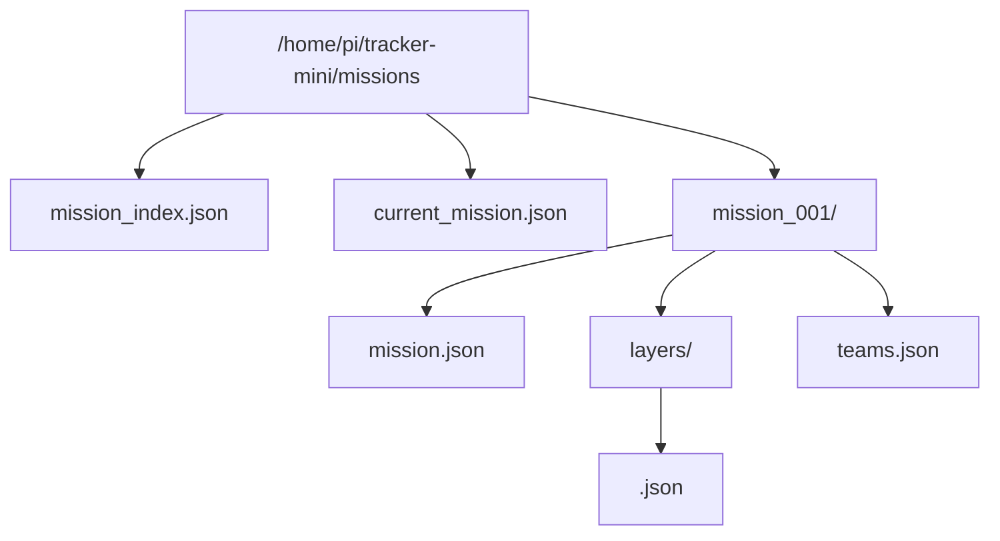
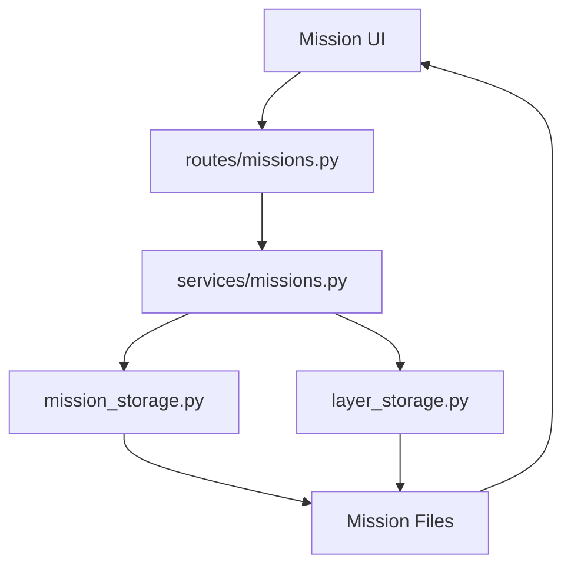

# Mission Storage

### Part of the Mini Tracker Developer Documentation

---

## Purpose

This document describes the Mini Tracker Mission subsystem.

It explains mission storage layout, current mission state, mission index, layers, imports, teams, CRUD workflow, frontend interaction, backend interaction, file organization and extension considerations.

For the broader application architecture, refer to `developer/architecture.md`.

---

## Mission Subsystem Overview

The Mission subsystem stores mission metadata and mission objects as local JSON files.

It is implemented across:

- `backend/services/mission_storage.py`
- `backend/services/missions.py`
- `backend/services/layer_storage.py`
- `backend/services/teams.py`
- `backend/routes/missions.py`
- `backend/routes/teams.py`
- `frontend/js/missions/`

The subsystem does not use a database server.

---

## Storage Root

Mission data is stored under:

```text
/home/pi/tracker-mini/missions
```

This is an absolute deployment path used by the backend services.

---

## Mission File Layout



| File or Directory | Purpose |
|----------|---------|
| `mission_index.json` | Lists available missions for the Dashboard mission list. |
| `current_mission.json` | Stores the currently selected mission ID. |
| `<mission_id>/mission.json` | Stores mission metadata. |
| `<mission_id>/layers/` | Stores mission layer JSON files. |
| `<mission_id>/layers/<layer_id>.json` | Stores one mission object or imported layer. |
| `<mission_id>/teams.json` | Stores configured mission operators for the selected mission. |

---

## Mission Index

`mission_storage.py` manages the mission index.

The index is a JSON array. Each entry contains the mission summary used by the Dashboard list:

| Field | Purpose |
|----------|---------|
| `id` | Mission identifier such as `mission_001`. |
| `name` | Mission name. |
| `description` | Mission description. |
| `status` | Mission status, currently created with `Planning`. |

New mission IDs are generated by reading existing IDs and incrementing the largest numeric suffix.

---

## Current Mission

The current mission is stored in `current_mission.json`.

The file contains:

```json
{
  "mission_id": "mission_001"
}
```

`get_current_mission_id()` returns the selected mission ID. `set_current_mission_id()` writes the current mission pointer.

When a selected mission is deleted, the current mission pointer is cleared by writing `null` as the mission ID.

---

## Mission Metadata

Each mission directory contains `mission.json`.

Confirmed mission fields include:

| Field | Purpose |
|----------|---------|
| `id` | Mission identifier. |
| `name` | Mission name. |
| `description` | Mission description. |
| `status` | Mission status. |
| `created` | UTC ISO timestamp created by the backend. |

Mission update operations may change name, description and status.

---

## Layers

Mission layers are stored as individual JSON files under `<mission_id>/layers/`.

Layer records are created or updated through `layer_storage.py`.

Confirmed layer fields include:

| Field | Purpose |
|----------|---------|
| `id` | Layer ID. Generated with `uuid.uuid4().hex` when missing. |
| `name` | Layer display name. |
| `type` | Layer category or type. |
| `geometry` | Geometry type summary. |
| `visible` | Visibility flag stored in the layer. |
| `locked` | Lock flag stored in the layer. |
| `style` | Leaflet style data. |
| `properties` | Layer metadata. |
| `geojson` | GeoJSON geometry or feature data. |

The frontend renders layer geometry using Leaflet. Circle geometry is represented with GeoJSON plus `properties.leafletType` and `properties.radius`.

---

## GeoJSON Imports

The backend supports GeoJSON layer import.

The route `/api/missions/import-geojson` accepts:

- `mission_id` form field
- Uploaded file

The backend reads the uploaded file as JSON and saves it as a layer with:

- `type: "geojson"`
- `geometry: "feature_collection"`
- `visible: true`
- `locked: false`
- `properties.source: "import"`
- `properties.filename`
- `geojson` containing the uploaded content

The current implementation confirms layer import. It does not implement a complete mission export workflow.

---

## Teams

Mission team configuration is stored in `teams.json` inside the current mission directory.

If the team file does not exist, `teams.py` creates:

```json
{
  "operators": []
}
```

Operator entries contain:

| Field | Purpose |
|----------|---------|
| `id` | Local operator ID. |
| `longName` | Operator long name. |
| `shortName` | Operator short name used for Meshtastic matching. |
| `nodeId` | Matched Meshtastic node ID. |
| `lastSeen` | Last match timestamp. |
| `online` | Current online state. |

Team status is built by combining configured operators with Meshtastic nodes.

---

## CRUD Workflow

Mission CRUD is implemented in `services/missions.py` and exposed through `routes/missions.py`.



Supported backend workflows include:

- List missions
- Create mission
- Read mission
- Update mission
- Select current mission
- Delete mission
- Import GeoJSON layer
- List layers
- Read layer
- Create layer
- Update layer
- Delete layer

---

## Frontend Interaction

Frontend mission code is organized under `frontend/js/missions/`.

| Module | Role |
|----------|------|
| `mission-network.js` | API wrapper for mission and layer endpoints. |
| `mission-controller.js` | Modal and mission workflow entry points. |
| `mission-planning.js` | Mission list, selected mission, layer list and mission actions. |
| `mission-draw.js` | Leaflet-Geoman drawing and editing session state. |
| `mission-layer-properties.js` | Layer metadata and save behavior. |
| `mission-layer.js` | Leaflet rendering of saved layers. |
| `mission-teams.js` | Mission team and gateway UI. |
| `mission-toolbar.js` | Drawing toolbar state and controls. |

The frontend is responsible for interactive geometry creation. The backend stores the resulting JSON.

---

## Backend Interaction

Backend mission routes return simple JSON structures.

Typical responses include:

- Mission arrays for mission list
- Mission objects for mission detail
- `{ "success": true, "mission": ... }` for mission creation or update
- Layer arrays for mission layers
- `{ "success": true, "layer": ... }` for layer creation or update
- `{ "success": false, "message": ... }` for selected errors

Detailed endpoint behavior is documented in `developer/api.md`.

---

## Extensibility Considerations

The Mission subsystem is file-based and easy to inspect.

Future additions should preserve:

- One mission directory per mission
- One JSON file per layer
- A small index file for mission list summaries
- A separate current mission pointer
- Team configuration scoped to the current mission directory

When adding new layer fields, keep existing frontend rendering behavior in mind. When adding new mission-level metadata, update both `mission.json` and `mission_index.json` if the Dashboard list needs the value.

---

## Related Documentation

- `developer/architecture.md`
- `developer/frontend.md`
- `developer/backend.md`
- `developer/services.md`
- `developer/api.md`
- `user/dashboard.md`

