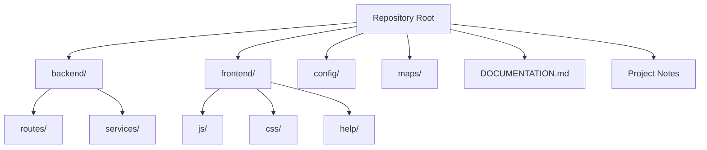

# Repository

### Part of the Mini Tracker Developer Documentation

---

## Purpose

This document describes the Mini Tracker repository organization.

It explains where application code, configuration, documentation, generated files and runtime data are located so that developers can understand where changes should be made.

For the full software architecture, refer to `developer/architecture.md`.

---

## Repository Layout

Mini Tracker is organized as a compact Flask backend with a static JavaScript frontend.

The repository does not use a frontend build pipeline in the current implementation. The Dashboard is served from static files under `frontend/`.

---

## Top-Level Items

| Path | Purpose |
|----------|---------|
| `backend/` | Flask application, route blueprints and backend service modules. |
| `frontend/` | Static Dashboard, JavaScript modules, CSS, icons and Help documentation. |
| `config/` | Runtime configuration files read by the backend. |
| `maps/` | Offline MBTiles map files and map catalog metadata. |
| `DOCUMENTATION.md` | Documentation rules that must be read before writing or editing documentation. |
| `Requisiti.txt` | Project requirement notes. |
| `ISTRUZIONI.TXT` | Operational and project notes, including Raspberry Pi paths and service references. |
| `CNSAS/` | Reference material and project artifacts outside the running application. |

Generated files under `frontend/help/site/` must not be edited directly. Documentation source files are under `frontend/help/docs/`.

---

## Backend Directory

The backend directory contains the Flask application.

| Path | Purpose |
|----------|---------|
| `backend/app.py` | Flask app creation, startup actions, blueprint registration, Dashboard serving and Help serving. |
| `backend/config.py` | Loads `config/settings.json` and provides `save_settings()`. |
| `backend/routes/` | HTTP API endpoints grouped by subsystem. |
| `backend/services/` | System, hardware, storage, traffic, network, update and integration logic. |

The route layer should remain thin. New backend behavior should normally be implemented in `backend/services/` and exposed through a route module only when the Dashboard or another client needs an HTTP API.

---

## Frontend Directory

The frontend directory contains the browser Dashboard.

| Path | Purpose |
|----------|---------|
| `frontend/index.html` | Main Dashboard page, drawer panels, modals and script loading. |
| `frontend/js/` | Browser JavaScript modules. |
| `frontend/css/` | Dashboard styling. |
| `frontend/icons/` | Map marker and traffic icons. |
| `frontend/vendor/` | Vendored browser libraries such as Leaflet and Leaflet-Geoman. |
| `frontend/help/` | MkDocs Help documentation source and generated site. |

Frontend modules use browser globals such as `window.AIR`, `window.DRONES`, `window.GLIDER`, `window.MESHTASTIC` and `window.MISSION`. New frontend features should follow the existing module pattern rather than introducing a new framework.

---

## Configuration Files

Runtime configuration is stored as JSON.

| File | Purpose |
|----------|---------|
| `config/settings.json` | Main application settings, including network, DS110, map, DSC, traffic and Meshtastic configuration. |
| `config/map_provider.json` | Map provider settings and API key state. |
| `maps/maps_catalog.json` | Offline map metadata and active map state. |

`backend/config.py` loads `settings.json` into a shared `SETTINGS` object at backend startup. Runtime changes made through settings APIs call `save_settings()` to write the file.

---

## Documentation Files

Documentation source lives under `frontend/help/docs/`.

| Path | Purpose |
|----------|---------|
| `frontend/help/docs/index.md` | Documentation entry point and status table. |
| `frontend/help/docs/product-*.md` | Product-level documentation. |
| `frontend/help/docs/user/` | Operator and user workflows. |
| `frontend/help/docs/hardware/` | Hardware subsystem documentation. |
| `frontend/help/docs/developer/` | Developer architecture, API and implementation documentation. |
| `frontend/help/mkdocs.yml` | MkDocs configuration and navigation. |
| `frontend/help/site/` | Generated Help site served by Flask. |

Only files under `frontend/help/docs/` should be edited when writing documentation.

---

## Generated Files

The repository contains generated and runtime-derived content.

| Path | Notes |
|----------|-------|
| `frontend/help/site/` | Generated MkDocs output. Do not edit directly. |
| `maps/*.mbtiles` | Offline map databases. Some files are operational data rather than source code. |
| `tracker-mini.zip` | Package archive present in the repository root. |

Generated Help output is served by the backend but is not the documentation source of truth.

---

## Runtime Data

Some runtime paths used by the application are outside the repository checkout.

| Runtime Path | Purpose |
|----------|---------|
| `/home/pi/tracker-mini/missions` | Mission index, selected mission, mission metadata, layers and teams. |
| `/home/pi/tracker-mini-updater` | Update uploads, staging, test install, backups and install request state. |
| `/run/readsb/aircraft.json` | Local ADS-B decoder output consumed by Mini Tracker. |
| `/sys/class/net/wlan1` | Wi-Fi Client adapter presence check. |
| `/dev/serial0` and `/dev/tty*` paths | Serial and UART device paths used by DS110 and Meshtastic integrations. |

Developers should distinguish repository files from deployment runtime data. Some service modules use absolute Raspberry Pi deployment paths.

---

## Development Workflow

The current project workflow is direct and file-based.

Recommended sequence for code changes:

1. Identify whether the change belongs to backend, frontend, configuration, documentation or runtime storage.
2. Read `developer/architecture.md` for the surrounding architecture.
3. For backend behavior, update a service module first and keep route changes minimal.
4. For Dashboard behavior, update the relevant `frontend/js/` module and matching markup or CSS only when required.
5. For documentation, edit only `frontend/help/docs/` and update `frontend/help/docs/index.md` when adding a document.
6. Avoid editing generated files under `frontend/help/site/`.

The project favors small subsystem-oriented files over broad cross-cutting abstractions.

---

## Where To Add New Code

| Change Type | Preferred Location |
|----------|--------------------|
| New backend API | Add or extend a module in `backend/routes/`, backed by service logic. |
| New backend behavior | Add or extend a module in `backend/services/`. |
| New Dashboard panel behavior | Add or extend a file in `frontend/js/`, usually near the related feature. |
| New traffic map layer behavior | Extend the related `frontend/js/air/`, `drones/`, `glider/` or `meshtastic/` module. |
| New mission behavior | Extend `frontend/js/missions/` and the mission route or service modules. |
| New persistent runtime setting | Update `config/settings.json` handling and the relevant settings route or service. |
| New documentation | Add Markdown under `frontend/help/docs/` and update the documentation status table. |

When a feature crosses layers, keep the same boundary used elsewhere: browser module, route module, service module, storage or device interface.

---

## Related Documentation

- `developer/architecture.md`
- `developer/backend.md`
- `developer/frontend.md`
- `developer/services.md`
- `developer/mission-storage.md`
- `developer/api.md`
- `developer/coding-guidelines.md`

