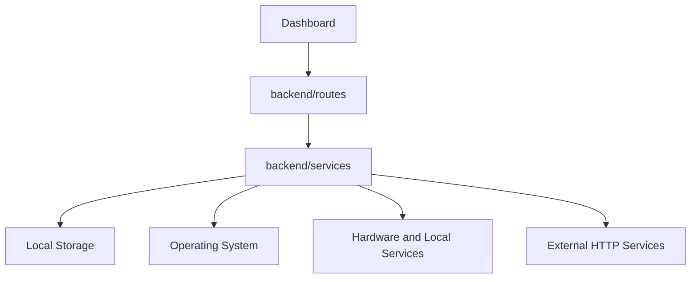
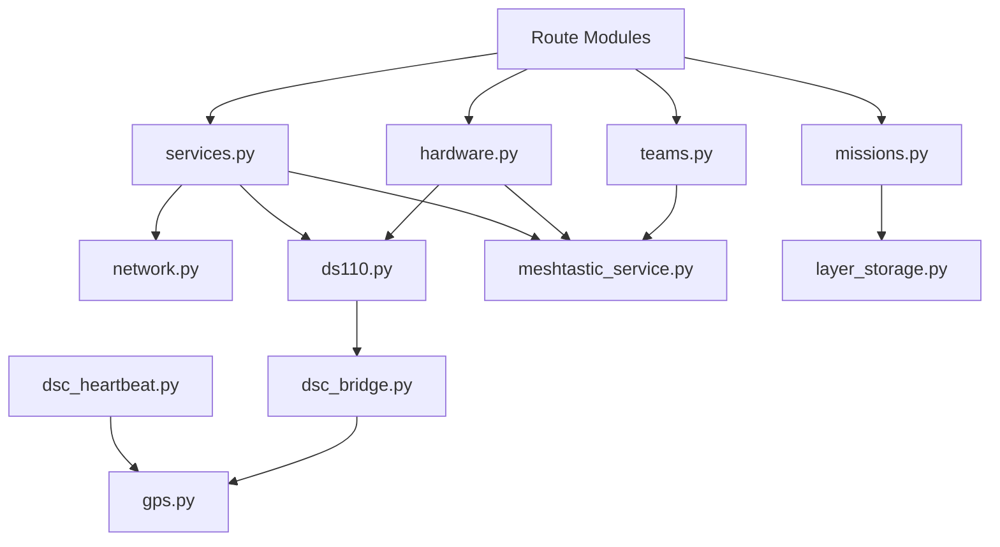
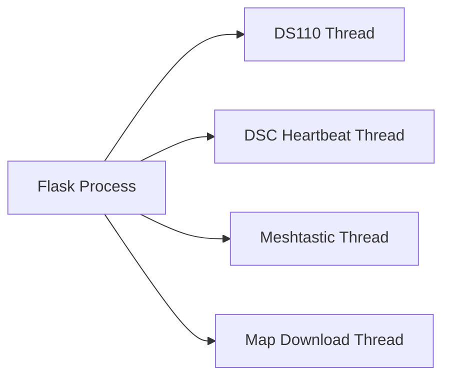

# Services

### Part of the Mini Tracker Developer Documentation

---

## Purpose

This document describes the Mini Tracker backend service layer.

It explains service responsibilities, runtime state, background workers and how services interact with the operating system, hardware, frontend routes and external integrations.

For the overall software architecture, refer to `developer/architecture.md`.

---

## Service Layer Role

Service modules live in `backend/services/`.

They contain the implementation logic behind the Flask routes. Routes normally parse requests and return JSON. Services perform the work: reading files, updating configuration, starting workers, communicating with hardware, polling external sources and preparing data for the Dashboard.

---

## Service Modules

| Service Module | Responsibility |
|----------|----------------|
| `system.py` | Hostname, CPU, RAM, disk and uptime status, plus application restart, system reboot and system shutdown commands. |
| `network.py` | Network status for Ethernet, Access Point, Wi-Fi Client and Internet availability. |
| `network_manager.py` | Wi-Fi scan/connect/disconnect, Access Point start/stop and User LAN configuration through `nmcli`. |
| `services.py` | Aggregated service status for Dashboard indicators. |
| `hardware.py` | Aggregated hardware state based on device paths, service state and receiver activity. |
| `gps.py` | GPS status and SKY data through `gpsd`. |
| `ds110.py` | DS110 Remote ID worker, MAVLink reading, Remote ID decoding and in-memory aircraft cache. |
| `readsb.py` | Local ADS-B receiver service control through `systemctl`. |
| `air_local.py` | Local ADS-B aircraft normalization from `/run/readsb/aircraft.json`. |
| `air_network.py` | Network ADS-B fetch and merge from SolarMonitor, OGN-derived ADS-B and OpenSky. |
| `ogn_network.py` | OGN / FLARM traffic fetch and filtering. |
| `meshtastic_service.py` | Meshtastic serial gateway worker and node cache. |
| `teams.py` | Mission team status derived from mission team files and Meshtastic nodes. |
| `dsc_settings.py` | DSC settings read and update through `SETTINGS`. |
| `dsc_heartbeat.py` | DSC heartbeat background worker. |
| `dsc_bridge.py` | Outbound detected-drone posting to DSC. |
| `maps.py` | Offline tile serving, map catalog, provider settings and map metadata operations. |
| `map_downloader.py` | Background map download jobs and MBTiles creation. |
| `mission_storage.py` | Mission index and current mission helpers. |
| `missions.py` | Mission CRUD, mission selection and GeoJSON layer import. |
| `layer_storage.py` | Mission layer file CRUD. |
| `logger.py` | In-memory logs and standard output logging. |
| `updater.py` | Update package validation, staging, test install, backup, restore and install request creation. |

---

## Service Interaction

Services are Python modules in the Flask process. They call each other directly where needed.

The codebase does not implement a separate dependency injection layer. Modules import the services they need directly.

---

## Background Workers

Several services create background threads.

| Worker | Module | Started By | Purpose |
|----------|--------|------------|---------|
| DS110 worker | `ds110.py` | `app.py` at startup when Remote ID is enabled, or `/api/ds110/enable` | Reads MAVLink messages from the configured DS110 device and updates Remote ID aircraft state. |
| DSC heartbeat loop | `dsc_heartbeat.py` | `app.py` at startup | Posts tracker heartbeat data when synchronization and Internet connectivity are available. |
| Meshtastic worker | `meshtastic_service.py` | `/api/meshtastic/enable` | Connects to the configured Meshtastic serial device, refreshes nodes and updates gateway position. |
| Map download worker | `routes/maps.py` and `map_downloader.py` | `/api/maps/download` | Downloads map tiles and writes an MBTiles file while updating in-memory job progress. |

Workers use module-level flags and variables for state.

---

## Shared Runtime State

Some services keep live state in memory.

| Module | Runtime State |
|----------|---------------|
| `ds110.py` | `remoteid_aircraft`, `running`, `thread`, `last_heartbeat`, `last_serial`. |
| `meshtastic_service.py` | `meshtastic_nodes`, `running`, `thread`, `interface`, packet timing and last sent position. |
| `map_downloader.py` | `_download_jobs` and `_download_lock`. |
| `logger.py` | `_logs`, an in-memory deque limited to 2000 entries. |
| `dsc_heartbeat.py` | `_status`, last attempt and heartbeat state. |
| `dsc_bridge.py` | `_last_sent`, a rate-limit cache for detected drone posts. |

This state is not persistent across backend restarts. Persistent data is stored in JSON files or MBTiles where the implementation explicitly writes it.

---

## Threading Model

The service layer uses Python threads for long-running work.

The current threading model is simple:

- Workers are daemon threads.
- DS110 and Meshtastic workers use module-level `running` flags.
- Map downloads use a thread per requested download job.
- Download job state is protected by a `threading.Lock`.
- Logs and most other in-memory state are module-level structures.

Developers should be careful when adding shared state. If a value can be updated by a background worker and read by a route, it should be treated as concurrent state.

---

## Operating System Interaction

Several services call operating system tools or read operating system paths.

| Area | Service | Implementation |
|----------|---------|----------------|
| Network status | `network.py` | Uses `psutil`, `socket` and `nmcli` output. |
| Network configuration | `network_manager.py` | Uses `/usr/bin/nmcli` through `subprocess`. |
| Access Point | `network_manager.py` | Starts hotspot mode on `wlan0`. |
| Local ADS-B service | `readsb.py` | Uses `sudo systemctl start/stop/is-active readsb-local.service`. |
| System power and restart | `system.py` | Uses `sudo systemctl restart tracker-mini.service`, `sudo /usr/sbin/reboot` and `sudo /usr/sbin/shutdown -h now`. |
| Wi-Fi Client presence | `hardware.py` | Checks `/sys/class/net/wlan1`. |
| Serial devices | `settings.py`, `hardware.py` | Uses `/dev/serial*`, `/dev/ttyACM*`, `/dev/ttyUSB*`, `/dev/ttyAMA*`, `/dev/ttyS*`. |
| GPS | `gps.py` | Connects to gpsd and to `127.0.0.1:2947`. |
| ADS-B decoder output | `air_local.py`, `hardware.py`, `services.py` | Reads `/run/readsb/aircraft.json`. |

These operating system integrations are part of the deployment architecture described in `developer/architecture.md`.

Deployment sudoers configuration must allow the backend service account to run the required `nmcli`, `systemctl`, reboot and shutdown commands without an interactive password prompt. The repository does not contain a sudoers file, so maintainers should keep the installed sudoers policy aligned with the command paths used by the service modules.

---

## Hardware Interaction

Hardware-facing services use the operating system as the boundary.

| Hardware Subsystem | Service Interface |
|----------|-------------------|
| DS110 Remote ID | Serial or UART device configured in `SETTINGS["ds110"]`, read with pymavlink. |
| Meshtastic Gateway | Serial device configured in `SETTINGS["meshtastic"]["device"]`, read with `SerialInterface`. |
| GPS | Local gpsd service. |
| ADS-B Receiver | `readsb-local.service` and `/run/readsb/aircraft.json`. |
| Network Interfaces | `eth0`, `wlan0` and `wlan1` through psutil and NetworkManager. |

Services report operational state to the Dashboard through API endpoints. They do not expose a formal hardware object model.

---

## Frontend Interaction

The frontend reaches services through route modules.

Examples:

- `dashboard.js` calls `/api/status`, `/api/network`, `/api/services`, `/api/settings` and `/api/dsc/settings`.
- `drawer.js` calls network, hardware, GPS, logs, DSC and DS110 settings APIs.
- `maps_manager.js` calls map listing, provider and download APIs.
- `frontend/js/air/*` calls local and network ADS-B APIs.
- `frontend/js/drones/*` calls the Remote ID aircraft API.
- `frontend/js/glider/*` calls the OGN / FLARM API.
- `frontend/js/meshtastic/*` calls team APIs.
- `frontend/js/missions/*` calls mission and layer APIs.

The service layer does not know about frontend modules. It returns JSON structures that the frontend renders.

---

## Service Design Notes

The current service style is direct and practical.

- Services are module-level functions rather than classes.
- Persistent storage is file-based.
- Runtime state is kept in module globals where needed.
- Routes call services directly.
- External integrations use `requests` or serial libraries directly inside service modules.
- Logging uses the shared `log()` function from `logger.py`.

New service code should follow the existing subsystem boundaries and avoid moving route, UI or storage responsibilities into unrelated modules.

---

## Related Documentation

- `developer/architecture.md`
- `developer/backend.md`
- `developer/frontend.md`
- `developer/api.md`
- `developer/mission-storage.md`
- `developer/coding-guidelines.md`
- `hardware/raspberry-pi.md`
