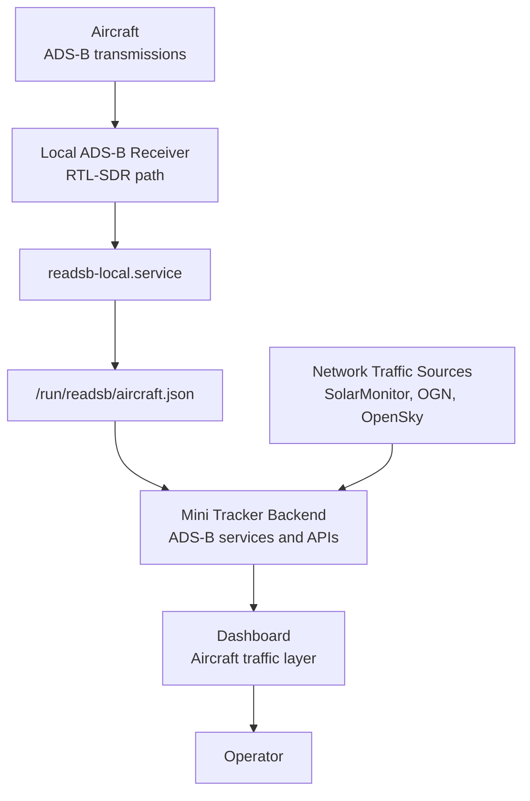
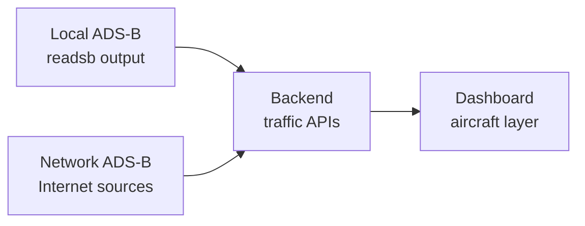

# ADS-B

### Part of the Mini Tracker Hardware Documentation

---

## Purpose

This document describes the ADS-B subsystem as part of the Mini Tracker hardware platform.

The ADS-B subsystem contributes aircraft awareness to the Mini Tracker operational picture. It is documented here from the perspective of field deployment, integration, monitoring and maintenance.

This document is not an ADS-B tutorial and does not describe ADS-B receiver technology in general. It describes the ADS-B functions that are implemented and exposed by Mini Tracker.

---

## Operational Role

The ADS-B subsystem supports awareness of aircraft visible to Mini Tracker.

Mini Tracker can use two ADS-B traffic paths:

| Traffic Path | Operational Role |
|-------------|------------------|
| **Local ADS-B** | Uses the local receiver and decoder output available on the Mini Tracker node. |
| **Network ADS-B** | Uses Internet-reachable traffic sources when network connectivity is available. |

The Dashboard presents both paths as part of the same aircraft traffic layer. This allows the operator to use local reception in the field while also using network traffic sources when Internet access is available.

ADS-B visibility depends on receiver state, antenna placement, decoder state, map area, local radio conditions, Internet availability for network sources and aircraft transmitting usable data.

---

## ADS-B Architecture

The ADS-B subsystem connects receiver, decoder, backend services and Dashboard visualization.

The local and network paths are separate sources before they reach the Dashboard. The Dashboard combines them into one aircraft layer so the operator can monitor aircraft without switching map views.

---

## Local ADS-B Reception

Mini Tracker exposes local ADS-B reception through the Dashboard as **ADS-B Local (RTL-SDR)**.

The project implementation confirms the local path through:

- the `readsb-local.service` system service
- the readsb aircraft output file at `/run/readsb/aircraft.json`
- the backend local aircraft API
- the Dashboard local ADS-B traffic toggle

The backend reads the local readsb output file and converts aircraft records into Dashboard traffic objects. Aircraft are included only when they have usable position data and are inside the current map bounds.

By default, non-helicopter aircraft above 1000 meters are filtered from the local traffic view. The Dashboard includes a **Show all aircraft over 1000m** option for operators who need to display higher aircraft.

---

## readsb Integration

Mini Tracker uses readsb as the local ADS-B decoder integration point.

The backend monitors and controls the local decoder through the `readsb-local.service` system service:

| Function | Mini Tracker Behavior |
|----------|-----------------------|
| **Status check** | The backend checks whether `readsb-local.service` is active. |
| **Enable local ADS-B** | The backend starts `readsb-local.service`. |
| **Disable local ADS-B** | The backend stops `readsb-local.service`. |
| **Aircraft data** | The backend reads `/run/readsb/aircraft.json`. |
| **Freshness check** | Local ADS-B is considered alive when the readsb output file was updated recently. |

Mini Tracker does not expose lower-level receiver telemetry in the current implementation. Operational monitoring is based on service state and the presence and freshness of the readsb aircraft output file.

---

## Network ADS-B Sources

Mini Tracker can also request aircraft traffic from network sources when Internet connectivity is available.

The current implementation uses:

- SolarMonitor ADS-B aircraft data
- SolarMonitor OGN traffic filtered to ADS-B objects
- OpenSky aircraft state data

Network ADS-B requests are limited to the current map bounds. The backend filters stale, out-of-bounds and high-altitude traffic before returning aircraft to the Dashboard.

Network ADS-B is operationally useful when Internet access is available. It does not replace the local receiver because it depends on external connectivity and external source availability.

---

## Local and Network Traffic Relationship

Local ADS-B and network ADS-B are independent inputs to the Mini Tracker aircraft layer.

The Dashboard requests network aircraft and local aircraft during each aircraft update cycle, then renders the combined result in the same map layer.

The current frontend updates the aircraft layer by aircraft identifier. This allows aircraft from different sources to occupy the same operational layer instead of appearing in separate map tools.

Operators should treat the two paths as complementary:

- Local ADS-B depends on the local receiver, antenna, decoder and Mini Tracker hardware state.
- Network ADS-B depends on Internet connectivity and external traffic source availability.
- Either path may show aircraft that the other path does not show.

---

## Dashboard Integration

The Dashboard is the operator interface for ADS-B monitoring.

Mini Tracker exposes ADS-B state through:

| Dashboard Item | Purpose |
|---------------|---------|
| **ADSB Rx** | Indicates whether local ADS-B data is currently alive. |
| **ADSB Net** | Indicates whether network ADS-B is available through Internet connectivity. |
| **ADS-B Network** | Enables or disables the network aircraft source in the browser. |
| **ADS-B Local (RTL-SDR)** | Enables or disables the local readsb receiver service. |
| **Show all aircraft over 1000m** | Allows higher non-helicopter aircraft to remain visible. |

The Dashboard stores the network ADS-B display preference in browser local storage. Local ADS-B state is read from the backend and changing the local ADS-B checkbox sends a request to start or stop the readsb service. The local ADS-B enabled state is persisted in the Mini Tracker traffic configuration and applied during backend startup.

The aircraft layer refreshes periodically and uses the current map bounds when requesting traffic. Moving or zooming the map changes the area used for ADS-B traffic requests.

---

## Aircraft Visualization

ADS-B aircraft are displayed on the Dashboard map as aircraft markers.

The current Dashboard implementation supports:

- aircraft markers on the traffic air map pane
- aircraft icons based on available category information
- a helicopter icon for aircraft identified as helicopters
- heading-based marker rotation
- short aircraft trails
- popup details including callsign, ICAO identifier, source, altitude and speed
- stale marker fading before removal

The visualization is intended for operational awareness. It should not be interpreted as a guarantee that every aircraft in the area is visible.

---

## Local Receiver Monitoring

Mini Tracker monitors local ADS-B using the readsb output file.

The hardware status service reports:

| Status Field | Meaning |
|-------------|---------|
| **ADS-B receiver** | The readsb aircraft output file exists. |
| **ADS-B decoder** | The readsb aircraft output file was updated recently. |

The services status used by the Dashboard reports local ADS-B as available when the readsb aircraft output file exists and has recent activity.

If the local receiver is enabled but the output file is missing or stale, Mini Tracker will not consider local ADS-B alive.

---

## Hardware Status Indicators

ADS-B hardware state is visible through the Dashboard status indicators.

| Indicator | Green State | Red State |
|----------|-------------|-----------|
| **ADSB Rx** | Local ADS-B output is fresh and the local source is enabled. | Local ADS-B output is missing, stale or disabled. |
| **ADSB Net** | Internet connectivity is available and the network ADS-B source is enabled. | Internet connectivity is unavailable or the network source is disabled. |

These indicators summarize availability. They do not provide antenna signal quality, receiver gain or per-aircraft reception diagnostics.

---

## Operational Considerations

ADS-B operation should be verified before relying on the aircraft layer in the field.

Operators and maintainers should consider:

- local ADS-B requires the receiver path, readsb service and antenna to be operational
- network ADS-B requires Internet connectivity
- the Dashboard filters traffic to the current map bounds
- non-helicopter aircraft above 1000 meters are hidden unless the high-altitude option is enabled
- aircraft without usable position data are not displayed
- stale aircraft can fade before being removed from the map

Local reception can be useful when Internet connectivity is unavailable, but it still depends on the receiver and decoder running correctly on the Mini Tracker node.

---

## Field Deployment Considerations

Before field deployment, verify the ADS-B subsystem from the Dashboard.

Recommended checks:

1. Confirm that Mini Tracker is powered and the Dashboard is reachable.
2. Confirm that **ADS-B Local (RTL-SDR)** is enabled when local reception is required.
3. Confirm that **ADSB Rx** becomes green when local readsb data is fresh.
4. Confirm antenna placement and receiver connection if local ADS-B does not become available.
5. Confirm Internet connectivity when **ADS-B Network** is required.
6. Confirm that the map is centered and zoomed to the operational area.
7. Enable **Show all aircraft over 1000m** only when higher aircraft are operationally relevant.

The ADS-B subsystem should be checked together with networking, power and the computing platform because all three affect receiver operation and Dashboard visibility.

---

## Diagnostics

ADS-B diagnostics should start from the Dashboard and then move toward hardware and service checks.

| Symptom | Likely Area to Check |
|--------|----------------------|
| **ADSB Rx is red** | Local ADS-B checkbox, readsb service state, receiver connection, readsb output freshness. |
| **ADSB Net is red** | Internet connectivity, network ADS-B checkbox, external source availability. |
| **No local aircraft displayed** | Map bounds, altitude filter, receiver state, antenna placement, readsb output file. |
| **No network aircraft displayed** | Internet connectivity, external source response, map bounds, altitude filter. |
| **Aircraft disappear quickly** | Feed freshness, update timing, stale marker behavior, source availability. |
| **Only helicopters or low aircraft appear** | High-altitude filtering may be active. |

The backend logs ADS-B source activity and readsb state changes. These logs can help maintainers distinguish between missing local decoder output, unavailable network sources and filtering by map bounds or altitude.

---

## Maintenance Notes

ADS-B maintenance should focus on the integrated Mini Tracker path rather than on generic receiver tuning.

Maintainers should verify:

- the local receiver path is physically connected
- the antenna is suitable for the deployment location
- `readsb-local.service` can be started and stopped by Mini Tracker
- `/run/readsb/aircraft.json` exists when the decoder is producing data
- the readsb output file is updated recently during local reception
- the Dashboard local ADS-B toggle matches the intended operating state
- Internet connectivity is available when network ADS-B is required
- power stability is sufficient for the computing platform and receiver

If local ADS-B is not required for a deployment, it can be disabled from the Dashboard without disabling network ADS-B.

---

## Relationship with Other Hardware Subsystems

ADS-B depends on several other Mini Tracker subsystems.

| Subsystem | Relationship |
|----------|--------------|
| **Power System** | Provides stable power for the computing platform and local receiver path. |
| **Computing Platform** | Hosts readsb integration, backend services and Dashboard access. |
| **Networking** | Provides Dashboard access and Internet connectivity for network ADS-B sources. |
| **GPS** | Provides Mini Tracker node position context, independent from aircraft positions. |
| **Dashboard** | Presents ADS-B source state and aircraft visualization to the operator. |

ADS-B should be understood as one traffic source inside the Mini Tracker operational picture, alongside Remote ID, Meshtastic and other supported traffic or team awareness sources.

---

## Related Documentation

- `hardware/overview.md`
- `hardware/networking.md`
- `hardware/power.md`
- `hardware/raspberry-pi.md`
- `user/dashboard.md`
- `user/traffic-monitoring.md`
- `developer/architecture.md`
- `developer/services.md`
- `developer/api.md`
