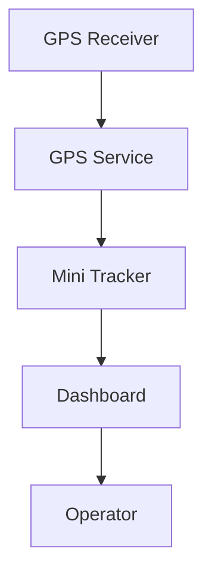

# GPS

### Part of the Mini Tracker Hardware Documentation

---

## Purpose

This document describes the Mini Tracker GPS subsystem from an operational and maintenance perspective.

It explains how GPS contributes to node positioning, Dashboard status, DSC position mode and field readiness.

This document is not a low-level GPS receiver guide. It describes GPS as an integrated positioning subsystem of Mini Tracker.

---

## Operational Role

The GPS subsystem provides the geographic position of the Mini Tracker node.

This position identifies where the Mini Tracker unit itself is located. It is independent from aircraft, drones or Meshtastic operators displayed on the map.

GPS position is used by the Dashboard and by services that need to know the current position of the Mini Tracker node.

---

## GPS Architecture

Mini Tracker reads GPS information from the local GPS service and presents the resulting position state through the Dashboard.

The operator normally interacts with GPS information through Dashboard status and DSC position settings rather than through the receiver directly.

---

## Position Acquisition

After startup, the GPS receiver may require time to obtain a position fix.

Position acquisition depends on receiver availability, antenna placement and sky visibility. Buildings, vehicles, terrain, dense vegetation and indoor locations may delay or prevent a valid fix.

The operator should allow the system enough time to acquire a position before relying on GPS-based node positioning.

---

## GPS Fix

The Dashboard reports whether GPS is available and whether a fix has been obtained.

When a fix is available, the system may display the fix mode as a dimensional fix value. A valid fix allows Mini Tracker to use GPS latitude and longitude as the node position where GPS position mode is selected.

If GPS is available but no fix is present, the receiver may be connected but not yet able to provide a usable position.

---

## Satellite Information

Mini Tracker exposes basic satellite-related information when available.

The Dashboard hardware status may show:

- GPS receiver availability
- GPS fix state
- Fix mode
- Satellite count
- HDOP
- Position

Satellite count and HDOP help the operator or maintainer understand the current quality of the GPS solution. Missing values do not always indicate a fault; they may reflect receiver state, service availability or temporary reception conditions.

---

## Position Source

Mini Tracker supports two DSC position modes:

| Position Mode | Operational Use |
|----------|------------------|
| **Manual Position** | Uses operator-entered latitude and longitude. |
| **GPS Position** | Uses the current GPS fix when available. |

The Dashboard displays the active DSC mode as:

| Label | Meaning |
|----------|----------|
| **DSC-M** | Manual DSC position source. |
| **DSC-G** | GPS DSC position source. |

When GPS position mode is selected, the manual latitude and longitude fields are disabled and the node position follows the GPS fix when a valid fix is available.

---

## Dashboard Integration

GPS information is presented in the Dashboard hardware status and DSC settings.

The operator can verify:

- Whether the GPS receiver is connected
- Whether a GPS fix is available
- Fix mode
- Satellite count
- HDOP
- Current latitude and longitude
- Whether DSC position is using manual or GPS mode

GPS status should be checked after startup and before field deployment.

---

## Field Considerations

GPS performance depends strongly on installation and operating conditions.

Recommended checks:

1. Place the GPS antenna where sky visibility is adequate.
2. Power on Mini Tracker and allow startup to complete.
3. Open the Dashboard.
4. Check GPS receiver availability.
5. Wait for a valid GPS fix.
6. Confirm that the displayed position is consistent with the expected location.
7. Select manual or GPS DSC position mode according to the operational requirement.

If GPS is required for the mission, confirm the fix before leaving the preparation area.

---

## Diagnostics

GPS-related issues may appear as missing or incomplete position information.

Possible symptoms include:

- GPS receiver shown as missing
- No GPS fix after startup
- Missing satellite or HDOP information
- Position not displayed
- DSC-G selected but no usable GPS position available
- Node marker not updating from GPS position

These symptoms may result from receiver connection, sky visibility, GPS service state or local environmental conditions.

---

## Maintenance Notes

GPS should be inspected as a complete positioning subsystem.

Maintainers should consider receiver connection, antenna placement, sky visibility, GPS service availability and Dashboard status together. The operator should not need to perform low-level GPS service checks during normal field operation.

When troubleshooting, first verify whether the Dashboard reports the receiver as available and whether a fix is present.

---

## Related Documentation

- `hardware/overview.md`
- `hardware/power.md`
- `hardware/networking.md`
- `user/installation.md`
- `user/first-start.md`
- `user/dashboard.md`
