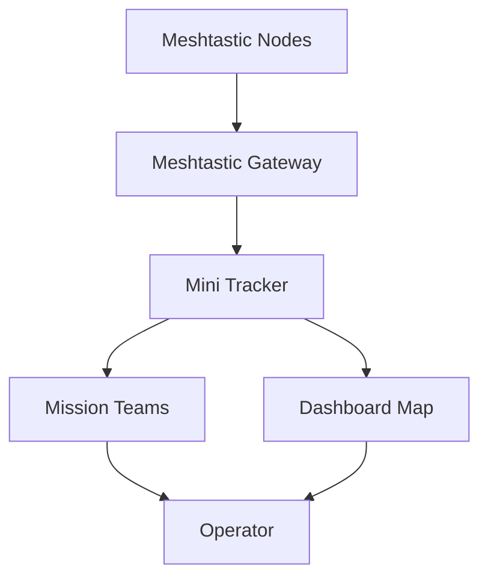
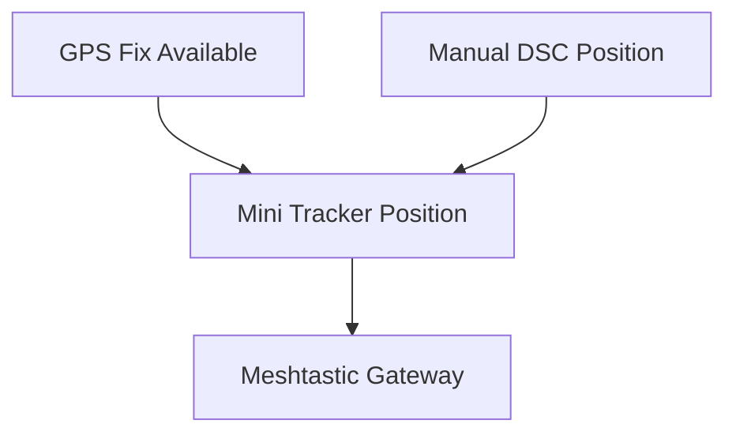

# Meshtastic

### Part of the Mini Tracker Hardware Documentation

---

## Purpose

This document describes the Mini Tracker Meshtastic subsystem from an operational and maintenance perspective.

It explains how the Meshtastic gateway supports team awareness, operator position display and mission team integration.

This document is not a Meshtastic configuration manual. It describes Meshtastic as an integrated hardware subsystem of Mini Tracker.

---

## Operational Role

The Meshtastic subsystem supports team awareness during field operations.

When enabled and connected, the gateway receives information from Meshtastic nodes and makes operator positions available to the Mini Tracker Dashboard and Mission Teams workflow.

Meshtastic information is part of team awareness rather than air traffic. It is displayed on the operational map because operator positions are relevant to mission coordination.

---

## Gateway Architecture

Mini Tracker uses a serial-connected Meshtastic gateway.

The gateway is configured from the project settings with a device path, node identifier and node name. The service maintains a local cache of received Meshtastic nodes and refreshes operator information periodically.

The operator interacts with Meshtastic through Dashboard traffic controls, map markers and the Mission Teams view.

---

## Gateway Hardware

The Meshtastic gateway is treated as an external radio subsystem connected to Mini Tracker.

The current configuration identifies a serial device path and a Meshtastic node identity. The system uses this gateway to receive node information and to publish the Mini Tracker node position when position information is available.

Backend startup attempts to start the Meshtastic worker through the persistent traffic configuration. If Meshtastic traffic is disabled in settings, the service does not connect to the configured serial gateway.

Gateway operation depends on the configured device being present, the gateway being reachable and Meshtastic radio conditions in the field.

---

## Operator Nodes

Mini Tracker receives Meshtastic node information and normalizes it for operational display.

Node information may include:

- Node identifier
- Long name
- Short name
- Hardware model
- Role
- Position
- Battery level
- Voltage
- Signal information
- Channel utilization
- Last seen information

Mission operators are configured in the active mission. Mini Tracker matches received Meshtastic nodes to configured operators by short name and stores the matched node identifier on the operator entry.

Nodes are separated into three groups for operational use:

| Group | Meaning |
|----------|---------|
| **Gateway** | The local Meshtastic gateway connected to Mini Tracker. |
| **Mission Operators** | Configured operators whose short name matches a received Meshtastic node. |
| **External Nodes** | Meshtastic nodes not matched to configured mission operators. |

---

## Team Awareness

Meshtastic contributes team position awareness to the Dashboard.

When operator nodes provide valid position information, Mini Tracker can display operator markers on the map. Selecting a marker shows available information such as operator name, short name, node identifier, battery, signal information, last seen time and position.

Operator markers use Meshtastic last seen timing to avoid keeping stale positions on the map indefinitely. The configured stale and retention windows are intentionally wider than Remote ID timing because Meshtastic nodes may transmit position updates infrequently when the operator is stationary.

This allows the operator to understand where team members are located in relation to the mission area and other operational layers.

---

## Position Sharing

Mini Tracker can update the gateway position from the current Mini Tracker node position.

When GPS is available and has a valid fix, the Meshtastic subsystem uses the GPS position. If GPS is not available, it falls back to the manual DSC position stored in the Mini Tracker settings.

The system avoids sending repeated position updates when the position has not changed meaningfully.

---

## Telemetry

Mini Tracker may display telemetry and link-related information received from Meshtastic nodes.

Available information can include battery level, voltage, channel utilization, signal-to-noise ratio, hop information and last seen time. Not every node provides every field.

Missing telemetry values should be treated as unavailable data, not necessarily as a system fault.

---

## Messages

The Meshtastic service recognizes incoming text-message packets and records them through the backend Notification Service.

Operator-facing message workflows are handled through the Mission Teams panel and the backend Notification Service. The Notification Service records notification state and uses Meshtastic as the current transport for operator messages.

The Teams panel supports sending a message to one operator or to all online configured operators. Message entries identify whether the message was sent by the Mini Tracker gateway or received from an operator node, and they include the destination, delivery state and timestamp.

---

## Dashboard Integration

Meshtastic is integrated into several Dashboard areas.

The operator can verify:

- Meshtastic service enable state
- Meshtastic link activity
- Gateway information in Mission Teams
- Operator nodes
- External nodes
- Operator map markers
- Battery and signal information when available

The Dashboard top status bar and service status view indicate whether Meshtastic is enabled and whether live data is being received.

---

## Mission Teams Integration

The Mission Teams workflow uses Meshtastic node data to support mission coordination.

The operator can configure mission operators with long names and short names. When a received Meshtastic node matches a configured operator by short name, Mini Tracker associates that node with the mission operator.

The Mission Teams view displays gateway information, configured mission operators and external nodes detected through Meshtastic.

The view also provides NodeDB maintenance actions for removing one external node from the radio or clearing the radio NodeDB. These actions request changes on the Meshtastic radio and clear the corresponding Mini Tracker in-memory node state.

---

## Gateway Status

Gateway status includes information about whether the gateway is connected and selected configuration details when available.

Displayed gateway information may include:

- Gateway node information
- Region
- TX power
- Hop limit
- Node count
- Channel utilization

These values are useful for operational awareness and maintenance checks. They should be interpreted according to the configured Meshtastic environment.

---

## GPS Interaction

Meshtastic position sharing depends on Mini Tracker node position.

When a GPS fix is available, GPS is preferred for the gateway position update. When GPS is not available, the manual DSC position is used.

Operators should verify GPS or manual position before relying on Meshtastic position sharing during field operations.

---

## Field Deployment Considerations

Meshtastic performance depends on gateway state, antenna placement, configured nodes and local radio conditions.

Recommended checks:

1. Verify that Meshtastic is enabled when team awareness is required.
2. Confirm that the gateway is connected.
3. Confirm that the Meshtastic link is active.
4. Verify that expected operator nodes are visible.
5. Confirm that operator positions are displayed when position data is available.
6. Check battery and signal information where available.
7. Verify GPS or manual DSC position for Mini Tracker node position sharing.

Meshtastic should be checked before the operational phase begins, especially when team position awareness is part of the mission workflow.

---

## Diagnostics

Meshtastic issues may appear as missing gateway or operator information.

Possible symptoms include:

- Meshtastic gateway shown as missing
- Meshtastic link shown as inactive
- No operator nodes visible
- Operators shown offline
- External nodes visible but not matched to mission operators
- Operator markers missing from the map
- Position missing for one or more nodes
- Battery or signal information unavailable

These symptoms may result from gateway connection, disabled service state, node configuration, short-name mismatch, missing position data or local radio conditions.

---

## Maintenance Notes

Meshtastic should be maintained as a gateway subsystem.

Maintainers should consider the configured serial device, gateway state, node visibility, radio conditions, operator short-name matching and Dashboard status together.

The operator should not need to perform low-level gateway diagnostics during normal field operation. Basic checks should begin from the Dashboard and Mission Teams view.

---

## Related Documentation

- `hardware/overview.md`
- `hardware/power.md`
- `hardware/networking.md`
- `hardware/gps.md`
- `user/dashboard.md`
- `user/first-start.md`
- `user/traffic-monitoring.md`
