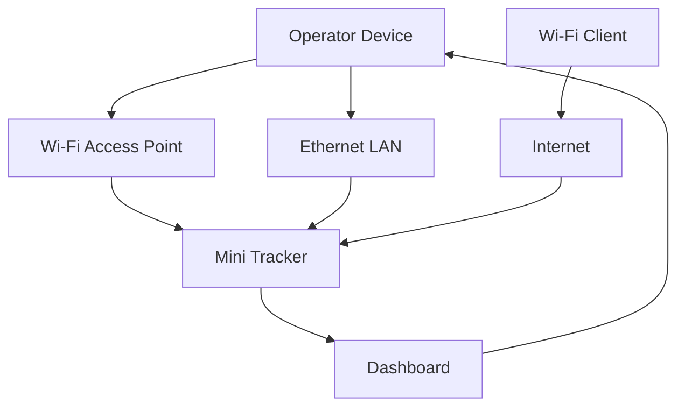

# Networking

### Part of the Mini Tracker Hardware Documentation

---

## Purpose

This document describes the Mini Tracker networking subsystem from an operational and maintenance perspective.

It explains how Mini Tracker provides local Dashboard access, optional Internet connectivity and network status information during field operations.

This document is not a developer guide and does not document internal APIs. It describes networking as an integrated hardware subsystem of Mini Tracker.

---

## Operational Role

The networking subsystem allows operators to access Mini Tracker and allows the node to use external network services when connectivity is available.

Networking supports:

- Local Dashboard access
- Ethernet connectivity
- Built-in Wi-Fi Access Point operation
- Optional Wi-Fi Client connectivity
- Internet availability checks
- Online map sources and map downloads
- Network-based traffic sources

Mini Tracker is designed to remain useful without Internet connectivity. Local Dashboard access and installed offline maps remain central to field operation when external networks are unavailable.

---

## Network Architecture

Mini Tracker separates local access from optional external connectivity.

The built-in Access Point provides direct operator access in the field. Ethernet provides wired access and LAN configuration. The optional Wi-Fi Client interface can connect Mini Tracker to an existing wireless network when Internet access or external services are required.

The Dashboard presents network status so the operator can understand which access methods and external connections are currently available.

---

## Network Interfaces

Mini Tracker uses several network roles.

| Network Role | Operational Purpose |
|----------|----------------------|
| **Admin LAN** | Provides fixed Ethernet management access for the Mini Tracker node. |
| **User LAN** | Provides an operator-configurable Ethernet address for integration with a local network. |
| **Wi-Fi Access Point** | Provides direct local wireless access to Mini Tracker without existing infrastructure. |
| **Wi-Fi Client** | Connects Mini Tracker to an existing wireless network when the client adapter is available. |
| **Internet Connectivity** | Enables online map sources, map downloads and network-based traffic services. |

The Dashboard shows the state of these roles in the Network panel.

---

## Ethernet Connectivity

Ethernet provides stable wired access during setup, maintenance and deployments where a wired connection is available.

Mini Tracker exposes an Admin LAN address used for management access. The current configured Admin LAN address is `192.168.1.115`.

The Dashboard also supports a User LAN configuration. The operator can enter a User LAN IP address, subnet mask and gateway from the Network Settings panel. This allows Mini Tracker to be integrated with a local Ethernet network while preserving the fixed Admin LAN address.

Ethernet is recommended when a stable wired connection is available, especially during installation, configuration or maintenance.

---

## Wi-Fi Access Point Mode

The built-in Wi-Fi Access Point provides local wireless access without existing network infrastructure.

Mini Tracker attempts to start the local hotspot during application startup. The configured Access Point SSID is `Portable-Air-Node`.

Access Point mode is intended for field deployments where the operator connects directly to Mini Tracker from a computer, tablet or phone.

The Dashboard displays Access Point state, SSID and IP address in the Network panel.

---

## Wi-Fi Client Mode

Wi-Fi Client mode allows Mini Tracker to connect to an existing wireless network.

This mode depends on the Wi-Fi Client adapter being present. The Dashboard hardware status identifies whether the Wi-Fi Client adapter is detected.

From Network Settings, the operator can:

- Scan available Wi-Fi networks
- View signal level and security information
- Identify saved networks
- Connect to a selected network
- Disconnect the Wi-Fi Client connection

Wi-Fi Client mode is primarily used when Mini Tracker requires Internet access for online map sources, map downloads or network-based traffic information.

---

## Local Dashboard Access

The Dashboard is the primary operator interface for networking status and configuration.

Operators can access the Dashboard using Ethernet or the built-in Wi-Fi Access Point. Wi-Fi Client connectivity is used for connection to an external wireless network and does not replace the local field access role of the Access Point.

Local access is important because Mini Tracker is often deployed where Internet connectivity is unavailable. The operator should verify that the Dashboard is reachable before leaving for the operational area.

---

## Internet Connectivity

Mini Tracker checks whether Internet connectivity is available.

Internet availability affects several operational functions:

- Automatic map source selection
- Online topographic map display
- Offline map downloads
- Network ADS-B information
- OGN / FLARM network information
- DSC synchronization

When Internet connectivity is not available, Mini Tracker can still provide local Dashboard access and use installed offline maps.

---

## Network Configuration

Network configuration is performed from the Dashboard Network Settings panel.

The available operator actions are:

- Scan Wi-Fi networks
- Connect the Wi-Fi Client to a selected network
- Disconnect the Wi-Fi Client
- Configure User LAN IP address, subnet mask and gateway

Access Point startup is handled by Mini Tracker during application startup. The current Dashboard controls focus on Wi-Fi Client connection and User LAN configuration.

Operators should apply network changes during preparation whenever possible, especially when Internet access is required for map downloads or network services.

---

## Operating Modes

Mini Tracker can be used in different networking conditions.

| Mode | Operational Use |
|----------|------------------|
| **Standalone Local Access** | Operator connects directly using the built-in Access Point or Ethernet. Internet is not required. |
| **Connected Field Operation** | Mini Tracker uses Wi-Fi Client or Ethernet connectivity where Internet access is available. |
| **Ethernet Integration** | Mini Tracker is connected to a local wired network using Admin LAN and optional User LAN configuration. |

Switching between operating conditions is normally performed by connecting or disconnecting the Wi-Fi Client, changing User LAN settings or selecting a different physical access method.

---

## Dashboard Status

The Network panel displays the current networking state.

The operator can verify:

- Admin LAN connection state and IP address
- User LAN connection state and IP address
- Access Point state
- Access Point SSID
- Access Point IP address
- Wi-Fi Client connection state
- Wi-Fi Client SSID
- Wi-Fi Client IP address
- Internet availability

The top status bar also includes a NET indicator. This indicator reflects Internet-related service status and helps the operator quickly identify whether network-dependent services are expected to be available.

---

## Offline Operation

Mini Tracker follows an Offline First approach.

Internet connectivity improves the system when online map sources, map downloads or network traffic sources are required. It is not required for local Dashboard access or for use of installed offline maps.

Before deployment, operators should prepare offline map coverage and mission information while Internet access is still available. This reduces dependency on external networks in the operational area.

---

## Field Deployment Considerations

Before field deployment, the operator should confirm that the selected networking mode matches the mission.

Recommended checks:

1. Confirm that the Dashboard is reachable through the intended access method.
2. Verify Access Point status when direct wireless access is required.
3. Verify Ethernet status when wired access is required.
4. Confirm User LAN settings when Mini Tracker must join a local wired network.
5. Confirm Wi-Fi Client adapter detection when external Wi-Fi connectivity is required.
6. Connect to the required Wi-Fi network before leaving reliable coverage.
7. Verify Internet availability when online services or downloads are required.
8. Confirm offline maps are available when Internet connectivity may be unavailable.

Network conditions should be treated as part of deployment readiness, not as a secondary setup detail.

---

## Network-Related Symptoms

Network issues may affect both operator access and network-dependent services.

Possible symptoms include:

- Dashboard unreachable from the operator device
- Access Point shown as inactive
- Wi-Fi Client adapter not detected
- Wi-Fi scan unavailable
- Wi-Fi Client disconnected
- User LAN address missing or incorrect
- Internet status shown as unavailable
- Online maps unavailable
- Map downloads blocked because Internet access is missing
- Network ADS-B or OGN / FLARM information unavailable

These symptoms do not always indicate a hardware fault. They may result from missing adapters, weak signal, incorrect LAN settings, unavailable Internet service or local network conditions.

---

## Maintenance Notes

Networking should be inspected as a complete subsystem.

Maintainers should consider the physical interface, adapter presence, configured addresses, wireless signal conditions and Dashboard status together. The operator should not need to access low-level network tools during normal field operation.

When troubleshooting, first confirm that the Dashboard network status reflects the expected operating mode. Then verify the relevant physical connection, Wi-Fi Client adapter, Access Point state or local network configuration.

---

## Related Documentation

- `hardware/overview.md`
- `hardware/power.md`
- `hardware/raspberry-pi.md`
- `user/installation.md`
- `user/first-start.md`
- `user/dashboard.md`
- `user/maps.md`
- `user/traffic-monitoring.md`
