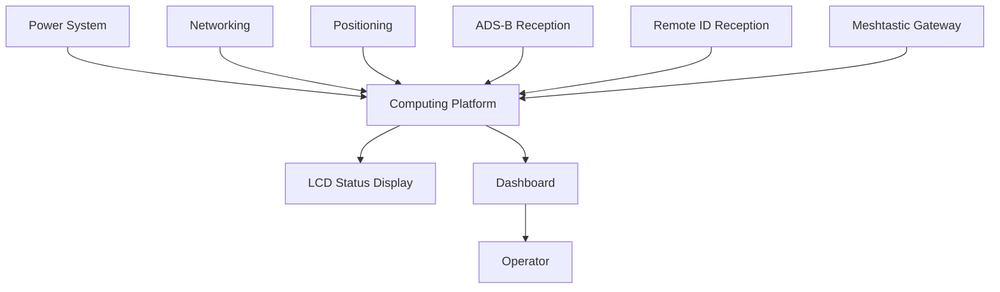
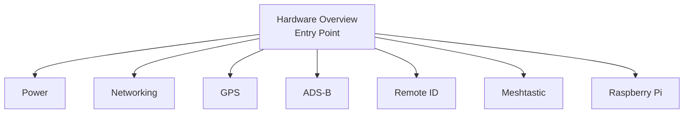

# Hardware Overview

### Part of the Mini Tracker Hardware Documentation

---

## Purpose

This document introduces the hardware architecture of Mini Tracker.

It explains how the main hardware subsystems work together to provide portable situational awareness during field operations.

This document is not an assembly manual and does not describe Mini Tracker as a Raspberry Pi project. It describes Mini Tracker as a complete integrated field device composed of functional hardware subsystems.

---

## Hardware Philosophy

Mini Tracker hardware is organized around operational function.

Each subsystem exists to support field deployment, local awareness, communication, positioning or access to the Dashboard. The operator and maintainer should understand what each subsystem contributes to the overall system before reviewing detailed subsystem documentation.

Mini Tracker is composed of independent functional subsystems. This modular architecture allows individual hardware technologies to evolve over time without changing the overall product architecture or the operator workflow.

The hardware documentation avoids low-level electronic implementation details unless they are necessary to understand installation, integration, service or field use.

---

## Hardware Design Principles

Mini Tracker hardware has been designed around a small number of practical field principles.

- **Portability**: the system is organized as a compact field node that can be deployed where operational awareness is required.
- **Modularity**: hardware subsystems remain functionally separate so that power, networking, positioning and radio technologies can be documented, maintained and evolved independently.
- **Offline operation**: essential local functions should remain available even when Internet connectivity is unavailable.
- **Operational simplicity**: the hardware should support rapid preparation, clear external connections and straightforward verification from the Dashboard.

These principles guide the hardware architecture without turning Mini Tracker into a collection of unrelated components.

---

## System Overview

Mini Tracker combines power, computing, networking, positioning and radio reception subsystems inside a portable field node.

The Computing Platform acts as the integration point for the hardware subsystems. The Dashboard remains the operator interface where the integrated information becomes visible.

---

## Hardware Architecture

The hardware architecture is based on independent subsystems that contribute to a single operational device.

| Subsystem | Operational Role |
|----------|------------------|
| **Power System** | Provides stable power for field operation. |
| **Computing Platform** | Integrates the hardware subsystem functions required by the Mini Tracker node. |
| **Networking** | Provides local access and optional external connectivity. |
| **Positioning** | Provides the geographic position of the Mini Tracker node. |
| **ADS-B Reception** | Supports awareness of aircraft equipped with ADS-B transmitters. |
| **Remote ID Reception** | Supports awareness of drones transmitting supported Remote ID data. |
| **Meshtastic Gateway** | Supports team awareness and operator positioning. |
| **LCD Status Display** | Provides local boot and subsystem status information on the Mini Tracker unit. |
| **Dashboard Integration** | Presents subsystem state and operational information through the operator interface. |

These subsystems should be understood as parts of one integrated field device rather than as separate standalone projects.

---

## Power System

Mini Tracker is powered from an external regulated 12 VDC supply.

The power system supports field operation from suitable external sources such as portable batteries, vehicle power systems, solar power systems, generators or laboratory supplies.

Inside the enclosure, regulated power conversion distributes the required supply levels to the internal subsystems. The operator is not expected to configure or adjust the internal power conversion system during normal use.

Power reliability directly affects all other subsystems. Field deployments should use a stable supply appropriate for the planned operating duration and environmental conditions.

---

## Computing Platform

The internal computing platform provides the processing foundation for Mini Tracker.

Mini Tracker is based on Raspberry Pi, but the Raspberry Pi is only one subsystem within the complete product. From the hardware documentation perspective, its role is to host the local services, hardware interfaces and Dashboard access required by the field device.

The Computing Platform integrates the hardware subsystems into a single operational device. It allows power, networking, positioning and receiver information to contribute to one coherent Mini Tracker node instead of remaining separate hardware functions.

Low-level Raspberry Pi configuration, operating system details and software architecture are outside the scope of this hardware overview.

---

## Networking

The networking subsystem provides access to Mini Tracker in both standalone and connected deployment scenarios.

Mini Tracker supports:

- Ethernet for stable local wired access
- Built-in Wi-Fi Access Point for direct field access without existing infrastructure
- Optional Wi-Fi Client connectivity for connection to an existing wireless network

Networking supports local operator access, Internet connectivity, communication with external services and future distributed Mini Tracker deployments.

Ethernet is useful during setup, maintenance and deployments where a wired connection is available. The built-in Access Point supports direct access from an operator device in the field. Optional Wi-Fi Client connectivity can provide Internet access when external services, online map sources or map downloads are required.

---

## Positioning

The GPS subsystem provides the geographic position of the Mini Tracker node.

Node position is important because the Dashboard uses it as part of the operational context. The GPS subsystem allows the operator to verify where the Mini Tracker unit is located in relation to the mission area, traffic information and map view.

This position describes the Mini Tracker node itself. It is independent from aircraft, drones or operators detected by other sources and displayed on the map.

GPS performance depends on receiver state, antenna placement and sky visibility.

---

## ADS-B Reception

The ADS-B subsystem supports awareness of aircraft equipped with ADS-B transmitters.

Its operational role is to receive local aircraft traffic information and make it available to the Mini Tracker operational picture.

ADS-B reception depends on receiver state, antenna placement, local radio conditions and the aircraft transmitting compatible data in range.

Decoder implementation details are outside the scope of this hardware overview.

---

## Remote ID Reception

The Remote ID subsystem supports awareness of drones transmitting supported identification data.

Its operational role is to provide drone-related information that can contribute to the operator's understanding of nearby unmanned aircraft activity.

Remote ID visibility depends on receiver state, antenna placement, radio range and drones transmitting supported data in the operating area.

---

## Meshtastic Gateway

The Meshtastic subsystem supports team awareness and operator positioning.

When configured and available, Meshtastic information can help Mini Tracker display mission operator positions and node status as part of the operational picture.

Meshtastic performance depends on gateway state, antenna placement, configured nodes and local radio conditions.

---

## LCD Status Display

The LCD status display provides local visual feedback on the Mini Tracker unit.

The current implementation supports a 20x4 I²C character display. During application startup, Mini Tracker shows a boot screen and then switches to a status screen that is refreshed by the backend LCD service.

The status screen currently shows fields for local ADS-B, Remote ID, Meshtastic, IP and Access Point information. It is a local hardware status aid and does not replace the Dashboard.

---

## Dashboard Integration

The Dashboard is not a hardware subsystem.

It is the operational interface where information produced by the hardware subsystems is presented to the operator as a unified operational picture.

The Dashboard allows the operator to verify subsystem availability, monitor network and receiver state, view GPS-related position information and observe traffic or team information when available.

Detailed Dashboard use is covered in the **Dashboard** document.

---

## Hardware Documentation Structure

This document is the entry point for the Hardware Documentation section.

Each hardware subsystem is documented separately so that readers can focus on the area relevant to installation, integration or maintenance.

Planned hardware documentation:

- `hardware/power.md`
- `hardware/networking.md`
- `hardware/gps.md`
- `hardware/ads-b.md`
- `hardware/remote-id.md`
- `hardware/meshtastic.md`
- `hardware/raspberry-pi.md`

These documents describe individual subsystems in more detail. They should be read together with the User Guide when preparing Mini Tracker for field deployment.

---

## Related Documentation

- `product-overview.md`
- `product-vision.md`
- `user/installation.md`
- `user/first-start.md`
- `user/dashboard.md`
- `user/traffic-monitoring.md`
- `user/settings.md`
