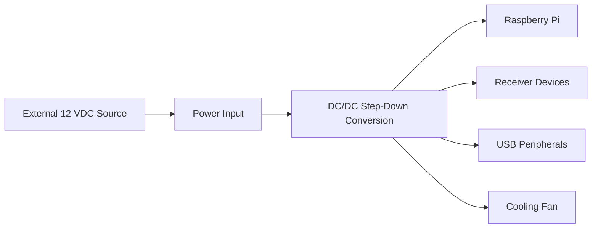

# Power System

### Part of the Mini Tracker Hardware Documentation

---

## Purpose

This document describes the Mini Tracker power subsystem from an operational and maintenance perspective.

It explains how external 12 VDC power is converted and distributed inside the unit to support the computing platform, receiver devices, USB peripherals and cooling.

This document is not a low-level electronics guide. It describes the power system as an integrated subsystem of Mini Tracker.

---

## Operational Role

The power subsystem provides the electrical foundation for the entire Mini Tracker node.

Stable power is essential because every Mini Tracker subsystem depends on it. The computing platform, networking, GPS, receiver devices, USB peripherals and internal cooling fan all require reliable power to remain available during field operations.

During deployment, the operator should treat power readiness as a primary operational check. A Mini Tracker unit with unstable or insufficient power may start correctly but become unreliable once receivers, peripherals or services are active.

---

## Power Architecture

Mini Tracker is powered from an external regulated 12 VDC input.

Inside the enclosure, two independent 5 A DC/DC step-down converters provide regulated 5 V power for the Raspberry Pi and all internal peripherals. The operator is never expected to adjust or configure the internal power conversion system during normal use.

The power architecture allows Mini Tracker to operate from different field power sources while maintaining the regulated internal supply required by the device.

---

## External Power Sources

The external 12 VDC input allows Mini Tracker to be powered from several field sources.

Typical sources include:

- AC/DC power supplies
- Vehicle electrical systems
- Portable batteries
- Solar power systems with suitable battery and regulator
- Generators
- Laboratory power supplies

The selected source must be stable and suitable for continuous operation. It should provide enough current capacity and autonomy for the expected mission duration, including receiver operation and cooling.

Before deployment, operators should avoid weak, poorly regulated or improvised power sources that cannot reliably support the full system load.

---

## Internal Power Distribution

Inside the enclosure, Mini Tracker uses two independent 5 A DC/DC step-down converters.

These converters provide regulated 5 V power for the Raspberry Pi and all internal peripherals. The internal power system also supplies receiver devices, USB peripherals and the internal cooling fan.

The converters are part of the integrated Mini Tracker power subsystem. They should not be treated as loose components or adjusted during normal field use.

Detailed wiring, connector types and circuit-level behavior are outside the scope of this document.

---

## Cooling Fan Power

The internal cooling fan is powered by the Mini Tracker power subsystem.

Its role is to support thermal stability during operation, especially when Mini Tracker is used for extended periods or in warm field conditions.

If the fan is visible or audible during normal operation, the operator may include it in basic field checks. Fan behavior should be interpreted together with system status and environmental conditions.

---

## Field Power Considerations

Field deployments should use a suitable 12 VDC source matched to the operational scenario.

The operator should consider:

- Expected mission duration
- Battery autonomy
- Environmental temperature
- Cable quality
- Connector reliability
- Stability of the external supply
- Whether the unit starts correctly before leaving for the operational area

Longer deployments require additional attention to power autonomy. Hot environments may increase the importance of reliable cooling. Mobile or vehicle-based deployments should use cables and connections that remain secure during movement.

The power source should be verified before the operational phase begins, preferably while corrective action is still possible.

---

## Power-Related Symptoms

Poor power quality or undervoltage can cause operational symptoms that may appear unrelated to the power system.

Possible symptoms include:

- Unexpected reboots
- Raspberry Pi undervoltage behavior
- USB device instability
- Receiver problems
- GPS receiver instability
- Dashboard services becoming unavailable
- Fan not operating when expected

These symptoms do not always prove that the power source is the cause, but they should prompt the operator or maintainer to verify the external supply, cables, connectors and system status.

---

## Operator Checks

Before field deployment, perform a basic power readiness check.

Recommended sequence:

1. Verify that the external 12 VDC source is suitable for Mini Tracker.
2. Verify that the power source has enough autonomy for the planned mission duration.
3. Inspect cables and connectors for secure connection and visible damage.
4. Power on the unit.
5. Allow Mini Tracker to complete startup.
6. Check Dashboard system status.
7. Verify GPS, receivers and services as applicable.
8. Check that the cooling fan is operating if it is visible or audible.

If power-related symptoms appear during preparation, resolve them before deployment whenever possible.

---

## Maintenance Notes

Internal power conversion should be inspected only during maintenance.

The operator should not adjust internal DC/DC converters in the field. Internal converter adjustment, inspection or replacement belongs to maintenance activity and should be performed only by personnel responsible for service of the unit.

During maintenance, power checks should consider the complete subsystem, including the external supply, internal conversion, connected peripherals and cooling.

---

## Related Documentation

- `hardware/overview.md`
- `hardware/raspberry-pi.md`
- `hardware/networking.md`
- `user/installation.md`
- `user/first-start.md`
- `user/dashboard.md`
