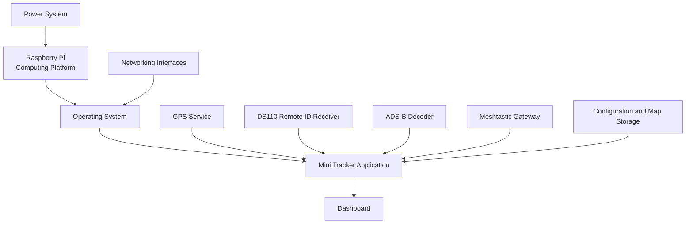
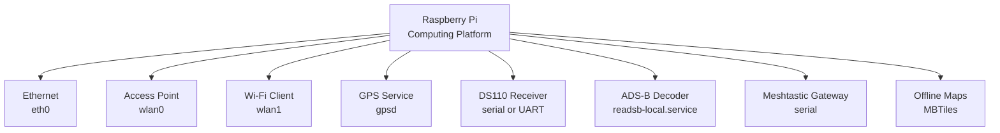

# Raspberry Pi

### Part of the Mini Tracker Hardware Documentation

---

## Purpose

This document describes the Raspberry Pi as the Mini Tracker Computing Platform.

It explains how the Raspberry Pi hosts the local software services, operating system interfaces, Dashboard and hardware connections that allow Mini Tracker to operate as an integrated field node.

This document is not a Raspberry Pi tutorial. It does not describe the Raspberry Pi as a standalone computer. It describes the role of the Raspberry Pi inside Mini Tracker.

---

## Operational Role

The Raspberry Pi provides the computing foundation for Mini Tracker.

Inside Mini Tracker, the Raspberry Pi is responsible for running the local application, exposing the Dashboard, interacting with the operating system and coordinating the hardware subsystems that contribute to field awareness.

The operator normally does not interact with the Raspberry Pi directly. The operational interface is the Dashboard. The Raspberry Pi is the internal platform that makes the Dashboard and subsystem integration available.

---

## Computing Platform Role

The Raspberry Pi is considered the Computing Platform because it joins separate hardware functions into one operational Mini Tracker node.

It hosts the services that:

- Serve the Dashboard and Help pages
- Start and monitor local network access
- Read GPS status through the local GPS service
- Communicate with the DS110 Remote ID receiver
- Track local ADS-B decoder state
- Communicate with the Meshtastic gateway when enabled
- Store configuration and map files
- Report system, network, hardware and service status
- Support update, backup and restore workflows

Without the Computing Platform, the other hardware subsystems would remain separate receivers, adapters or power loads. The Raspberry Pi provides the local processing and integration layer that turns those subsystems into a single Mini Tracker device.

---

## Platform Architecture

Mini Tracker uses the Raspberry Pi as the local host for both operator access and subsystem integration.

The Dashboard is presented to the operator through the services hosted on the Raspberry Pi.

---

## Operating System Interaction

Mini Tracker relies on the operating system for device access, networking, storage and service control.

The current implementation interacts with the operating system through:

| Operating System Area | Mini Tracker Use |
|----------|-------------------|
| **Network interfaces** | Reads `eth0`, `wlan0` and `wlan1` state and addresses. |
| **NetworkManager** | Uses `nmcli` to scan Wi-Fi networks, connect Wi-Fi Client mode, configure Ethernet and start the Access Point. |
| **System services** | Uses `systemctl` to start or stop the local ADS-B receiver service named `readsb-local.service` and to restart `tracker-mini.service`. |
| **Power control** | Uses operating system reboot and shutdown commands when requested from the Dashboard. |
| **GPS service** | Reads GPS data from `gpsd` on `127.0.0.1:2947`. |
| **Device filesystem** | Checks serial and network device paths such as `/dev/serial0`, `/dev/ttyACM*`, `/dev/ttyUSB*` and `/sys/class/net/wlan1`. |
| **System status** | Reads CPU, RAM, disk usage, uptime and hostname for Dashboard status. |

These operating system interfaces are part of the Mini Tracker platform integration. Operators should normally verify their state from the Dashboard instead of using low-level operating system commands during field use.

---

## Hosted Services

The Raspberry Pi hosts the Mini Tracker application and supporting service workflows.

| Hosted Function | Operational Purpose |
|----------|----------------------|
| **Dashboard server** | Serves the operator Dashboard on the local Mini Tracker node. |
| **Help pages** | Serves the generated Help documentation from the local application. |
| **Network management** | Starts the Access Point and manages Wi-Fi Client and User LAN settings. |
| **Remote ID service** | Starts the DS110 receiver worker when Remote ID is enabled. |
| **DSC heartbeat** | Sends tracker heartbeat information when DSC synchronization is enabled and Internet connectivity is available. |
| **GPS status** | Reads GPS fix, position, satellite and HDOP information from the local GPS service. |
| **ADS-B local control** | Controls the local ADS-B receiver service and monitors decoder output. |
| **Meshtastic integration** | Connects to the configured Meshtastic serial gateway when enabled. |
| **Maps and storage** | Serves offline map tiles and reports map storage information. |
| **Update workflow** | Handles update package upload, validation, backup, test install and install request creation. |
| **System power controls** | Provides Dashboard actions to restart the application, reboot the Raspberry Pi or shut down the Raspberry Pi. |
| **Logs** | Provides application log access from the Dashboard. |

The application serves the Dashboard from the local frontend and listens on the Mini Tracker node so operator devices can access it through the configured network interfaces.

---

## Dashboard Hosting

The Raspberry Pi hosts the Mini Tracker Dashboard.

The Dashboard is served by the local backend application and is the main interface for operators, maintainers and integrators. It presents map data, system status, network status, traffic source status, hardware status, mission workflows, logs and update controls.

Mini Tracker also serves the generated Help documentation through the same local application. This allows operators to open product documentation from the device when the Dashboard is reachable.

Dashboard access depends on the networking subsystem. Operators may reach it through Ethernet or through the built-in Wi-Fi Access Point, depending on the deployment scenario.

---

## Hardware Interfaces

The Raspberry Pi provides the hardware and operating system interfaces used by Mini Tracker.

| Interface | Mini Tracker Use |
|----------|-------------------|
| **Ethernet** | Uses `eth0` for Admin LAN access and optional User LAN configuration. |
| **Wi-Fi Access Point** | Uses `wlan0` for the built-in Access Point. |
| **Wi-Fi Client** | Uses `wlan1` when a Wi-Fi Client adapter is present. |
| **USB / serial devices** | Supports serial-connected devices exposed through `/dev/ttyACM*`, `/dev/ttyUSB*` and `/dev/serial/by-id/*`. |
| **GPIO / UART serial** | Supports the configured DS110 UART path `/dev/serial0` when the receiver is configured for UART operation. |
| **Local service interfaces** | Reads GPS from `gpsd` and ADS-B decoder state from `/run/readsb/aircraft.json`. |

The current DS110 configuration uses the UART device path `/dev/serial0` at 115200 baud. The Dashboard also supports selecting USB or UART mode and choosing an available serial device path for the DS110 receiver.

The Meshtastic gateway is configured as a serial-connected device. The current settings identify it by a `/dev/serial/by-id/...` path.

---

## Storage and Boot Media

The Raspberry Pi depends on local system storage for the operating system, the Mini Tracker application and operational data.

The current implementation uses local filesystem paths for:

- Mini Tracker application files under `/home/pi/tracker-mini`
- Update staging, uploads, backups and install requests under `/home/pi/tracker-mini-updater`
- Configuration files under `config/`
- Offline map files under `maps/`
- Generated Help pages under `frontend/help/site/`

Mini Tracker reports disk usage for the root filesystem through the Dashboard system status. Map storage information is calculated from the local `maps/` directory.

The implementation does not expose a separate data disk or removable map storage workflow. The boot and application storage should therefore be treated as critical system storage. Power loss, failed writes or a full filesystem can affect startup, configuration, maps, updates and Dashboard availability.

---

## Communication With Hardware Subsystems

The Raspberry Pi communicates with the other Mini Tracker hardware subsystems through operating system interfaces and local services.

The Computing Platform does not replace the hardware subsystems. It hosts the integration logic that reads their state, exposes operator controls and presents their data through the Dashboard.

---

## Startup Considerations

During application startup, Mini Tracker initializes several platform functions.

The current implementation:

- Starts the local Wi-Fi Access Point when it is not already active
- Starts the DS110 Remote ID receiver worker when Remote ID is enabled in settings
- Starts the DSC heartbeat workflow
- Registers the Dashboard and API routes
- Serves the Dashboard and Help pages locally

After startup, the operator should allow enough time for receiver services, GPS, network interfaces and Dashboard status indicators to settle before judging field readiness.

Recommended checks:

1. Confirm that the Dashboard is reachable.
2. Check system status for hostname, CPU, RAM and disk usage.
3. Verify network status for the intended access method.
4. Verify GPS status if GPS position is required.
5. Verify Remote ID, ADS-B and Meshtastic status according to the mission.
6. Confirm offline maps or Internet connectivity according to the planned map source.

Startup readiness should be assessed from the complete Dashboard state, not from a single indicator.

---

## Shutdown Considerations

Mini Tracker stores configuration, maps, logs, update packages and backup data on local storage.

The operator should avoid removing power while Mini Tracker is writing data. This is especially important during:

- Map downloads
- Configuration changes
- System update package upload or validation
- Backup or restore activity
- Active log or service state changes

The current Dashboard provides System Power controls for restarting the Mini Tracker application, rebooting the Raspberry Pi and shutting down the Raspberry Pi. These actions request privileged operating system operations and should be used only when the operator is ready for the Dashboard or the device to become temporarily unavailable.

Power stability is part of platform reliability. Unexpected power loss can interrupt hosted services and may leave storage operations incomplete.

The deployed operating system must allow the Mini Tracker backend service account to perform the confirmed privileged operations without an interactive password prompt. The current implementation uses `sudo` for NetworkManager operations, readsb service control, `tracker-mini.service` restart, reboot and shutdown.

---

## Maintenance Considerations

Maintainers should treat the Raspberry Pi as the Computing Platform, not as an isolated board.

Useful maintenance checks include:

- Dashboard reachability
- Hostname, CPU, RAM and disk usage
- Root filesystem free space
- Map storage usage
- Ethernet and Wi-Fi interface state
- Access Point state
- Wi-Fi Client adapter detection
- Serial device availability for DS110 and Meshtastic
- GPS service availability
- ADS-B decoder state
- Application logs
- Update package, backup and restore state

Most checks should begin in the Dashboard because it presents the integrated Mini Tracker state. Low-level operating system inspection is a maintenance activity and should be used when Dashboard status is insufficient to identify the cause of a problem.

---

## Relationship With Other Hardware Subsystems

The Raspberry Pi sits between the power, networking, positioning, receiver and operator interface subsystems.

| Related Subsystem | Relationship to the Raspberry Pi |
|----------|-------------------------------------|
| **Power System** | Supplies regulated power required for the Computing Platform and connected peripherals. |
| **Networking** | Provides Ethernet, Access Point and Wi-Fi Client paths used to reach the Dashboard and external services. |
| **GPS** | Provides node position through the local GPS service. |
| **ADS-B Reception** | Provides local aircraft decoder output monitored by Mini Tracker. |
| **Remote ID Reception** | Provides drone detection data through the DS110 serial or UART connection. |
| **Meshtastic Gateway** | Provides team awareness through a serial-connected gateway. |
| **Dashboard Integration** | Presents the platform and subsystem state to the operator. |

The Raspberry Pi is therefore the integration point for Mini Tracker, but it is not the whole product. Field readiness depends on the Computing Platform and the connected hardware subsystems working together.

---

## Platform-Related Symptoms

Computing Platform issues may appear as service, interface or Dashboard symptoms.

Possible symptoms include:

- Dashboard unreachable
- Help pages unavailable
- High disk usage
- System status unavailable
- Access Point not active
- Wi-Fi Client adapter missing
- Serial device missing from DS110 settings
- Remote ID receiver connected but no heartbeat
- ADS-B decoder offline
- GPS service unavailable
- Meshtastic gateway missing or inactive
- Update or backup workflow failing

These symptoms do not always indicate a Raspberry Pi hardware fault. They may result from power instability, storage pressure, missing peripherals, operating system service state, network configuration or subsystem-specific receiver issues.

---

## Related Documentation

- `hardware/overview.md`
- `hardware/power.md`
- `hardware/networking.md`
- `hardware/gps.md`
- `hardware/ads-b.md`
- `hardware/remote-id.md`
- `hardware/meshtastic.md`
- `user/installation.md`
- `user/first-start.md`
- `user/dashboard.md`
- `user/maps.md`
- `user/traffic-monitoring.md`
