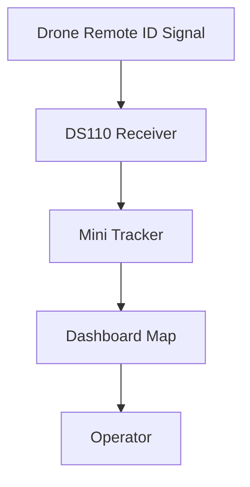

# Remote ID

### Part of the Mini Tracker Hardware Documentation

---

## Purpose

This document describes the Mini Tracker Remote ID subsystem from an operational and maintenance perspective.

It explains how the Remote ID receiver contributes drone awareness to the Dashboard and how operators can verify receiver state during field operations.

This document is not a low-level radio or decoder guide. It describes Remote ID as an integrated hardware subsystem of Mini Tracker.

---

## Operational Role

The Remote ID subsystem supports awareness of drones transmitting supported identification data.

When the receiver is active and compatible data is received, Mini Tracker displays detected drones on the Dashboard map. Remote ID information helps the operator understand nearby unmanned aircraft activity in relation to the mission area.

Remote ID visibility depends on receiver state, antenna placement, radio range and drones transmitting supported data in the operating area.

---

## Receiver Architecture

Mini Tracker uses a DS110 Remote ID receiver.

The receiver can be configured for USB or UART connection, with a selected device path and baud rate. The current project configuration uses the DS110 settings stored in Mini Tracker settings.

The receiver service reads Remote ID data from the DS110 receiver and converts detected drones into operational objects for the Dashboard.

The operator interacts with Remote ID through Dashboard status, traffic source controls and drone markers on the map.

---

## Supported Receiver Data

The Remote ID subsystem processes supported OpenDroneID message data received through the DS110 receiver.

The implementation also handles supported DJI DroneID-derived data when available from the receiver stream.

Mini Tracker may identify vendor and model information from received identifiers when the identifier format is recognized. Vendor or model information may be absent for some detections.

---

## Drone Detection

Detected drones are stored as Remote ID aircraft objects and displayed when they contain usable identification and position information.

Remote ID detections may include:

- Serial number
- Vendor
- Model
- Source
- Position
- Altitude
- Height
- Speed
- Heading
- Operator position
- Operator identifier
- Last seen time

Not every drone provides every field. Missing values should be treated as unavailable data rather than as confirmation of a receiver fault.

---

## Dashboard Integration

Remote ID is integrated into the Dashboard traffic view.

The Dashboard can display Remote ID drones as map markers. Selecting a drone marker presents the available details for that object, including model, vendor, serial number and source where available.

When Remote ID packets are no longer received for a detected drone, the Dashboard marks the track as stale, fades the marker and removes it after the configured retention window expires. This prevents old Remote ID tracks from remaining on the operational map indefinitely while allowing slower-transmitting devices to remain visible long enough for field use.

The top status bar includes a RID indicator. The system status area also includes a Remote ID traffic source control labeled Remote ID (DS110).

The hardware status view shows:

- DS110 RID receiver connection state
- DS110 RID heartbeat state

---

## Supported Workflows

The current Dashboard supports the following Remote ID workflows:

- Enable or disable the Remote ID receiver service
- Configure DS110 interface mode
- Select the DS110 device path
- Configure DS110 baud rate
- Verify DS110 receiver connection
- Verify DS110 heartbeat activity
- Display detected drone markers on the map
- Fade and remove stale Remote ID markers when packets are no longer received
- Clear displayed Remote ID markers when the source is disabled

Remote ID detections may also be sent to DSC services when synchronization is enabled and Internet connectivity is available.

---

## Field Considerations

Remote ID reception should be verified before the operational phase begins.

Recommended checks:

1. Confirm that the DS110 receiver is connected.
2. Confirm that the DS110 heartbeat is active.
3. Verify that Remote ID is enabled when drone awareness is required.
4. Confirm receiver antenna placement according to the field setup.
5. Open the Dashboard map and verify that Remote ID markers appear when compatible drones are present.
6. Confirm Internet connectivity only if DSC synchronization or other network-dependent workflows are required.

The absence of Remote ID detections does not confirm that no drones are present. It may mean that no compatible drones are transmitting in range, that reception conditions are limited or that the receiver is not active.

---

## Diagnostics

Remote ID issues may appear as missing receiver state, missing heartbeat or absent drone markers.

Possible symptoms include:

- DS110 RID receiver shown as missing
- DS110 RID heartbeat shown as no data
- RID status indicator red
- Remote ID source disabled
- No drone markers displayed
- Drone markers missing position
- Vendor or model information unavailable

These symptoms may result from receiver connection, DS110 settings, service state, antenna placement, radio range or the availability of compatible Remote ID transmissions.

---

## Maintenance Notes

Remote ID should be inspected as a receiver subsystem.

Maintainers should consider receiver connection, configured interface, device path, baud rate, heartbeat state, antenna placement and Dashboard status together.

The operator should not need to inspect decoder internals during normal field operation. Basic checks should begin with Dashboard hardware status and the Remote ID traffic source control.

---

## Related Documentation

- `hardware/overview.md`
- `hardware/power.md`
- `hardware/networking.md`
- `user/dashboard.md`
- `user/first-start.md`
- `user/traffic-monitoring.md`
