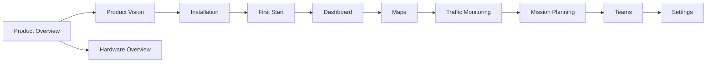

# Mini Tracker Documentation

Documentation Version: Draft

Last Updated: June 30, 2026

### Official Documentation Entry Point

---

## Welcome

This documentation provides the official reference for Mini Tracker users, operators, integrators, maintainers and developers.

The purpose of this index is to help readers identify the correct document for their role and objective.

For a description of the product, its capabilities and intended operational role, refer to `product-overview.md`.

---

## About this Documentation

The Mini Tracker documentation is organized around operational use, system preparation, hardware integration, maintenance and software development.

Each document is intended to cover a specific area of responsibility:

- Product documents explain the platform purpose and design principles.
- User documents describe operator workflows and field use.
- Hardware and maintenance documents support deployment and service activities.
- Developer documents describe the software architecture and extension points.

---

## Documentation Philosophy

Mini Tracker documentation is written from the operator's perspective whenever possible.

Documents describe operational workflows and field use rather than software implementation. Implementation details belong in the developer documentation.

The documentation evolves together with the product and should remain aligned with released capabilities.

---

## Documentation Structure

| Area | Purpose | Primary Audience |
|----------|----------|------------------|
| **Product Documentation** | Explains the product identity, vision and high-level capabilities. | Decision makers, operators, maintainers, developers |
| **User Guide** | Describes installation, first start, operator workflows, field use and operating settings. | Field operators, team leads, integrators |
| **Hardware Documentation** | Describes hardware assembly, integration and field deployment. | Integrators, maintainers |
| **Maintenance Documentation** | Describes diagnostics, troubleshooting and service procedures. | Maintainers, technical operators |
| **Developer Documentation** | Describes architecture, APIs and development practices. | Software developers, maintainers |

---

## Documentation Map

---

## Recommended Reading Path

### First-time Users

First-time users should begin with the product-level documents before moving to operational use.

Recommended sequence:

1. `product-overview.md`
2. `product-vision.md`
3. `user/installation.md`
4. `user/first-start.md`
5. `user/dashboard.md`
6. `user/maps.md`
7. `user/traffic-monitoring.md`
8. `user/faq.md`

---

### Field Operators

Field operators should focus on documents that support preparation and live field use.

Recommended sequence:

1. `user/first-start.md`
2. `user/dashboard.md`
3. `user/maps.md`
4. `user/traffic-monitoring.md`
5. `user/mission-planning.md`
6. `user/teams.md`
7. `user/settings.md`
8. `user/troubleshooting.md`

---

### Hardware Integration

Hardware integrators should use the product and hardware documents together.

Recommended sequence:

1. `product-overview.md`
2. `hardware/overview.md`
3. `user/installation.md`
4. `user/first-start.md`
5. `user/settings.md`

---

### Maintenance

Maintainers should focus on system state, diagnostics and repeatable service procedures.

Recommended sequence:

1. `user/dashboard.md`
2. `user/settings.md`
3. `user/troubleshooting.md`
4. `release-notes.md`

---

### Software Development

Software developers should begin with the product intent before reviewing implementation-oriented material.

Recommended sequence:

1. `product-overview.md`
2. `product-vision.md`
3. `developer/architecture.md`
4. `developer/api.md`
5. `release-notes.md`

---

## Documentation Status

| Repository File | Status | Area | Purpose |
|----------|----------|------|---------|
| `product-overview.md` | Complete | Product Documentation | Introduces the platform and its main capabilities. |
| `product-vision.md` | Complete | Product Documentation | Defines product mission, principles and long-term direction. |
| `user/dashboard.md` | Complete | User Guide | Describes the main operational interface. |
| `user/maps.md` | Complete | User Guide | Describes map use and offline coverage preparation. |
| `user/traffic-monitoring.md` | Complete | User Guide | Describes traffic awareness and information fusion. |
| `user/installation.md` | Complete | User Guide | Describes installation and preparation before first use. |
| `user/first-start.md` | Complete | User Guide | Guides the first operational preparation workflow before deployment. |
| `user/settings.md` | Planned | User Guide | Describes operator settings and configuration workflows. |
| `user/mission-planning.md` | Complete | User Guide | Describes mission creation, planning and map objects. |
| `user/teams.md` | Complete | User Guide | Describes team awareness and coordination workflows. |
| `user/troubleshooting.md` | Planned | User Guide | Provides operator-level troubleshooting procedures. |
| `hardware/overview.md` | Complete | Hardware Documentation | Introduces hardware components and integration scope. |
| `hardware/power.md` | Complete | Hardware Documentation | Describes power inputs, distribution and field power considerations. |
| `hardware/networking.md` | Complete | Hardware Documentation | Describes network interfaces and deployment connectivity options. |
| `hardware/gps.md` | Complete | Hardware Documentation | Describes GPS receiver integration and antenna considerations. |
| `hardware/ads-b.md` | Complete | Hardware Documentation | Describes ADS-B hardware integration. |
| `hardware/remote-id.md` | Complete | Hardware Documentation | Describes Remote ID hardware integration. |
| `hardware/meshtastic.md` | Complete | Hardware Documentation | Describes Meshtastic hardware integration. |
| `hardware/raspberry-pi.md` | Complete | Hardware Documentation | Describes Raspberry Pi platform integration and system role. |
| `maintenance/backup.md` | Complete | Maintenance Documentation | Describes current backup capabilities and update-created internal backups. |
| `maintenance/restore.md` | Complete | Maintenance Documentation | Describes current restore capabilities and update rollback scope. |
| `maintenance/update.md` | Complete | Maintenance Documentation | Describes the Dashboard update workflow and backend update subsystem. |
| `maintenance/diagnostics.md` | Complete | Maintenance Documentation | Describes available Dashboard diagnostic information and current limitations. |
| `maintenance/logs.md` | Complete | Maintenance Documentation | Describes in-memory logging and the Dashboard log viewer. |
| `developer/architecture.md` | Complete | Developer Documentation | Describes software architecture and internal organization. |
| `developer/repository.md` | Complete | Developer Documentation | Describes repository organization and project layout. |
| `developer/services.md` | Complete | Developer Documentation | Describes backend service responsibilities and interactions. |
| `developer/backend.md` | Complete | Developer Documentation | Describes Flask backend implementation and request flow. |
| `developer/frontend.md` | Complete | Developer Documentation | Describes Dashboard frontend implementation. |
| `developer/mission-storage.md` | Complete | Developer Documentation | Describes mission storage and mission data workflows. |
| `developer/api.md` | Complete | Developer Documentation | Documents API surfaces and integration points. |
| `developer/coding-guidelines.md` | Complete | Developer Documentation | Describes project coding style and contribution guidance. |
| `user/faq.md` | Planned | Product Documentation | Answers common user and operator questions. |
| `release-notes.md` | Planned | Product Documentation | Tracks product changes across releases. |
| `glossary.md` | Planned | Product Documentation | Defines product terminology and abbreviations. |
