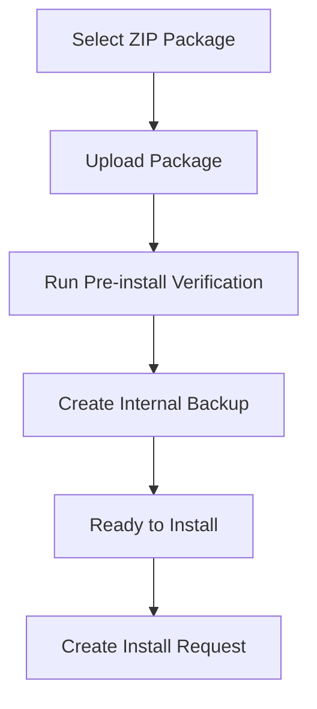

# Update

### Part of the Mini Tracker Maintenance Documentation

---

## Purpose

This document describes the current Mini Tracker update subsystem.

It covers the operator-visible workflow and the maintenance concepts needed to understand package upload, verification, backup creation and installation requests.

For endpoint-level implementation details, refer to `developer/api.md`. For backend request flow and service organization, refer to `developer/backend.md`.

---

## Update Role

Mini Tracker includes a Dashboard update workflow for uploading and verifying software update packages.

The backend update service can validate packages, extract them to a staging directory, run verification checks, create an internal backup and create an installation request.

The current repository does not include the external installer process that consumes the install request.

---

## Dashboard Workflow

The update workflow is opened from the Dashboard System panel through **System Update**.

The modal shows current installed package metadata when available, accepts a ZIP package and provides an **Upload & Verify** action. When verification succeeds, the Dashboard enables **Install Update**.

---

## Package Upload

The Dashboard uploads a selected ZIP package to the backend update API.

The backend stores uploaded packages in the updater upload directory using a secured filename. The upload response includes the filename and file size.

The Dashboard accepts `.zip` files in the file picker.

---

## Package Validation

Package validation opens the ZIP archive and checks whether it contains top-level `backend/` and `frontend/` paths.

The package is classified as:

| Type | Detected Contents |
|----------|-------------------|
| `full` | Backend and frontend content. |
| `backend` | Backend content only. |
| `frontend` | Frontend content only. |
| `unknown` | Neither expected path is detected. |

Validation confirms package structure at a high level. It does not describe a signed package or cryptographic trust model in the current implementation.

---

## Extraction

After validation, the package is extracted into the updater staging directory.

If an existing staging directory is present, it is removed before the new package is extracted. The extraction result reports whether `backend` and `frontend` content is present in staging.

---

## Syntax Verification

When a package contains backend files, the update service compiles staged Python files with Python's compile check.

The result reports the number of checked files and any syntax errors. If syntax errors are found, the pre-install workflow stops.

---

## Structure Verification

Backend and frontend packages are checked for required structure.

| Package Area | Required Items |
|----------|----------------|
| Backend | `app.py`, `routes/`, `services/` |
| Frontend | `index.html`, `css/`, `js/` |

If required items are missing, the package test fails before installation is requested.

---

## Test Installation

The update service can create a test installation under the updater working directory.

Staged backend and frontend content are copied into the test install directory. If the live tracker configuration directory exists, it is copied into the test install directory for the test environment.

The test installation reports backend and frontend file counts.

---

## Backend Import Verification

After test installation, the update service verifies that the staged backend can be imported.

The service runs a Python import check from the test backend directory. If the import fails or times out, the update pre-install workflow fails before backup creation and install request creation.

---

## Backup Creation

When package tests, test installation and backend import verification succeed, the update service creates an internal backup.

The backup archives the live backend and frontend directories into timestamped backup storage. Older update backups are cleaned up so that only a small recent set is kept.

These backups are intended for the update process and rollback support. They are not a general user-managed backup feature.

---

## Install Request

After successful verification, the Dashboard enables the install action.

Selecting **Install Update** creates an install request file in the updater working directory. The request records:

- Package filename
- Associated backup name
- Creation timestamp
- Pending status

The Dashboard then informs the operator that the package has been queued and refreshes the page after a countdown.

---

## Updater Directories

The current backend implementation uses updater paths under `/home/pi/tracker-mini-updater`.

| Directory or File | Purpose |
|----------|---------|
| `/home/pi/tracker-mini-updater/uploads` | Uploaded ZIP packages. |
| `/home/pi/tracker-mini-updater/staging` | Extracted package contents. |
| `/home/pi/tracker-mini-updater/test-install` | Temporary test installation. |
| `/home/pi/tracker-mini-updater/backups` | Internal update backups. |
| `/home/pi/tracker-mini-updater/current.json` | Installed package metadata read by the Dashboard. |
| `/home/pi/tracker-mini-updater/install-request.json` | Pending install request created by the backend. |

The live tracker directory used by the update service is `/home/pi/tracker-mini`.

---

## Current Limitations

The current update subsystem has important limitations.

- The repository contains the backend update API and Dashboard workflow, but not the external installer that applies pending install requests.
- The Dashboard does not provide a full backup management interface.
- The Dashboard does not provide a general restore interface.
- Package validation checks ZIP contents and expected structure, but does not implement package signing.
- Update backups are internal to the update process.
- Update metadata is read from `current.json` when present; if it is absent, installed package information is reported as unknown.

---

## Related Documentation

- `maintenance/backup.md`
- `maintenance/restore.md`
- `maintenance/logs.md`
- `developer/backend.md`
- `developer/api.md`
- `developer/services.md`
