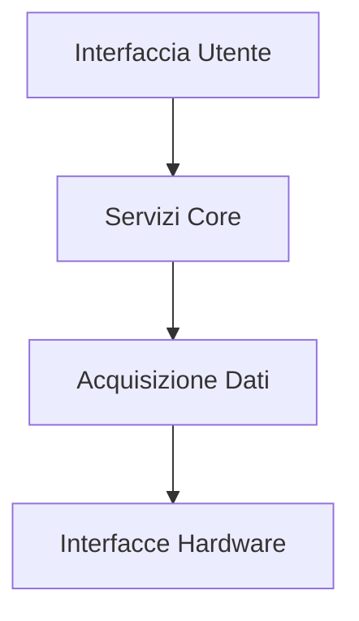

# Panoramica del Prodotto

# Mini Tracker

### Nodo Portatile di Consapevolezza del Traffico Aereo

---

## Scopo

Questo documento fornisce una panoramica ad alto livello della piattaforma Mini Tracker, delle sue funzionalità principali e degli scenari operativi per i quali è stata progettata.

---

## Panoramica

Mini Tracker è un **Nodo Portatile di Consapevolezza del Traffico Aereo** progettato per fornire un quadro operativo unificato durante le operazioni sul campo.

Anziché agire come un singolo ricevitore o un'applicazione di mappatura, Mini Tracker integra più tecnologie in una piattaforma portatile compatta capace di raccogliere, elaborare e presentare informazioni operative attraverso un'unica interfaccia web.

La piattaforma è stata progettata per operare in autonomia, anche in ambienti dove la connettività Internet non è disponibile.

---

## In breve

| Caratteristica | Descrizione |
|----------------|-------------|
| **Dispiegamento** | Nodo portatile da campo |
| **Piattaforma** | Raspberry Pi |
| **Interfaccia** | Dashboard basata su web |
| **Connettività** | Offline First |
| **Mappe** | MBTiles offline |
| **Pianificazione missioni** | Integrata |
| **Gestione team** | Integrata |
| **Remote ID** | Supportato |
| **ADS-B** | Supportato |
| **OGN / FLARM** | Supportato |
| **Meshtastic** | Supportato |
| **GPS** | Integrato |
| **Aggiornamenti** | OTA Update Manager |

---

## Sorgenti informative

Mini Tracker può raccogliere e correlare informazioni provenienti da più tecnologie indipendenti.

| Sorgente | Scopo |
|----------|-------|
| Remote ID | Identificazione e tracciamento droni |
| ADS-B | Consapevolezza del traffico aereo |
| OGN / FLARM | Consapevolezza alianti e aviazione leggera |
| Meshtastic | Posizione del team e messaggistica |
| GPS | Posizionamento del nodo |
| Mappe offline | Contesto geografico |

---

## Scenari operativi tipici

Mini Tracker è stato progettato per supportare operazioni quali:

- Ricerca e Soccorso (SAR)
- Protezione Civile
- Monitoraggio incendi
- Operazioni con droni
- Risposta alle emergenze
- Attività tecniche sul campo
- Dimostrazione e addestramento
- Ricerca e sperimentazione

---

## Architettura funzionale

Mini Tracker è organizzato in quattro livelli logici:

Per ulteriori dettagli sull'organizzazione software interna, consultare la **Guida all'Architettura**.
