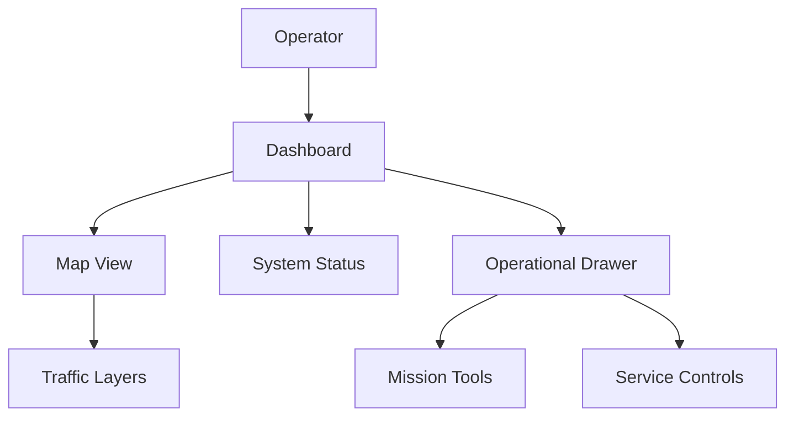
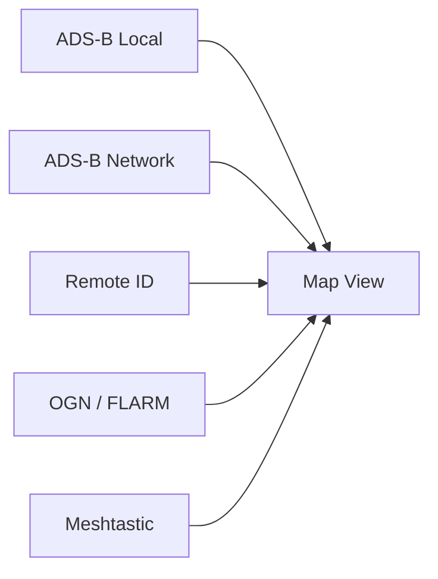
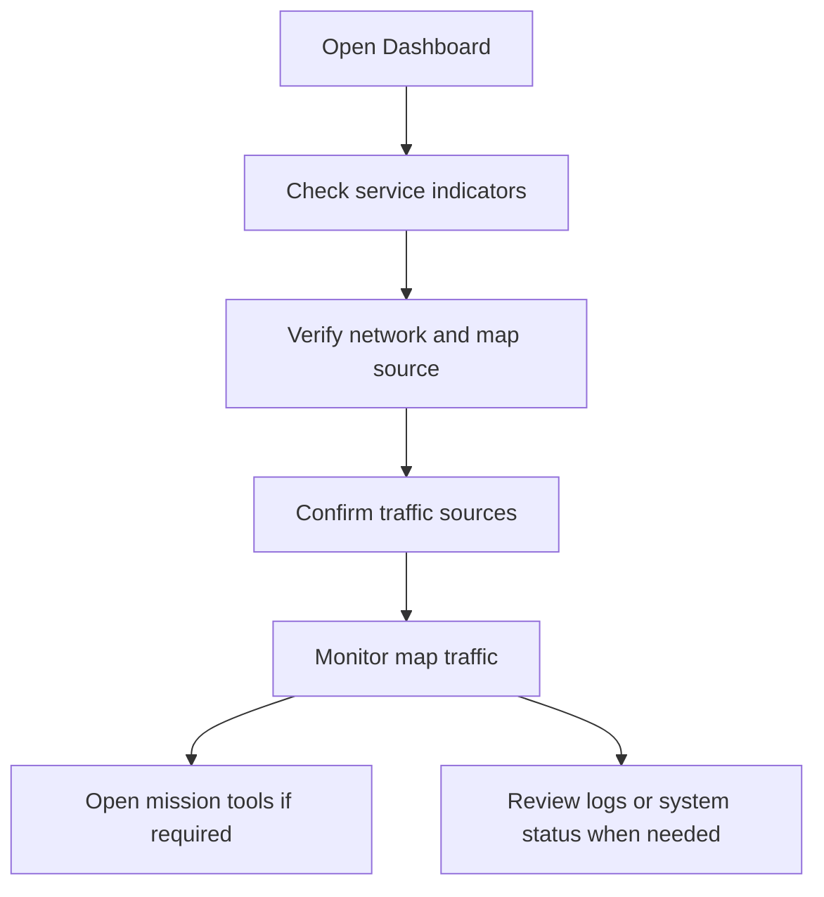

# Dashboard

### Part of the Mini Tracker User Guide

---

## Purpose

This document describes the Mini Tracker Dashboard from the operator's point of view.

The Dashboard is the main operational interface used to obtain situational awareness during field operations. It allows the operator to monitor the system, observe the operational map, verify active information sources and access mission-related tools when required.

The Dashboard is not intended to replace the dedicated configuration, mission planning or maintenance procedures. Those topics are covered in the related guides.

---

## Overview

The Dashboard provides a single operational picture by combining system state, map context and live operational information.

The operator uses the Dashboard to answer four operational questions:

- Is the Mini Tracker node running correctly?
- Is the map available for the current operating area?
- Which traffic and team information sources are active?
- What is happening around the mission area?

---

## Operational Role

During an operation, the Dashboard acts as the operator's primary monitoring workspace.

It supports:

- Initial system verification after startup
- Continuous monitoring of local airspace information
- Map-based awareness of aircraft, drones, gliders and operators
- Quick confirmation of network and receiver state
- Access to mission planning and team coordination tools
- Basic troubleshooting through status and logs

Detailed setup and configuration tasks should be performed according to the dedicated configuration and maintenance documentation.

---

## Main Areas

The Dashboard is organized around three operational areas.

| Area | Operational Purpose |
|----------|----------------------|
| **Status Bar** | Provides immediate awareness of network, receiver and synchronization state. |
| **Map View** | Displays the operational area, traffic information, team positions and mission layers. |
| **Operational Drawer** | Provides access to supporting workflows such as network checks, map management, system status, system settings, system power, system update, DSC, missions and logs. |

The operator normally spends most of the time in the map view and uses the drawer only when verification, configuration or mission actions are required.

---

## System Awareness

The Dashboard continuously presents the state of the Mini Tracker node and its main services.

The status indicators allow the operator to verify whether the following information sources and services are available:

- Network connectivity
- Local ADS-B receiver
- Network ADS-B source
- Remote ID receiver
- OGN / FLARM source
- Meshtastic receiver
- DSC synchronization

The DSC indicator identifies the active position mode:

| Label | Meaning |
|----------|----------|
| **DSC-M** | Manual DSC position source |
| **DSC-G** | GPS DSC position source |

The operator should verify these indicators after startup and periodically during the operation, especially when moving the node, changing antennas or modifying connectivity.

---

## Map View

The map is the primary operational area of the Dashboard.

It provides geographic context for:

- Air traffic
- Drone traffic
- OGN / FLARM objects
- Meshtastic operator positions
- DSC tracker position
- Mission objects and imported layers

The Dashboard can use offline maps served by the Mini Tracker node or an online topographic source when Internet connectivity is available.

Map source selection and offline map download procedures are covered in the **Configuration Guide** and related map management documentation.

---

## Traffic Information

The Dashboard can display multiple traffic sources on the same operational map.

Traffic objects are displayed as map markers. Selecting a marker opens the available details for that object.

The Dashboard supports:

- ADS-B aircraft from local and network sources
- Remote ID drones
- OGN / FLARM objects
- Meshtastic operator positions

ADS-B traffic is filtered by altitude by default. The operator can enable display of higher altitude aircraft when broader airspace awareness is required.

Dedicated operational details are covered in the **ADS-B Guide**, **Remote ID Guide** and **Meshtastic Guide**.

---

## Active Services

The Dashboard allows the operator to confirm which operational sources are active and, for supported services, enable or disable them during use.

This is useful when the operator needs to reduce map clutter, isolate a data source or verify whether a receiver is producing data.

Some controls affect only Dashboard visualization, while others control backend receiver services. Receiver availability still depends on the connected hardware and the current operating environment.

---

## System Controls

The System drawer panel provides operational access to status, traffic source controls, hardware status, DS110 settings, power actions and update access.

| System Area | Operator Use |
|----------|--------------|
| **System Status** | Shows host and service state used for operational verification. |
| **Traffic Sources** | Enables or disables supported traffic sources and aircraft altitude filtering. |
| **System Settings** | Opens hardware status and DS110 receiver settings. |
| **System Power** | Provides Restart Application, Reboot Raspberry and Shutdown Raspberry actions. |
| **System Update** | Opens the update modal for package upload, verification and install request creation. |

Power actions ask for operator confirmation before sending the request to Mini Tracker. Restart Application restarts the Tracker Mini application service. Reboot Raspberry and Shutdown Raspberry request operating system reboot or shutdown for the Mini Tracker computing platform.

---

## Mission Access

The Dashboard provides access to mission functions without making mission planning the default workspace.

From the Dashboard, the operator can open mission workflows to:

- Create or select a mission
- Display mission objects on the map
- Import GeoJSON layers
- Draw or edit mission objects
- Review team information from Meshtastic

Mission planning procedures are covered in the **Mission Planning Guide**.

TODO: The inspected frontend shows Duplicate Mission and Export Mission controls in the mission menu, but no active handler was identified for these controls.

---

## Team Awareness

When Meshtastic is enabled and operator data is available, the Dashboard can show mission operator positions on the map.

Operator markers provide quick awareness of team location and node status. The mission team view provides additional information about the gateway, configured operators and external nodes.

Detailed Meshtastic behavior is covered in the **Meshtastic Guide**.

---

## Operational Checks

A typical Dashboard workflow is:

Recommended operational sequence:

1. Open the Dashboard from a device connected to Mini Tracker.
2. Check the service indicators in the status bar.
3. Confirm that the map is available for the operating area.
4. Verify that the required traffic sources are active.
5. Monitor the map during the operation.
6. Open mission or team tools only when required by the workflow.
7. Use logs and system status for basic troubleshooting.

---

## Operational Notes

- The Dashboard refreshes system, service and network information periodically.
- Offline maps remain available without Internet connectivity when installed for the operating area.
- Online map sources and map downloads require Internet access.
- Browser-local settings are used for selected map source, dark map mode and selected visualization toggles.
- Traffic visibility depends on source availability, receiver state, map position and filtering options.
- Some Dashboard functions depend on connected hardware and active backend services.
- System update, power actions, detailed hardware diagnostics and maintenance procedures should be used carefully during field operations because they may interrupt Dashboard availability.

---

