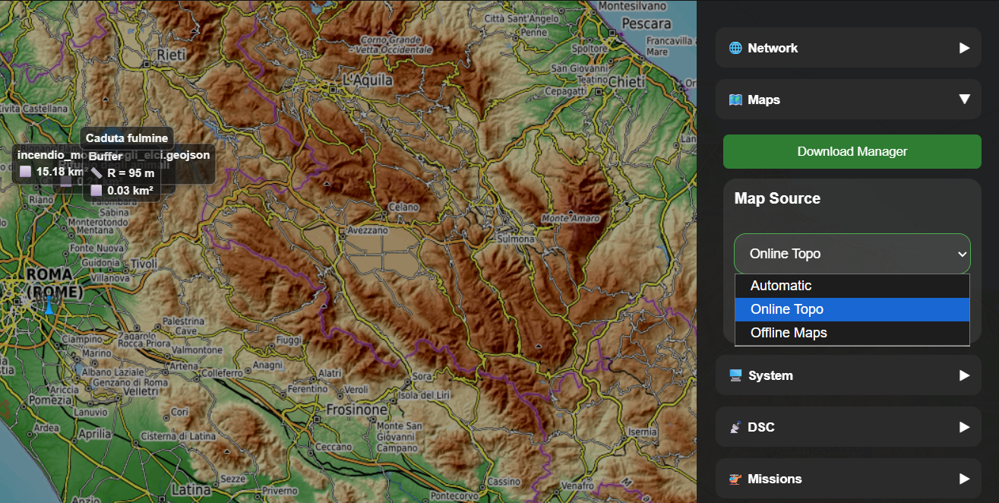
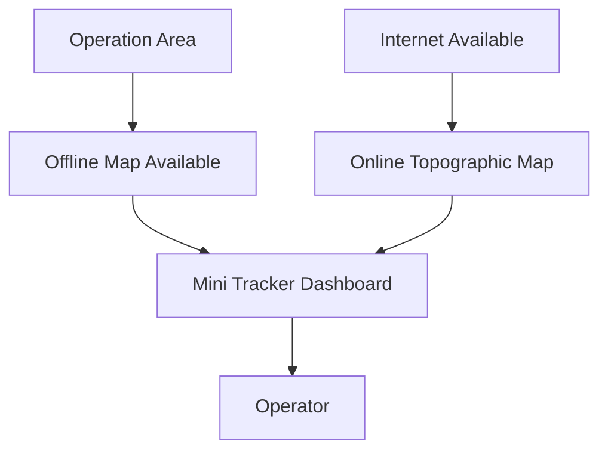
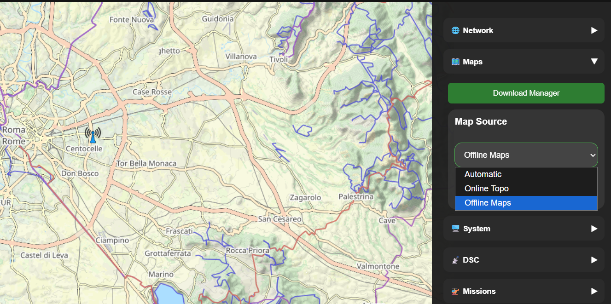
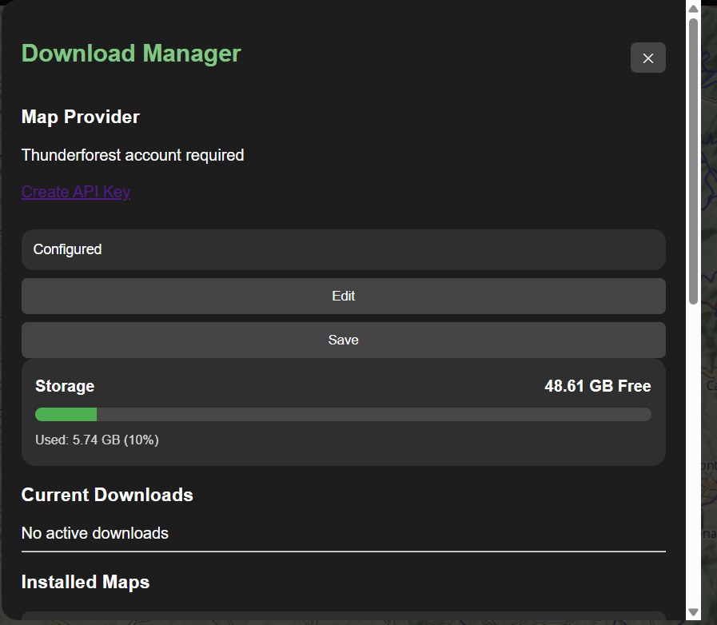
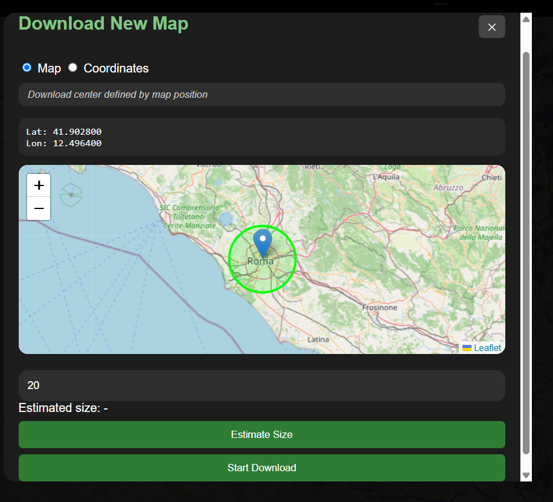
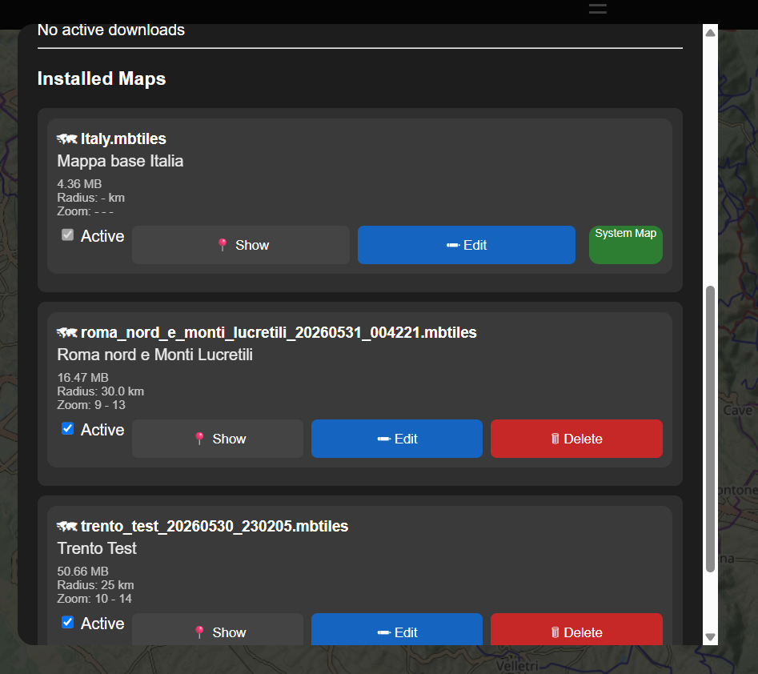
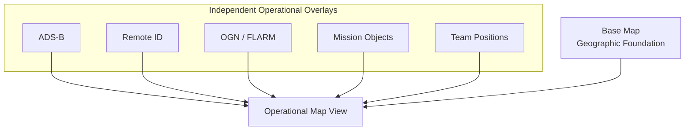
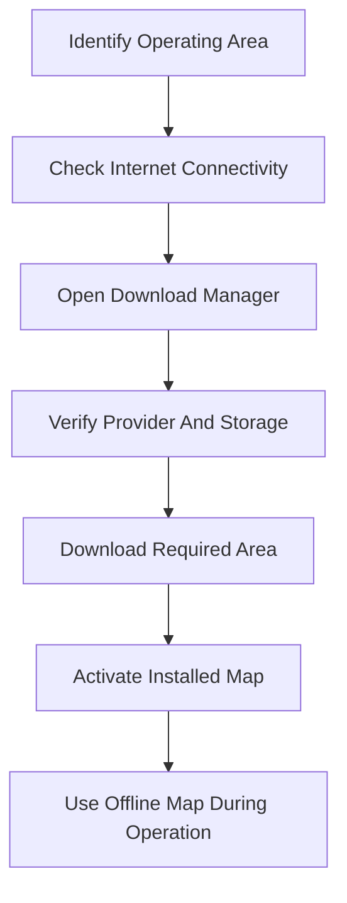

# Maps

### Part of the Mini Tracker User Guide

---

## Purpose

This document describes how operators use maps within Mini Tracker.

Maps provide the geographic context for traffic awareness, mission planning, team coordination and field monitoring. They allow the operator to understand where aircraft, drones, operators and mission objects are located in relation to the operating area.

Mini Tracker is designed to preserve map availability during field operations, including environments where Internet connectivity is unavailable.

---

## Overview

The map is the central operational workspace of the Dashboard.

It supports:

- Offline map visualization
- Optional online topographic visualization
- Display of aircraft, drones, gliders and operators
- Mission object visualization
- DSC tracker position awareness
- Preparation of additional offline map areas

The operator normally uses the map continuously during an operation and uses map management functions before or during deployment when additional geographic coverage is required.

*Maps panel with map source selection in the Dashboard drawer.*

---

## Offline First Philosophy

Mini Tracker follows an Offline First approach.

The platform is expected to remain operational even when Internet connectivity is not available. For maps, this means that essential geographic context should be available from local map files stored on the Mini Tracker node.

Online map sources can improve situational context when connectivity is available, but they are not intended to be the only source of operational mapping.

---

## Map Sources

Mini Tracker supports three map source modes.

| Mode | Operational Use |
|----------|------------------|
| **Automatic** | Allows Mini Tracker to select the appropriate source based on connectivity. |
| **Online Topo** | Uses an online topographic map when Internet connectivity is available. |
| **Offline Maps** | Uses locally installed MBTiles maps served by Mini Tracker. |

The selected map source is stored locally by the browser.

*Map source selector with online, automatic and offline map modes.*

---

## Automatic Map Selection

Automatic mode is intended for normal operation.

When Automatic mode is selected, Mini Tracker checks network connectivity and applies the available map source:

- If Internet access is available, the Dashboard uses the online topographic source.
- If Internet access is not available, the Dashboard uses locally installed offline maps.

The Dashboard periodically re-evaluates this selection while Automatic mode is active.

---

## Offline Maps

Offline maps are stored locally on the Mini Tracker node as MBTiles files.

Installed offline maps can be used without Internet access and are the preferred mapping source for planned field operations.

The operator can activate or deactivate installed maps. Active maps are available to the Dashboard when the offline map source is used.

A protected system map may be present and cannot be deleted from the Dashboard.

---

## Download Manager

The Download Manager is used to prepare offline map coverage.

It allows the operator to:

- Verify available storage
- Check whether the map provider is configured
- View current download jobs
- Review installed maps
- Activate or deactivate installed maps
- Rename map descriptions
- Delete non-protected maps
- Start a new offline map download

The Download Manager requires Internet connectivity before it can be opened for download operations.

Map downloads use the configured Thunderforest provider. A valid provider API key is required before new areas can be downloaded.

*Download Manager provider, storage and current download status.*

---

## Preparing Offline Coverage

A new offline map area can be defined in two ways:

| Method | Use Case |
|----------|----------|
| **Map position** | Use when the operator wants to visually select the area on a preview map. |
| **Coordinates** | Use when the operating area is known by latitude and longitude. |

The operator defines the center point and radius of the area. Mini Tracker estimates the approximate download size and shows a summary before starting the download.

*New offline map download defined by map position.*

During the download, progress is shown as a download job with percentage and tile count information.

When the download completes, the new map becomes available in the installed maps list.

---

## Installed Map Library

Installed maps can be reviewed from the Download Manager.

*Installed maps list with active state, show, edit and delete controls.*

For each map, Mini Tracker may display operational metadata such as:

- Description
- Size
- Radius
- Zoom range
- Active state

The operator can use this information to decide which maps should remain installed and which maps should be active for the current operation.

Non-protected maps can be deleted when storage needs to be recovered.

---

## Map Use During Operations

During an operation, maps provide the base context for all operational overlays.

The Dashboard can display:

- ADS-B traffic
- Remote ID drones
- OGN / FLARM traffic
- Meshtastic operators
- DSC tracker position
- Mission objects and imported layers

Changing the map source affects only the geographic base map. Operational overlays such as aircraft, drones, mission objects and team positions remain unchanged.

---

## Map Layers

Mini Tracker separates the base map from the operational information displayed above it.

The base map provides geographic context, while traffic layers, mission objects and team positions remain independent operational layers. This allows the operator to change the map source without changing the underlying operational information displayed on the Dashboard.

---
## Typical Workflow

A typical map preparation workflow is:

> **Best Practices**
>
> Before deployment, operators should download map coverage that includes not only the expected mission area, but also possible contingency areas, access routes and search expansion areas.

Recommended sequence:

1. Identify the expected operating area before deployment.
2. Connect Mini Tracker to the Internet when map downloads are required.
3. Open the Download Manager and verify storage availability.
4. Confirm that the map provider is configured.
5. Download the required area by map position or coordinates.
6. Confirm that the downloaded map is installed and active.
7. Use Automatic or Offline Maps mode during the field operation.

---

## Operational Recommendations

- Prepare offline maps before deployment whenever possible.
- Verify the operating area on the Dashboard before leaving Internet coverage.
- Keep only maps that are operationally useful to preserve storage.
- Use clear map descriptions so installed areas can be identified quickly.
- Use Automatic mode for general use and Offline Maps mode when Internet connectivity is unreliable.
- Confirm that the required map is active before starting the operation.
- Avoid starting large downloads immediately before deployment unless adequate time and connectivity are available.

---

## Operational Notes

- Online map sources require Internet access.
- Offline maps remain available without Internet access when installed locally.
- Map downloads require Internet access and a configured Thunderforest API key.
- Download progress is tracked while the Mini Tracker backend process is running.
- Browser-local settings are used for map source selection and dark map mode.
- Dark Map applies a darker visual overlay to the map and does not change the installed map data.

---
