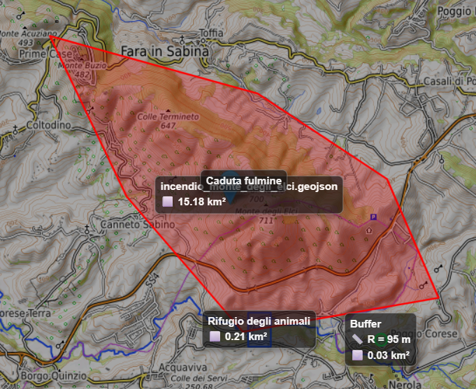
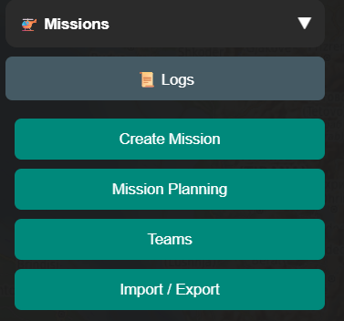
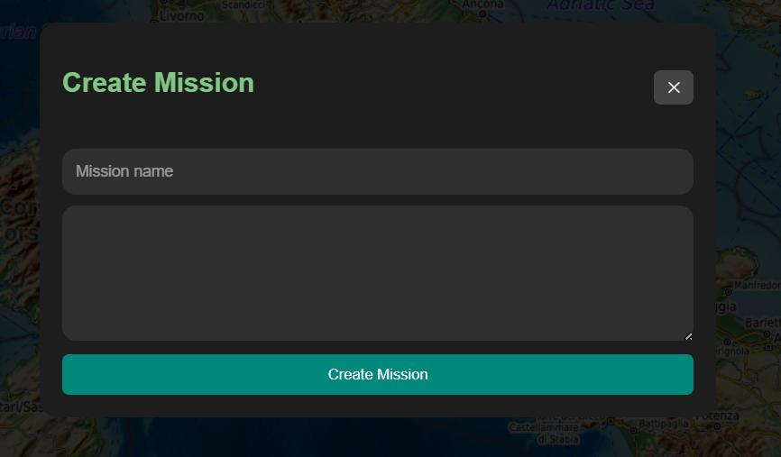
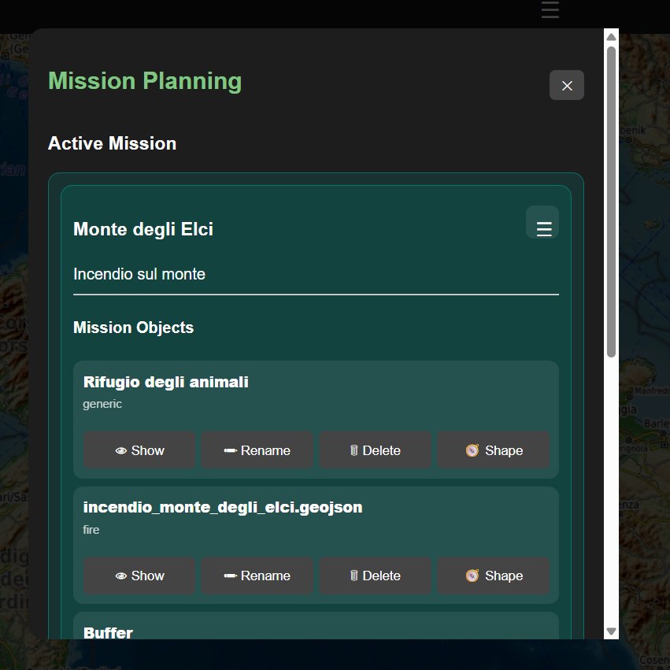
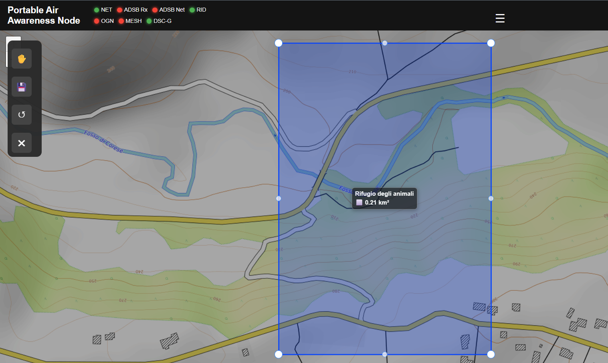
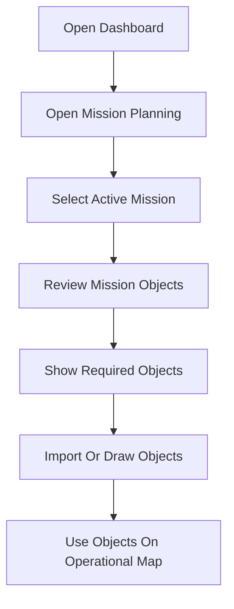

# Mission Planning

### Part of the Mini Tracker User Guide

---

## Purpose

This document describes how operators use Mission Planning within Mini Tracker.

Mission Planning allows the operator to select the active mission, review mission objects, display mission objects on the map, import GeoJSON layers and create or modify map objects for the current mission.

Mission objects are part of the operational map picture. They can represent areas, points, landing zones, buffers or other operational references used during field activity.

*Mission objects displayed on the operational map.*

---

## Overview

Mission Planning is accessed from the **Missions** section of the Dashboard drawer.

*Missions drawer section with Mission Planning access.*

The Missions section provides access to:

- Create Mission
- Mission Planning
- Teams
- Import / Export

The current inspected Dashboard shows **Import / Export** as disabled. GeoJSON layer import is available from the active mission menu inside Mission Planning.

*Create Mission panel with mission name, description and create action.*

---

## Active Mission

The Mission Planning window shows the active mission at the top of the interface.

*Active mission panel with mission objects and object actions.*

If no mission is selected, the active mission area shows that no active mission is available. When a mission is selected, the active mission card shows the mission name, description and mission object list.

The active mission menu provides the available mission actions:

| Action | Operational Use |
|----------|------------------|
| **Rename mission** | Change the mission name and description. |
| **Import Layer** | Import a GeoJSON or JSON file as a mission layer. |
| **New Object** | Start drawing a new mission object on the map. |
| **Delete mission** | Delete the active mission after confirmation. |

Deleting the active mission also clears the active mission selection.

---

## Mission Selection

The **Available Missions** section lists missions known to Mini Tracker.

Each mission entry shows:

- Mission name
- Mission description when available
- Mission status

Selecting a mission from the list makes it the active mission. The Mission Planning window then refreshes the active mission card and mission object list for the selected mission.

---

## Mission Object Visibility

Mission objects are displayed as independent map overlays above the base map.

The **Show mission objects on map** control changes visibility for all objects in the active mission. Individual objects can also be shown or hidden from the mission object list.

When only some objects are visible, the all-objects control reflects a partial selection state.

Changing mission object visibility affects only the map display. It does not delete or modify mission object data.

---

## Mission Objects

Mission objects are listed under the active mission card.

Each object entry shows the object name, object type and available object actions:

| Action | Operational Use |
|----------|------------------|
| **Show / Hide** | Display or remove the object from the map. |
| **Rename** | Change the object name. |
| **Delete** | Delete the object after confirmation. |
| **Shape** | Edit the object geometry on the map. |

Showing an object adds it to the map and centers the map around the object extent when possible.

Mission object popups show the object name, type and description when available.

---

## Importing GeoJSON Layers

GeoJSON import is available from the active mission menu by selecting **Import Layer**.

The import workflow accepts `.geojson` and `.json` files. The uploaded file is stored as a mission layer for the active mission and then appears in the mission object list.

Imported layers are treated like other mission objects for map visibility, deletion and object list management.

---

## Drawing New Objects

Selecting **New Object** closes the Mission Planning window and opens the mission drawing toolbar on the map.

The drawing toolbar supports:

| Tool | Use |
|----------|-----|
| **Rectangle** | Draw a rectangular mission area. |
| **Polygon** | Draw a custom polygon area. |
| **Circle** | Draw a circular area with radius information. |
| **Marker** | Place a point object. |
| **Save** | Continue to the layer properties window. |
| **Close** | Cancel the drawing operation. |

After drawing the geometry, selecting **Save** opens the layer properties window.

---

## Editing Object Shape

The **Shape** action opens the selected object on the map and switches the drawing toolbar into edit mode.

*Mission object geometry editor on the operational map.*

In edit mode, the toolbar allows the operator to enable vertex editing and save the updated geometry. Saving opens the layer properties window so the operator can confirm the object information before the object is updated.

Closing the drawing toolbar cancels the active drawing or editing session.

---

## Layer Properties

The layer properties window is used when creating a new object or saving an edited object.

It contains:

| Field | Purpose |
|----------|---------|
| **Name** | Object display name. |
| **Category** | Object category shown in the mission object list. |
| **Color** | Object line and fill color on the map. |
| **Description** | Optional operational description shown in object details. |
| **Show label** | Controls whether the object label is shown on the map. |
| **Show measurements** | Controls whether available area or radius information is shown with the label. |

Available categories are:

- Generic
- Search Area
- Fire Area
- Landing Zone
- Buffer
- Point of Interest

Labels may include the object name and, when enabled, measurements for supported geometries such as circles and polygons.

---

## Typical Operational Workflow

A typical mission planning workflow is:

Recommended sequence:

1. Open the Dashboard from a device connected to Mini Tracker.
2. Open **Mission Planning** from the Missions drawer section.
3. Select the mission that should be active for the operation.
4. Review the current mission objects.
5. Show only the mission objects required on the operational map.
6. Import GeoJSON layers or draw new objects when additional references are required.
7. Confirm object labels, measurements and colors before using them during the operation.

---

## Operational Recommendations

- Keep the active mission aligned with the current field operation.
- Use clear mission and object names so they can be recognized quickly in the object list and on the map.
- Display only the mission objects needed for the current phase of the operation.
- Use object categories consistently across missions.
- Verify imported GeoJSON layers on the map before relying on them operationally.
- Use labels and measurements when they improve map interpretation, and disable them when the map becomes crowded.
- Delete obsolete objects when they are no longer useful for the mission.

---

## Operational Notes

- Mission objects are stored as local mission layers.
- GeoJSON import adds a layer to the active mission; it does not import a complete mission package.
- The Dashboard shows a mission creation dialog with name and description fields, while current planning operations are performed on missions available in the mission list.
- The **Import / Export** button in the Missions drawer is currently disabled.
- Mission object visibility is a display control and should not be used as confirmation that an object has been deleted.
- Mission objects remain separate from the base map source. Changing between online and offline maps does not change mission object data.
