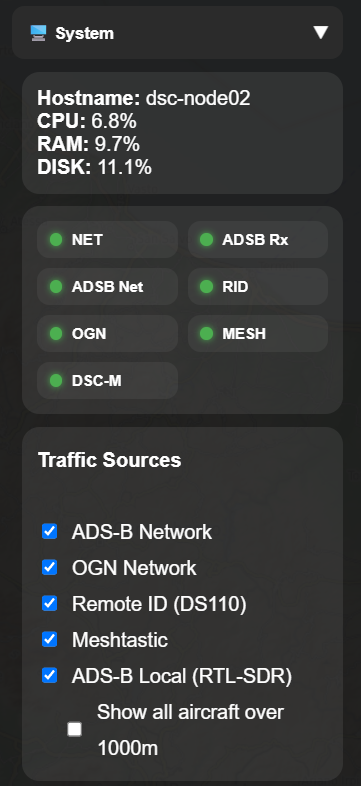
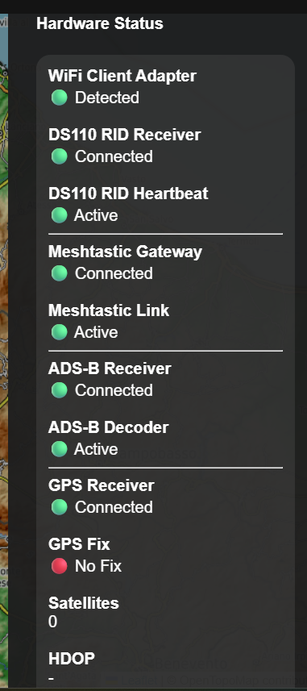
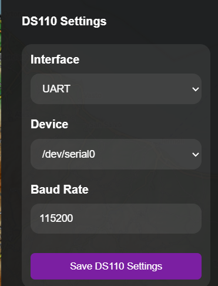
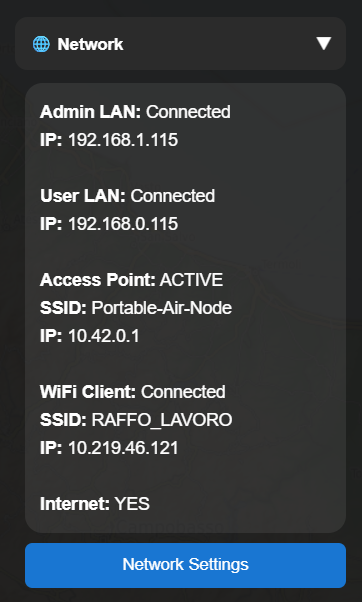
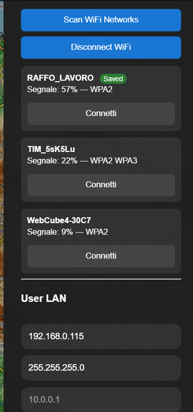
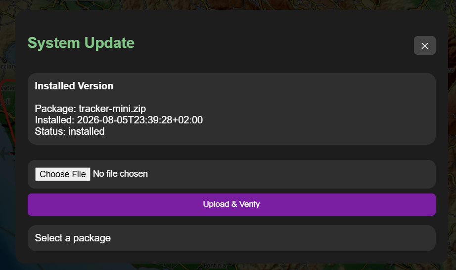

# Settings

### Part of the Mini Tracker User Guide

---

## Purpose

This document describes the operator-facing settings and system controls available from the Mini Tracker Dashboard.

Settings are used to verify service state, manage traffic source visibility, inspect hardware status, configure selected receivers and open the system update workflow.

Settings should be used carefully during field operations because some actions can interrupt data collection, radio reception, map availability or the Dashboard itself.

---

## Overview

Operator settings are accessed from the Dashboard drawer, mainly through the **System** and network-related panels.

The settings areas support:

- System status review
- Traffic source enable and visibility controls
- Hardware status review
- DS110 Remote ID receiver configuration
- Network and Wi-Fi Client settings
- System update package preparation
- Power and restart actions

Settings are operational controls. They do not replace hardware checks, antenna placement checks or deployment validation.

---

## System Status And Traffic Sources

The System panel shows basic host resource information and service indicators.

*System panel with service indicators and traffic source controls.*

The traffic source controls allow the operator to enable or disable supported sources for the current operating need.

| Control | Operational Use |
|----------|------------------|
| **ADS-B Network** | Shows network ADS-B traffic when Internet connectivity is available. |
| **OGN Network** | Shows OGN / FLARM traffic when Internet connectivity is available. |
| **Remote ID (DS110)** | Starts or stops Remote ID reception from the configured DS110 receiver. |
| **Meshtastic** | Starts or stops the Meshtastic team awareness service. |
| **ADS-B Local (RTL-SDR)** | Starts or stops the local ADS-B receiver service. |
| **Show all aircraft over 1000m** | Expands ADS-B display beyond the default low-altitude filter. |

Some controls affect backend receiver services, while others affect Dashboard visualization. Hardware must still be connected and working for a source to provide live data.

---

## Hardware Status

The Hardware Status view summarizes the operational state of connected devices and data paths.

*Hardware Status view with receiver, gateway, decoder and GPS indicators.*

Operators should use this view before field activity and whenever a data source appears missing from the map.

Important checks include:

- Wi-Fi Client adapter detection
- DS110 Remote ID receiver connection and heartbeat
- Meshtastic gateway connection and link activity
- ADS-B receiver and decoder state
- GPS receiver state, fix state, satellite count and HDOP

A red or missing status does not always identify a hardware fault. It may indicate a disconnected device, unavailable signal, disabled service, missing GPS fix or a temporary receiver condition.

---

## DS110 Remote ID Receiver Settings

The DS110 receiver configuration allows the operator or maintainer to review the selected Remote ID receiver connection.

*DS110 Remote ID receiver configuration panel.*

Configuration values should match the deployed Mini Tracker hardware. Changing receiver settings during an operation can interrupt Remote ID visibility until the receiver and service are available again.

---

## Network Settings

Network settings help the operator confirm whether Mini Tracker is connected through the expected network path.

*Network status view with Access Point, Wi-Fi Client and Internet state.*

The Wi-Fi and LAN settings area supports connection checks and local network configuration.

*Wi-Fi Client and User LAN settings.*

Internet connectivity is required for online maps, network traffic sources, map downloads and Drone Sky Check imports. Mini Tracker can continue to operate with offline maps and local receivers when Internet connectivity is unavailable.

---

## System Update

The System Update workflow is used to upload and validate update packages before installation.

*System Update panel for package upload, checks and install request preparation.*

Operators should avoid starting update actions during active field operations unless the operational situation allows service interruption and recovery time.

---

## Operational Recommendations

- Check system status and hardware status before relying on traffic or team data.
- Confirm the required traffic sources are enabled before the operational phase begins.
- Keep Internet-dependent sources disabled when they are not useful in the current deployment.
- Use hardware status together with map behavior; a green status confirms availability, not operational coverage.
- Avoid changing receiver configuration during active monitoring unless troubleshooting requires it.
- Prepare updates outside operational periods whenever possible.

---

## Operational Notes

- Offline maps and local receivers can continue to support field use without Internet connectivity.
- Network ADS-B, OGN / FLARM, online maps, map downloads and Drone Sky Check imports require Internet connectivity.
- Receiver status depends on both hardware connection and service state.
- GPS may be connected while still reporting no fix.
- Restart, reboot, shutdown and update actions may interrupt Dashboard availability.

---

## Related Documentation

- `user/dashboard.md`
- `user/maps.md`
- `user/traffic-monitoring.md`
- `hardware/networking.md`
- `hardware/remote-id.md`
- `hardware/meshtastic.md`
