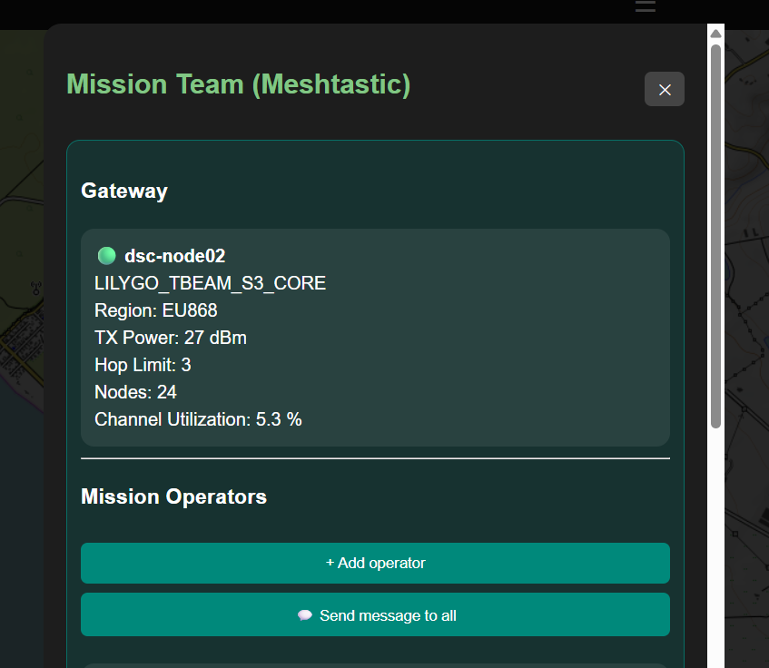
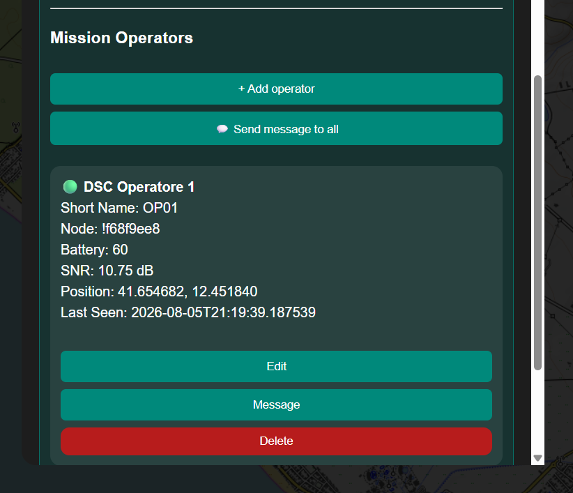
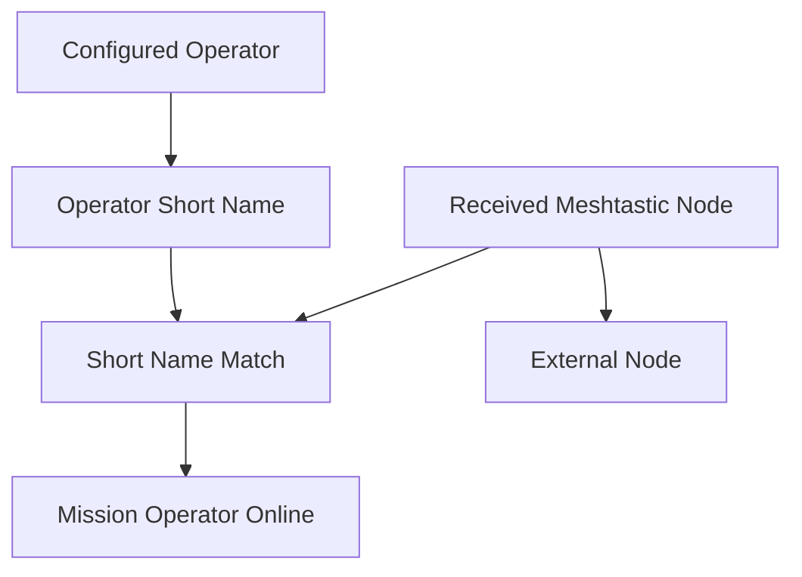
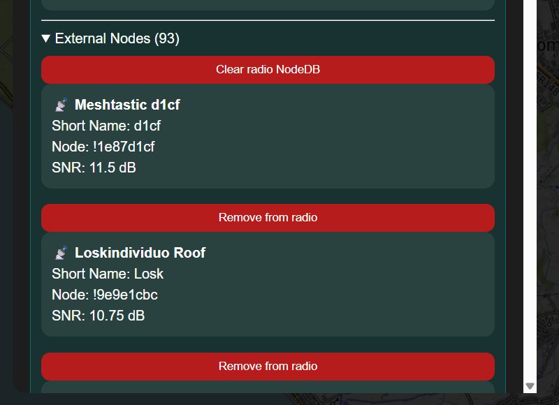
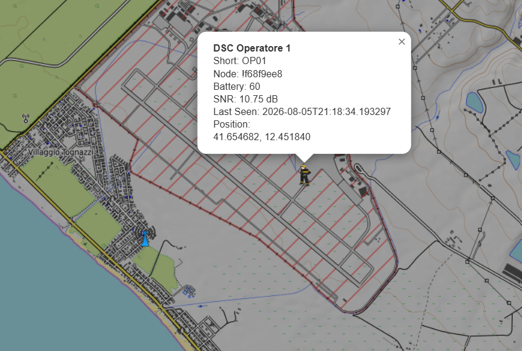
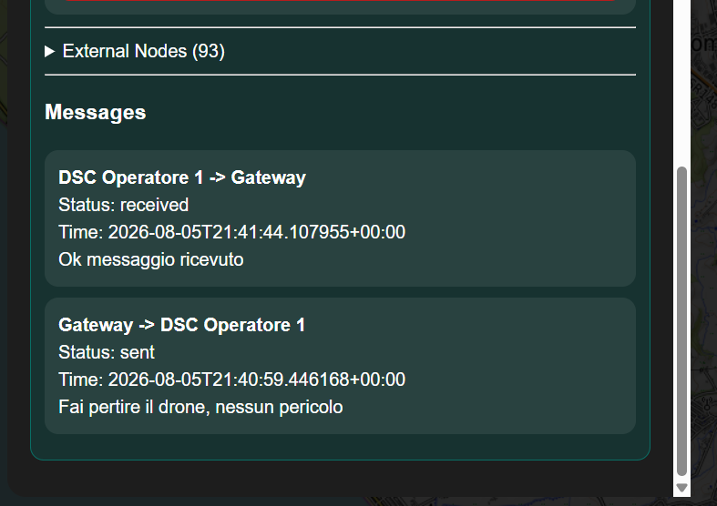
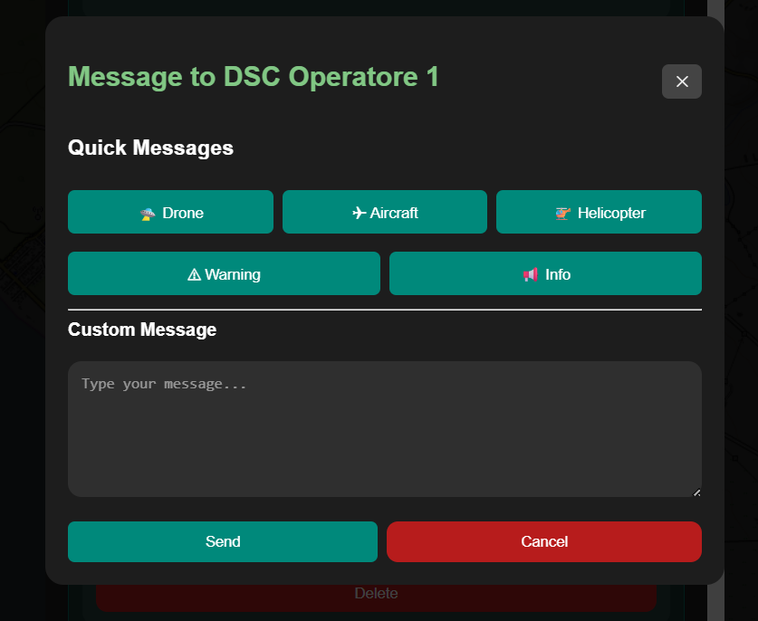

# Teams

### Part of the Mini Tracker User Guide

---

## Purpose

This document describes how operators use the Teams workflow within Mini Tracker.

Teams allows the operator to review the Meshtastic gateway, manage mission operators, distinguish configured operators from external radio nodes and send operational messages through the Mission Teams panel.

Team information is part of mission coordination. It complements the operational map and mission planning tools, but it does not replace standard team communication procedures.

---

## Overview

The Teams workflow is accessed from the **Missions** section of the Dashboard drawer.

The Mission Team window shows:

- Meshtastic gateway information
- Mission Operators
- External Nodes
- Messages

Mission operators are stored with the active mission. When a Meshtastic node is received with a matching short name, Mini Tracker associates that node with the configured operator.

*Mission Team window with gateway status and Mission Operators controls.*

---

## Gateway

The Gateway section summarizes the Meshtastic gateway used by Mini Tracker.

Displayed information may include:

| Field | Operational Use |
|----------|------------------|
| **Gateway name** | Identifies the local Meshtastic gateway node when available. |
| **Hardware model** | Shows the gateway device model when provided by Meshtastic. |
| **Region** | Indicates the LoRa region reported by the gateway configuration. |
| **TX Power** | Shows configured transmit power when available. |
| **Hop Limit** | Shows the configured hop limit. |
| **Nodes** | Shows the total visible team and external node count. |
| **Channel Utilization** | Helps assess radio channel load when telemetry is available. |

Gateway information is for operational awareness and maintenance checks. Missing fields do not always indicate a fault because not all Meshtastic data is available in every state.

---

## Mission Operators

Mission Operators are the configured team members for the active mission.

Each operator has:

| Field | Purpose |
|----------|---------|
| **Long name** | Human-readable operator name shown in the Teams panel and map details. |
| **Short name** | Meshtastic short name used to match the operator with a radio node. |
| **Node** | Meshtastic node identifier after a matching node has been detected. |
| **Online state** | Whether the associated node is currently visible in the Meshtastic node cache. |

The operator can add, edit or delete mission operators from the Teams panel.

*Mission Operators section with an associated online Meshtastic node.*

---

## Automatic Node Association

Mini Tracker associates configured operators with Meshtastic nodes automatically.

The association uses the configured operator short name and the Meshtastic node short name. When they match, Mini Tracker stores the node identifier on the operator entry and updates the operator state.

Nodes that do not match a configured operator are listed as External Nodes.

---

## Gateway, Operators and External Nodes

The Teams panel separates Meshtastic data into three operational groups.

| Group | Meaning |
|----------|---------|
| **Gateway** | The local Meshtastic gateway connected to Mini Tracker. |
| **Mission Operators** | Configured operators whose short name matches a received Meshtastic node. |
| **External Nodes** | Meshtastic nodes visible to the gateway but not matched to configured mission operators. |

This distinction helps the operator understand which nodes belong to the mission team and which nodes are simply present in the radio NodeDB.

*External Meshtastic nodes are listed separately from configured mission operators.*

---

## Operator Map Markers

When a configured mission operator has position data, Mini Tracker can display that operator on the Dashboard map.

Selecting the operator marker shows the operator name, short name, node identifier, battery state, signal information and last seen time when these values are available.

When an operator is no longer seen by the Meshtastic gateway, the marker becomes stale, fades visually and is removed after the configured retention period. The default retention period is intentionally long because Meshtastic position updates may be infrequent, especially when an operator is stationary.

*Mission operator marker and details on the operational map.*

---

## External Nodes and NodeDB

External Nodes are shown separately from Mission Operators.

The Teams panel provides two NodeDB maintenance actions:

| Action | Effect |
|----------|--------|
| **Remove from radio** | Requests removal of one selected node from the Meshtastic radio NodeDB. |
| **Clear radio NodeDB** | Requests a complete NodeDB reset on the Meshtastic radio. |

Both actions affect the Meshtastic radio NodeDB and the Mini Tracker in-memory node cache. They should be used only when the operator or maintainer intentionally wants to remove stale or unwanted node entries.

---

## Messages

The Teams panel includes a Messages section and a message dialog.

The operator can:

- Send a message to one mission operator
- Send a message to all online mission operators
- Use quick message templates
- Write a custom message
- Review recent incoming and outgoing notification entries shown in the Messages section

Messages are sent through the Notification Service. The Notification Service records the notification state and uses Meshtastic as the current delivery transport for operator messages.

Each message entry identifies the source, destination, delivery state, timestamp and text. Outgoing messages show the Mini Tracker gateway as the source and the operator as the destination. Incoming Meshtastic text messages from operator nodes are recorded as messages from the operator to the gateway.

*Messages section showing received and sent Meshtastic text messages with direction and status.*

---

## Sending a Message to One Operator

To send a message to a single operator:

1. Open **Teams** from the Missions section.
2. Locate the operator in **Mission Operators**.
3. Select **Message**.
4. Choose a quick message or enter a custom message.
5. Select **Send**.

The operator must have an associated Meshtastic node identifier for delivery to succeed.

*Direct message dialog for one configured mission operator.*

---

## Sending a Message to All Operators

To send a message to all online operators:

1. Open **Teams** from the Missions section.
2. Select **Send message to all**.
3. Choose a quick message or enter a custom message.
4. Select **Send**.

Mini Tracker sends the message only to configured operators that are currently online and have an associated node identifier.

---

## Operational Recommendations

- Configure operator short names before the operational phase begins.
- Keep Meshtastic short names consistent with the configured mission operators.
- Verify that expected operators appear online before relying on message delivery.
- Treat External Nodes as radio nodes outside the configured mission team unless they are intentionally added as operators.
- Use NodeDB removal actions carefully, especially during active field operations.
- Use messages for concise operational notices and continue using standard team communication procedures.

---

## Operational Notes

- Team configuration is scoped to the active mission.
- Operator association depends on Meshtastic node short names.
- Operators without current position data may still appear in the Teams panel but cannot be displayed as map markers.
- Operator markers use Meshtastic last seen timing for stale and removal behavior.
- Message delivery depends on Meshtastic gateway state, node availability and radio conditions.
- Recent messages are stored in backend memory and are not persistent across backend restarts.
- Incoming messages are recorded only while the Meshtastic service is running and receiving text-message packets.

---

## Related Documentation

- `user/dashboard.md`
- `user/mission-planning.md`
- `user/traffic-monitoring.md`
- `hardware/meshtastic.md`
- `developer/api.md`
