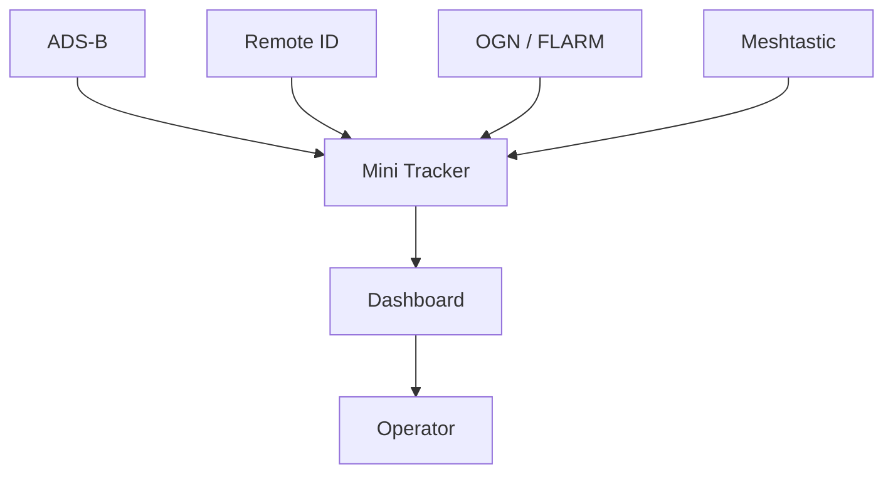
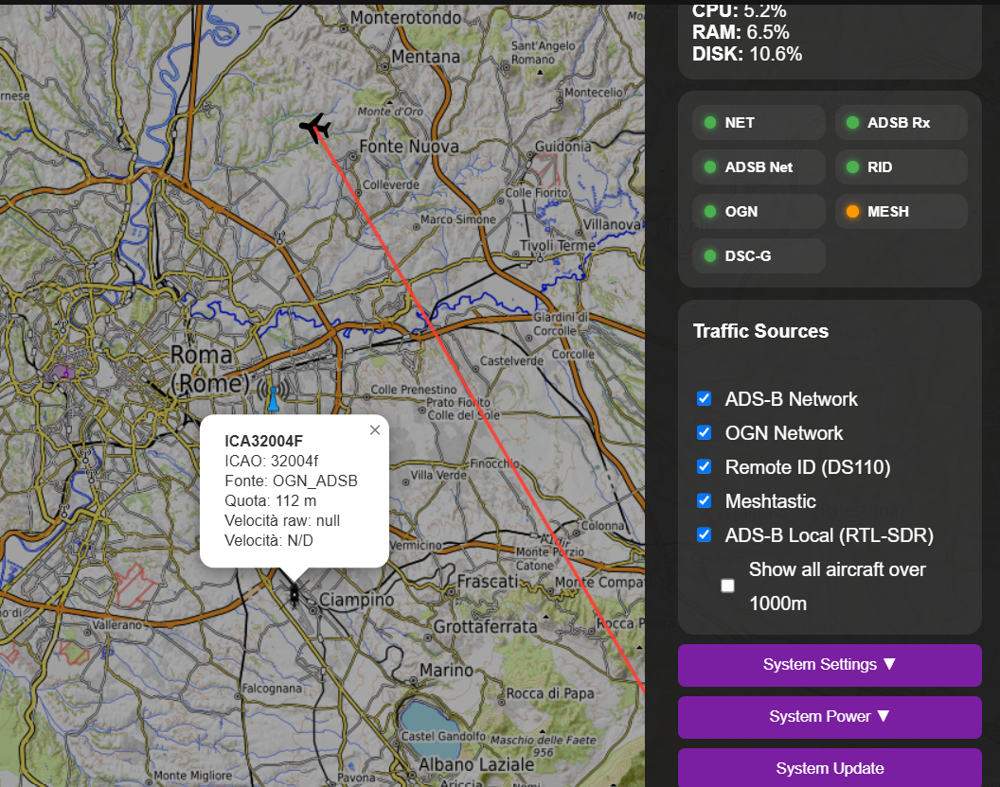
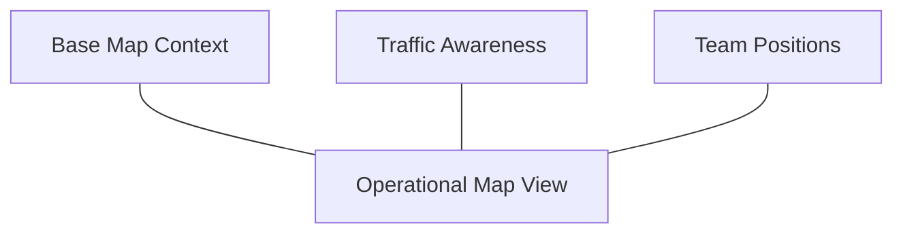
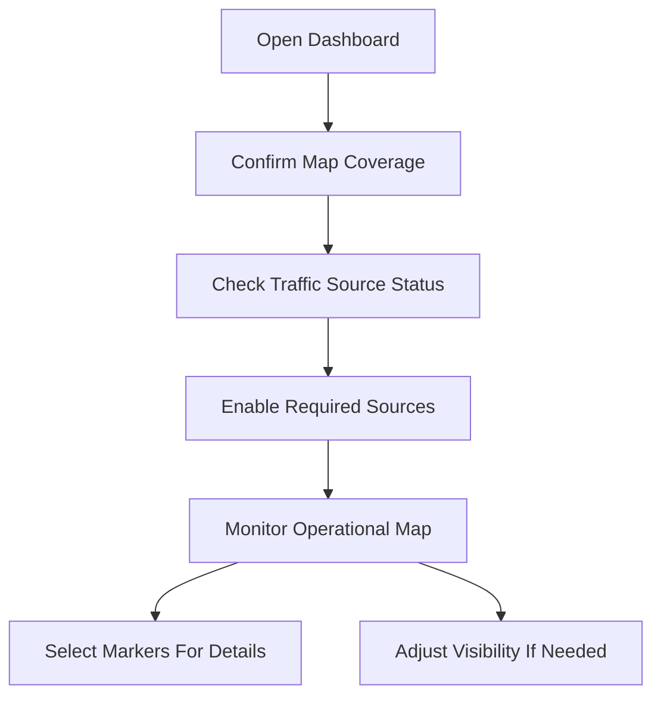

# Traffic Monitoring

### Part of the Mini Tracker User Guide

---

## Purpose

This document describes how Mini Tracker supports operator situational awareness by combining independent traffic and team information sources into a single operational picture.

Traffic monitoring helps the operator understand nearby aircraft, drones, gliders and mission team positions in relation to the operating area.

The objective is not to replace specialized aviation systems, but to present relevant field information in one practical operational view.

---

## Overview

Mini Tracker presents traffic and team information on the operational map as part of a single operational picture.

The Dashboard can display:

- ADS-B aircraft
- Remote ID drones
- OGN / FLARM traffic
- Meshtastic operator positions

Each source remains independent, but the operator views them together in one operational picture. This reduces the need to consult multiple devices or applications during field operations.

---

## Unified Situational Awareness

Traffic monitoring contributes to the unified operational picture provided by Mini Tracker.

The operator should interpret the Dashboard as a consolidated operational view. Each source may have different range, update rate, accuracy and dependency conditions.

---

## Traffic Sources

Mini Tracker can display information from several operational sources.

*Traffic sources panel with aircraft details on the operational map.*

| Source | Operational Purpose |
|----------|----------------------|
| **ADS-B** | Awareness of cooperative aircraft and helicopters equipped with ADS-B transmitters. |
| **Remote ID** | Awareness of drones transmitting supported identification data. |
| **OGN / FLARM** | Awareness of gliders and light aviation objects from supported network sources. |
| **Meshtastic Operators** | Awareness of mission operator positions and node status. |

---

### ADS-B

ADS-B provides awareness of cooperative aircraft equipped with ADS-B transmitters.

Mini Tracker supports both local and network ADS-B information:

- Local ADS-B data from the local receiver and decoder
- Network ADS-B data when Internet connectivity is available

Aircraft may be shown with callsign or identifier, ICAO identifier, source, altitude and speed when available.

By default, aircraft traffic is filtered to focus on lower altitude traffic relevant to the local operating area. Helicopters are treated as operationally relevant even when altitude filtering is active.

---

### Remote ID

Remote ID contributes awareness of drones detected by the supported receiver.

Drone markers may include:

- Model
- Vendor
- Serial number
- Source

Remote ID availability depends on the receiver state and on drones transmitting supported data in range.

Mini Tracker also identifies some drone vendor and model information from received identifiers when available.

---

### OGN / FLARM

OGN / FLARM traffic provides awareness of gliders and related light aviation objects from supported OGN network sources.

Examples may include FLARM-derived or compatible network sources such as SafeSky, FreeFlight and FANET.

Objects may be shown with identifier, source, altitude and update age when available.

OGN / FLARM network information requires Internet connectivity.

---

### Meshtastic Operators

Meshtastic operator information provides awareness of mission team positions.

When Meshtastic is enabled and operator data is available, Mini Tracker can display operator markers on the map.

Operator information may include:

- Operator name
- Short name
- Node identifier
- Battery information
- Signal information
- Last seen time
- Position

Meshtastic operators are part of team awareness rather than air traffic. They are displayed in the same operational map view because their position is relevant to mission coordination.

Operator messaging is handled from the Teams workflow rather than from traffic map markers.

---

## Traffic Visualization

Traffic and operator information is displayed as independent operational overlays above the map.

Changing the map source affects only the geographic base map. Traffic and team overlays remain operationally separate and continue to contribute to the same operational picture.

---

## Traffic Information

Selecting a traffic marker displays the information available for that object.

Available details depend on the source and on the data received.

Typical information may include:

- Identifier or callsign
- Source
- Position
- Altitude
- Speed
- Heading
- Last update or last seen time
- Battery and signal information for Meshtastic operators

The absence of a field does not necessarily indicate a system fault. Some sources do not provide all data fields for every object.

---

## Traffic Filtering

Mini Tracker uses display filters to keep the operational view focused.

The Dashboard can limit displayed traffic according to:

- Current map area
- Source availability
- Receiver state
- Data freshness
- Aircraft altitude filtering
- Operator-selected traffic source visibility

ADS-B aircraft above the default altitude threshold are hidden unless the operator enables broader altitude visibility. This helps reduce map clutter during low-altitude field operations.

Filtering affects visualization only. Display filters do not change received traffic data; they only determine what is shown to the operator on the Dashboard.

---

## Typical Operational Workflow

A typical traffic monitoring workflow is:

Recommended sequence:

1. Open the Dashboard from a device connected to Mini Tracker.
2. Confirm that the map covers the operating area.
3. Check the traffic source indicators.
4. Enable the traffic sources required for the operation.
5. Monitor aircraft, drones, gliders and team positions on the map.
6. Select markers when additional details are required.
7. Adjust traffic visibility when the map becomes too crowded.

---

## Operational Recommendations

- Verify the required traffic sources before the operational phase begins.
- Prepare offline map coverage for the full area where traffic awareness may be required.
- Position antennas and receivers to maintain the best possible local coverage.
- Keep the operational picture focused on information relevant to the mission.
- Use broader altitude visibility when the operation requires wider airspace awareness.
- Treat missing or stale traffic data as an operational limitation, not as confirmation that the area is clear.
- Maintain standard communication and lookout procedures even when traffic is visible on the Dashboard.

---

## Operational Notes

- Local ADS-B requires the local receiver and decoder to be active.
- The ADS-B Local control starts or stops the local receiver service on Mini Tracker.
- Network ADS-B and OGN / FLARM information require Internet connectivity.
- Remote ID visibility depends on receiver state, radio range and supported transmitted data.
- Meshtastic visibility depends on gateway state, node availability and position data.
- Traffic visibility depends on the current map area.
- Traffic objects may disappear from the view when data becomes stale or when the source is no longer available.
- The Dashboard refreshes traffic information periodically.

---
